# one-page-papers

**Foundational papers, typeset on a single poster. Print them, frame them, hang them.**

Each paper is laid out in full on one page: every section, equation, code listing, table and reference, with figures redrawn as vector graphics. The body size is computed automatically so the text fills the page exactly.

## Papers

<!-- catalog:start -->

35 posters in 10 categories. Each one comes in 4 themes, shown here with *Bitcoin: A Peer-to-Peer Electronic Cash System*, and in 3 formats (see [Download](#download)).

| ivory | white | genesis | blueprint |
|:-:|:-:|:-:|:-:|
| <a href="dist/crypto/bitcoin-A-ivory.pdf"></a> | <a href="dist/crypto/bitcoin-A-white.pdf"></a> | <a href="dist/crypto/bitcoin-A-genesis.pdf"></a> | <a href="dist/crypto/bitcoin-A-blueprint.pdf"></a> |

A click on a poster opens its PDF in the A format and in its first theme, and the links under its summary open the other themes. *Print from* is the smallest A size at which its body text is at least 8 pt.

### Cryptocurrency

| &nbsp;&nbsp;&nbsp;&nbsp;&nbsp;&nbsp;&nbsp;&nbsp;&nbsp;&nbsp;&nbsp;&nbsp;&nbsp;&nbsp;&nbsp;&nbsp;&nbsp;&nbsp;&nbsp;&nbsp;&nbsp;&nbsp;&nbsp;&nbsp; | Paper | Authors | Year | Print from | License |
|---|---|---|---|---|---|
| <a href="dist/crypto/bitcoin-A-ivory.pdf"></a> | [Bitcoin: A Peer-to-Peer Electronic Cash System](dist/crypto/bitcoin-A-ivory.pdf)<br>Proposes a peer-to-peer electronic cash system that prevents double-spending with a proof-of-work chain of timestamped blocks.<br>[ivory](dist/crypto/bitcoin-A-ivory.pdf)&nbsp;·&nbsp;[white](dist/crypto/bitcoin-A-white.pdf)&nbsp;·&nbsp;[genesis](dist/crypto/bitcoin-A-genesis.pdf)&nbsp;·&nbsp;[blueprint](dist/crypto/bitcoin-A-blueprint.pdf) | Satoshi Nakamoto | 2008 | A2 | MIT |
| <a href="dist/crypto/peercoin-A-ivory.pdf"></a> | [PPCoin: Peer-to-Peer Crypto-Currency with Proof-of-Stake](dist/crypto/peercoin-A-ivory.pdf)<br>Proposes a crypto-currency derived from Bitcoin in which proof-of-stake, based on coin age, provides most of the network security.<br>[ivory](dist/crypto/peercoin-A-ivory.pdf)&nbsp;·&nbsp;[white](dist/crypto/peercoin-A-white.pdf)&nbsp;·&nbsp;[genesis](dist/crypto/peercoin-A-genesis.pdf)&nbsp;·&nbsp;[blueprint](dist/crypto/peercoin-A-blueprint.pdf) | Sunny King, Scott Nadal | 2012 | A3 | CC BY-ND 4.0 |
| <a href="dist/crypto/bip-39-A-ivory.pdf"></a> | [BIP 39: Mnemonic code for generating deterministic keys](dist/crypto/bip-39-A-ivory.pdf)<br>Encodes entropy as a sentence of words from a 2048-word list, shown in full, then derives a binary seed.<br>[ivory](dist/crypto/bip-39-A-ivory.pdf)&nbsp;·&nbsp;[white](dist/crypto/bip-39-A-white.pdf)&nbsp;·&nbsp;[genesis](dist/crypto/bip-39-A-genesis.pdf)&nbsp;·&nbsp;[blueprint](dist/crypto/bip-39-A-blueprint.pdf) | Marek Palatinus, Pavol Rusnak, Aaron Voisine, Sean Bowe | 2013 | A2 | MIT |
| <a href="dist/crypto/ethereum-A-ivory.pdf"></a> | [Ethereum: A Next-Generation Smart Contract and Decentralized Application Platform](dist/crypto/ethereum-A-ivory.pdf)<br>Proposes Ethereum, a blockchain with a built-in Turing-complete language for contracts that encode arbitrary state transition functions.<br>[ivory](dist/crypto/ethereum-A-ivory.pdf)&nbsp;·&nbsp;[white](dist/crypto/ethereum-A-white.pdf)&nbsp;·&nbsp;[genesis](dist/crypto/ethereum-A-genesis.pdf)&nbsp;·&nbsp;[blueprint](dist/crypto/ethereum-A-blueprint.pdf) | Vitalik Buterin | 2014 | A0 | CC BY 4.0 (text, figures); MIT (code) |

### Computing pioneers

| &nbsp;&nbsp;&nbsp;&nbsp;&nbsp;&nbsp;&nbsp;&nbsp;&nbsp;&nbsp;&nbsp;&nbsp;&nbsp;&nbsp;&nbsp;&nbsp;&nbsp;&nbsp;&nbsp;&nbsp;&nbsp;&nbsp;&nbsp;&nbsp; | Paper | Authors | Year | Print from | License |
|---|---|---|---|---|---|
| <a href="dist/computing/lovelace-note-g-A-ivory.pdf">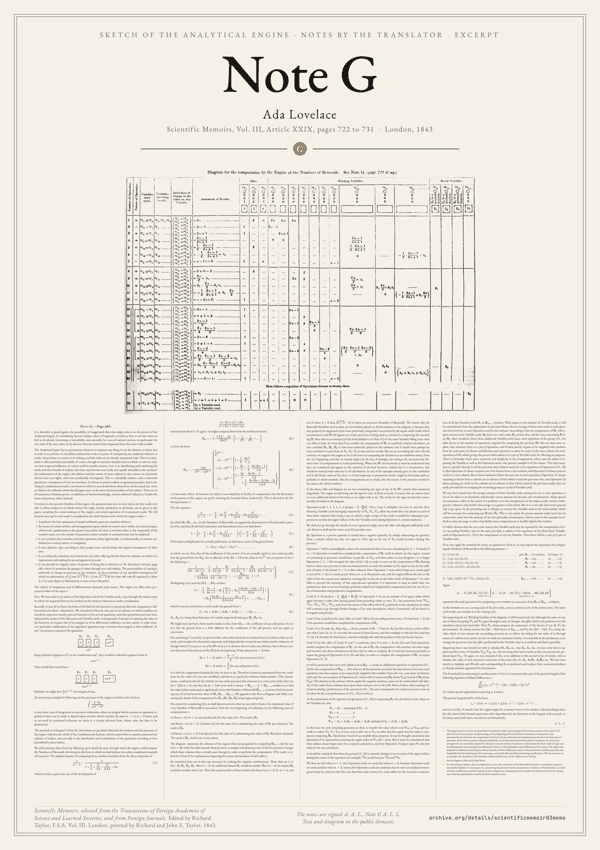</a> | [Sketch of the Analytical Engine: Note G](dist/computing/lovelace-note-g-A-ivory.pdf)<br>Lovelace's last note on the Analytical Engine: its limits, and how it would compute the Bernoulli numbers.<br>[ivory](dist/computing/lovelace-note-g-A-ivory.pdf)&nbsp;·&nbsp;[white](dist/computing/lovelace-note-g-A-white.pdf)&nbsp;·&nbsp;[genesis](dist/computing/lovelace-note-g-A-genesis.pdf)&nbsp;·&nbsp;[blueprint](dist/computing/lovelace-note-g-A-blueprint.pdf) | Ada Lovelace | 1843 | A1 | Public domain |

### Internet & networking

| &nbsp;&nbsp;&nbsp;&nbsp;&nbsp;&nbsp;&nbsp;&nbsp;&nbsp;&nbsp;&nbsp;&nbsp;&nbsp;&nbsp;&nbsp;&nbsp;&nbsp;&nbsp;&nbsp;&nbsp;&nbsp;&nbsp;&nbsp;&nbsp; | Paper | Authors | Year | Print from | License |
|---|---|---|---|---|---|
| <a href="dist/internet/rfc-1-A-ivory.pdf"></a> | [RFC 1: Host Software](dist/internet/rfc-1-A-ivory.pdf)<br>The first Request for Comments: the planned host software of the ARPA Network and its first experiments.<br>[ivory](dist/internet/rfc-1-A-ivory.pdf)&nbsp;·&nbsp;[white](dist/internet/rfc-1-A-white.pdf)&nbsp;·&nbsp;[genesis](dist/internet/rfc-1-A-genesis.pdf)&nbsp;·&nbsp;[blueprint](dist/internet/rfc-1-A-blueprint.pdf) | Steve Crocker | 1969 | A2 | Free reproduction (RFC Editor) |
| <a href="dist/internet/rfc-791-A-ivory.pdf"></a> | [RFC 791: Internet Protocol](dist/internet/rfc-791-A-ivory.pdf)<br>Section 3.1 of the Internet Protocol specification, which defines each field of the IPv4 header and its options.<br>[ivory](dist/internet/rfc-791-A-ivory.pdf)&nbsp;·&nbsp;[white](dist/internet/rfc-791-A-white.pdf)&nbsp;·&nbsp;[genesis](dist/internet/rfc-791-A-genesis.pdf)&nbsp;·&nbsp;[blueprint](dist/internet/rfc-791-A-blueprint.pdf) | Jon Postel | 1981 | A1 | Free reproduction (RFC Editor) |
| <a href="dist/internet/rfc-1149-A-ivory.pdf"></a> | [RFC 1149: A Standard for the Transmission of IP Datagrams on Avian Carriers](dist/internet/rfc-1149-A-ivory.pdf)<br>An April Fools' RFC on sending IP datagrams printed on a paper scroll wrapped around the leg of a bird.<br>[ivory](dist/internet/rfc-1149-A-ivory.pdf)&nbsp;·&nbsp;[white](dist/internet/rfc-1149-A-white.pdf)&nbsp;·&nbsp;[genesis](dist/internet/rfc-1149-A-genesis.pdf)&nbsp;·&nbsp;[blueprint](dist/internet/rfc-1149-A-blueprint.pdf) | David Waitzman | 1990 | A3 | Distribution unlimited |
| <a href="dist/internet/rfc-1925-A-ivory.pdf"></a> | [RFC 1925: The Twelve Networking Truths](dist/internet/rfc-1925-A-ivory.pdf)<br>An April Fools' RFC stating twelve fundamental truths of networking, several with corollaries.<br>[ivory](dist/internet/rfc-1925-A-ivory.pdf)&nbsp;·&nbsp;[white](dist/internet/rfc-1925-A-white.pdf)&nbsp;·&nbsp;[genesis](dist/internet/rfc-1925-A-genesis.pdf)&nbsp;·&nbsp;[blueprint](dist/internet/rfc-1925-A-blueprint.pdf) | Ross Callon | 1996 | A3 | Distribution unlimited |
| <a href="dist/internet/rfc-2324-A-ivory.pdf"></a> | [RFC 2324: Hyper Text Coffee Pot Control Protocol (HTCPCP/1.0)](dist/internet/rfc-2324-A-ivory.pdf)<br>An April Fools' RFC extending HTTP to control coffee pots; it defined the 418 I'm a teapot status code.<br>[ivory](dist/internet/rfc-2324-A-ivory.pdf)&nbsp;·&nbsp;[white](dist/internet/rfc-2324-A-white.pdf)&nbsp;·&nbsp;[genesis](dist/internet/rfc-2324-A-genesis.pdf)&nbsp;·&nbsp;[blueprint](dist/internet/rfc-2324-A-blueprint.pdf) | Larry Masinter | 1998 | A2 | © The Internet Society 1998, copies allowed |

### Software practice

| &nbsp;&nbsp;&nbsp;&nbsp;&nbsp;&nbsp;&nbsp;&nbsp;&nbsp;&nbsp;&nbsp;&nbsp;&nbsp;&nbsp;&nbsp;&nbsp;&nbsp;&nbsp;&nbsp;&nbsp;&nbsp;&nbsp;&nbsp;&nbsp; | Paper | Authors | Year | Print from | License |
|---|---|---|---|---|---|
| <a href="dist/software/gnu-manifesto-A-ivory.pdf">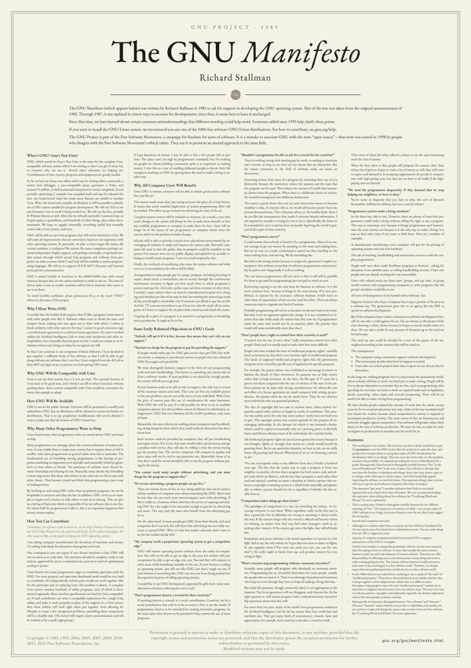</a> | [The GNU Manifesto](dist/software/gnu-manifesto-A-ivory.pdf)<br>Richard Stallman's 1985 call for support to write GNU, a complete Unix-compatible system that everyone may share and change.<br>[ivory](dist/software/gnu-manifesto-A-ivory.pdf)&nbsp;·&nbsp;[white](dist/software/gnu-manifesto-A-white.pdf)&nbsp;·&nbsp;[genesis](dist/software/gnu-manifesto-A-genesis.pdf)&nbsp;·&nbsp;[blueprint](dist/software/gnu-manifesto-A-blueprint.pdf) | Richard Stallman | 1985 | A2 | © FSF, verbatim copies allowed |
| <a href="dist/software/agile-manifesto-A-ivory.pdf">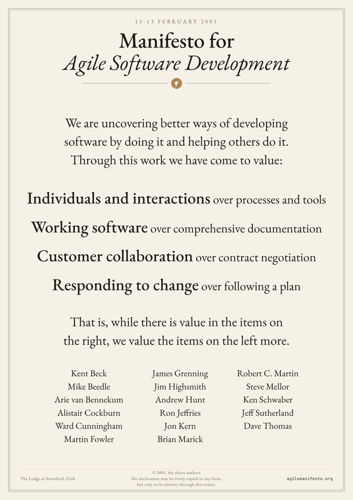</a> | [Manifesto for Agile Software Development](dist/software/agile-manifesto-A-ivory.pdf)<br>Four values for developing software, stated in 2001 by seventeen people who met at Snowbird, Utah.<br>[ivory](dist/software/agile-manifesto-A-ivory.pdf)&nbsp;·&nbsp;[white](dist/software/agile-manifesto-A-white.pdf)&nbsp;·&nbsp;[genesis](dist/software/agile-manifesto-A-genesis.pdf)&nbsp;·&nbsp;[blueprint](dist/software/agile-manifesto-A-blueprint.pdf) | Kent Beck, Mike Beedle, Arie van Bennekum, Alistair Cockburn, Ward Cunningham, Martin Fowler, James Grenning, Jim Highsmith, Andrew Hunt, Ron Jeffries, Jon Kern, Brian Marick, Robert C. Martin, Steve Mellor, Ken Schwaber, Jeff Sutherland, Dave Thomas | 2001 | A3 | © 2001 the authors, copies in entirety |
| <a href="dist/software/zen-of-python-A-ivory.pdf"></a> | [PEP 20: The Zen of Python](dist/software/zen-of-python-A-ivory.pdf)<br>Nineteen aphorisms by Tim Peters on the principles behind the design of the Python language.<br>[ivory](dist/software/zen-of-python-A-ivory.pdf)&nbsp;·&nbsp;[white](dist/software/zen-of-python-A-white.pdf)&nbsp;·&nbsp;[genesis](dist/software/zen-of-python-A-genesis.pdf)&nbsp;·&nbsp;[blueprint](dist/software/zen-of-python-A-blueprint.pdf) | Tim Peters | 2004 | A3 | Public domain |
| <a href="dist/software/twelve-factor-app-A-ivory.pdf">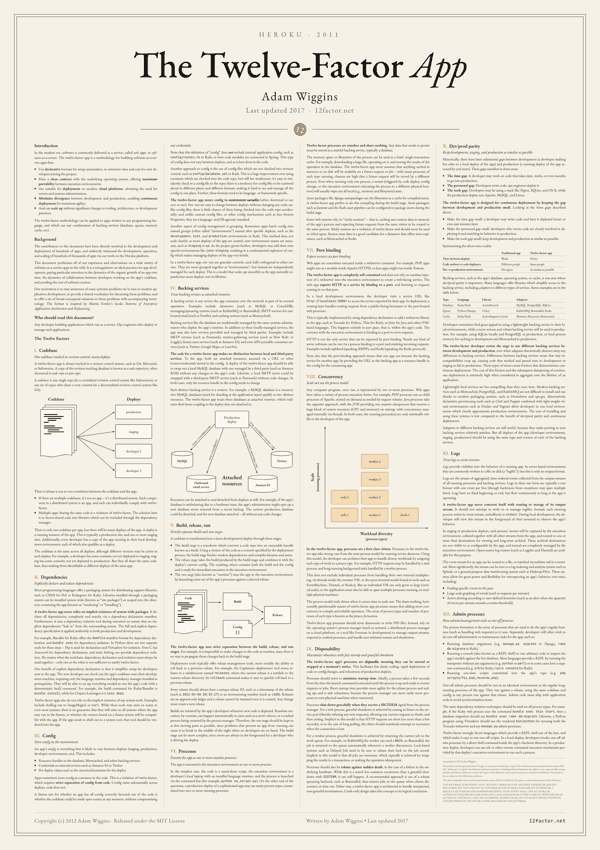</a> | [The Twelve-Factor App](dist/software/twelve-factor-app-A-ivory.pdf)<br>A methodology of twelve factors for building software-as-a-service apps, drawn from experience with hundreds of apps on Heroku.<br>[ivory](dist/software/twelve-factor-app-A-ivory.pdf)&nbsp;·&nbsp;[white](dist/software/twelve-factor-app-A-white.pdf)&nbsp;·&nbsp;[genesis](dist/software/twelve-factor-app-A-genesis.pdf)&nbsp;·&nbsp;[blueprint](dist/software/twelve-factor-app-A-blueprint.pdf) | Adam Wiggins | 2011 | A1 | MIT |
| <a href="dist/software/semver-A-ivory.pdf">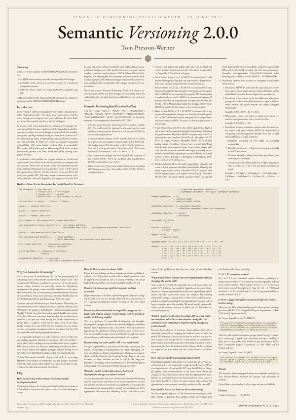</a> | [Semantic Versioning 2.0.0](dist/software/semver-A-ivory.pdf)<br>Rules and requirements that dictate how MAJOR.MINOR.PATCH version numbers are assigned and incremented, with a grammar and a FAQ.<br>[ivory](dist/software/semver-A-ivory.pdf)&nbsp;·&nbsp;[white](dist/software/semver-A-white.pdf)&nbsp;·&nbsp;[genesis](dist/software/semver-A-genesis.pdf)&nbsp;·&nbsp;[blueprint](dist/software/semver-A-blueprint.pdf) | Tom Preston-Werner | 2013 | A2 | CC BY 3.0 |

### Manifestos & announcements

| &nbsp;&nbsp;&nbsp;&nbsp;&nbsp;&nbsp;&nbsp;&nbsp;&nbsp;&nbsp;&nbsp;&nbsp;&nbsp;&nbsp;&nbsp;&nbsp;&nbsp;&nbsp;&nbsp;&nbsp;&nbsp;&nbsp;&nbsp;&nbsp; | Paper | Authors | Year | Print from | License |
|---|---|---|---|---|---|
| <a href="dist/manifestos/www-announcement-A-ivory.pdf">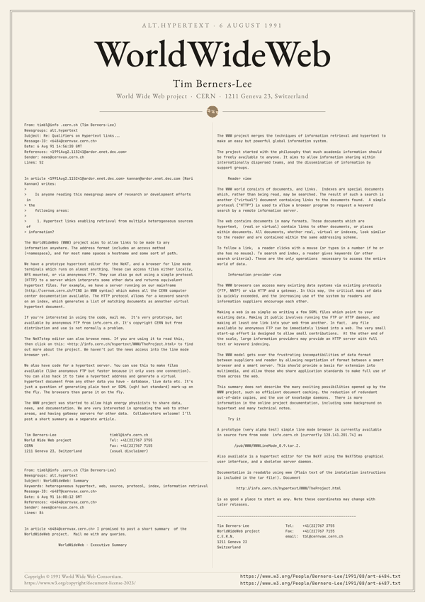</a> | [WorldWideWeb: the announcement on alt.hypertext](dist/manifestos/www-announcement-A-ivory.pdf)<br>Tim Berners-Lee's two Usenet posts of 6 August 1991 that described the WorldWideWeb project and offered its software.<br>[ivory](dist/manifestos/www-announcement-A-ivory.pdf)&nbsp;·&nbsp;[white](dist/manifestos/www-announcement-A-white.pdf)&nbsp;·&nbsp;[genesis](dist/manifestos/www-announcement-A-genesis.pdf)&nbsp;·&nbsp;[blueprint](dist/manifestos/www-announcement-A-blueprint.pdf) | Tim Berners-Lee | 1991 | A2 | W3C Document License |
| <a href="dist/manifestos/cyberspace-independence-A-ivory.pdf">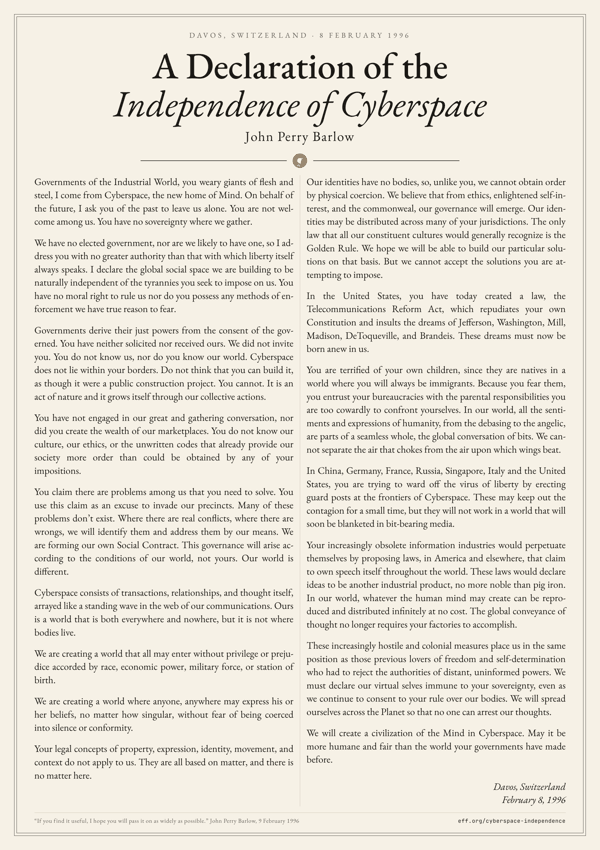</a> | [A Declaration of the Independence of Cyberspace](dist/manifestos/cyberspace-independence-A-ivory.pdf)<br>John Perry Barlow's 1996 declaration, written at Davos, that governments have no sovereignty over cyberspace.<br>[ivory](dist/manifestos/cyberspace-independence-A-ivory.pdf)&nbsp;·&nbsp;[white](dist/manifestos/cyberspace-independence-A-white.pdf)&nbsp;·&nbsp;[genesis](dist/manifestos/cyberspace-independence-A-genesis.pdf)&nbsp;·&nbsp;[blueprint](dist/manifestos/cyberspace-independence-A-blueprint.pdf) | John Perry Barlow | 1996 | A3 | Redistribution invited by the author |

### Physics & astronomy

| &nbsp;&nbsp;&nbsp;&nbsp;&nbsp;&nbsp;&nbsp;&nbsp;&nbsp;&nbsp;&nbsp;&nbsp;&nbsp;&nbsp;&nbsp;&nbsp;&nbsp;&nbsp;&nbsp;&nbsp;&nbsp;&nbsp;&nbsp;&nbsp; | Paper | Authors | Year | Print from | License |
|---|---|---|---|---|---|
| <a href="dist/physics/planck-1900-A-ivory.pdf">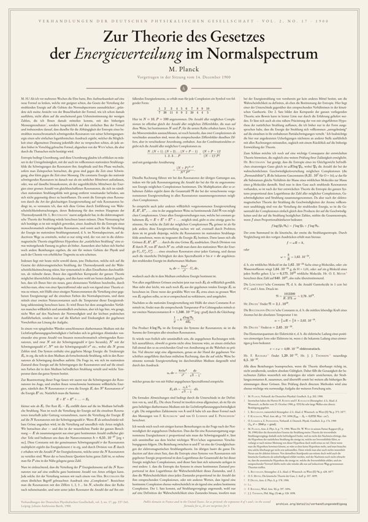</a> | [Zur Theorie des Gesetzes der Energieverteilung im Normalspectrum](dist/physics/planck-1900-A-ivory.pdf)<br>Planck derives the spectral energy distribution by dividing resonator energy into finite elements hν and counting complexions.<br>[ivory](dist/physics/planck-1900-A-ivory.pdf)&nbsp;·&nbsp;[white](dist/physics/planck-1900-A-white.pdf)&nbsp;·&nbsp;[genesis](dist/physics/planck-1900-A-genesis.pdf)&nbsp;·&nbsp;[blueprint](dist/physics/planck-1900-A-blueprint.pdf) | Max Planck | 1900 | A2 | Public domain |
| <a href="dist/physics/einstein-mass-energy-A-ivory.pdf">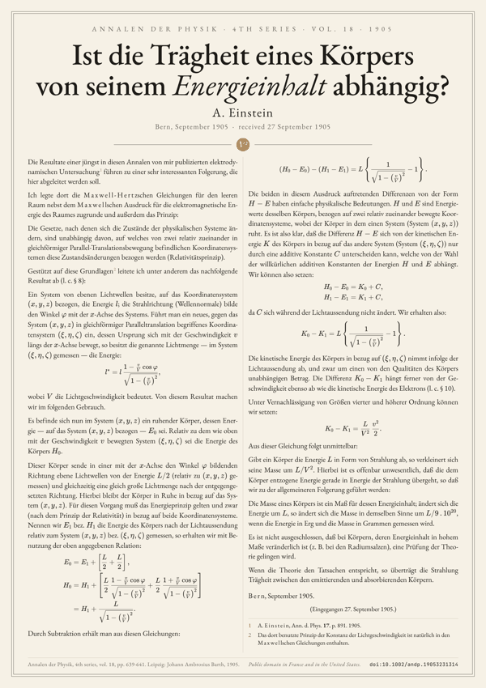</a> | [Ist die Trägheit eines Körpers von seinem Energieinhalt abhängig?](dist/physics/einstein-mass-energy-A-ivory.pdf)<br>Shows that a body emitting energy L as radiation loses mass L/V², so its mass measures its energy content.<br>[ivory](dist/physics/einstein-mass-energy-A-ivory.pdf)&nbsp;·&nbsp;[white](dist/physics/einstein-mass-energy-A-white.pdf)&nbsp;·&nbsp;[genesis](dist/physics/einstein-mass-energy-A-genesis.pdf)&nbsp;·&nbsp;[blueprint](dist/physics/einstein-mass-energy-A-blueprint.pdf) | Albert Einstein | 1905 | A3 | Public domain |
| <a href="dist/physics/einstein-electrodynamics-A-ivory.pdf">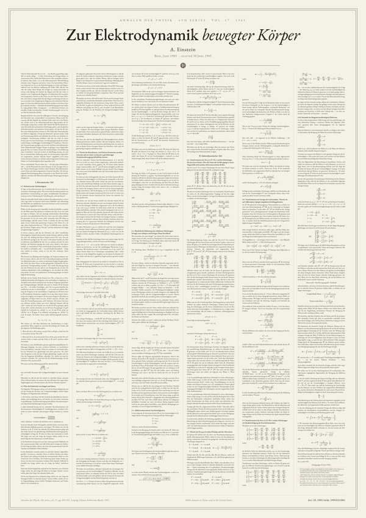</a> | [Zur Elektrodynamik bewegter Körper](dist/physics/einstein-electrodynamics-A-ivory.pdf)<br>Derives special relativity from the relativity principle and the constant speed of light, and applies it to electrodynamics and optics.<br>[ivory](dist/physics/einstein-electrodynamics-A-ivory.pdf)&nbsp;·&nbsp;[white](dist/physics/einstein-electrodynamics-A-white.pdf)&nbsp;·&nbsp;[genesis](dist/physics/einstein-electrodynamics-A-genesis.pdf)&nbsp;·&nbsp;[blueprint](dist/physics/einstein-electrodynamics-A-blueprint.pdf) | Albert Einstein | 1905 | A0 | Public domain |
| <a href="dist/physics/hubble-1929-A-ivory.pdf">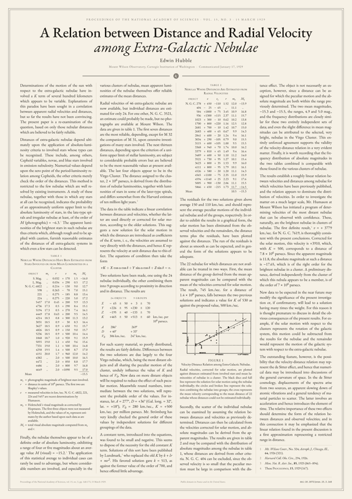</a> | [A Relation between Distance and Radial Velocity among Extra-Galactic Nebulae](dist/physics/hubble-1929-A-ivory.pdf)<br>Finds a roughly linear relation between the distances of extra-galactic nebulae and their radial velocities.<br>[ivory](dist/physics/hubble-1929-A-ivory.pdf)&nbsp;·&nbsp;[white](dist/physics/hubble-1929-A-white.pdf)&nbsp;·&nbsp;[genesis](dist/physics/hubble-1929-A-genesis.pdf)&nbsp;·&nbsp;[blueprint](dist/physics/hubble-1929-A-blueprint.pdf) | Edwin Hubble | 1929 | A3 | Public domain |

### Mathematics

| &nbsp;&nbsp;&nbsp;&nbsp;&nbsp;&nbsp;&nbsp;&nbsp;&nbsp;&nbsp;&nbsp;&nbsp;&nbsp;&nbsp;&nbsp;&nbsp;&nbsp;&nbsp;&nbsp;&nbsp;&nbsp;&nbsp;&nbsp;&nbsp; | Paper | Authors | Year | Print from | License |
|---|---|---|---|---|---|
| <a href="dist/mathematics/galois-letter-A-ivory.pdf">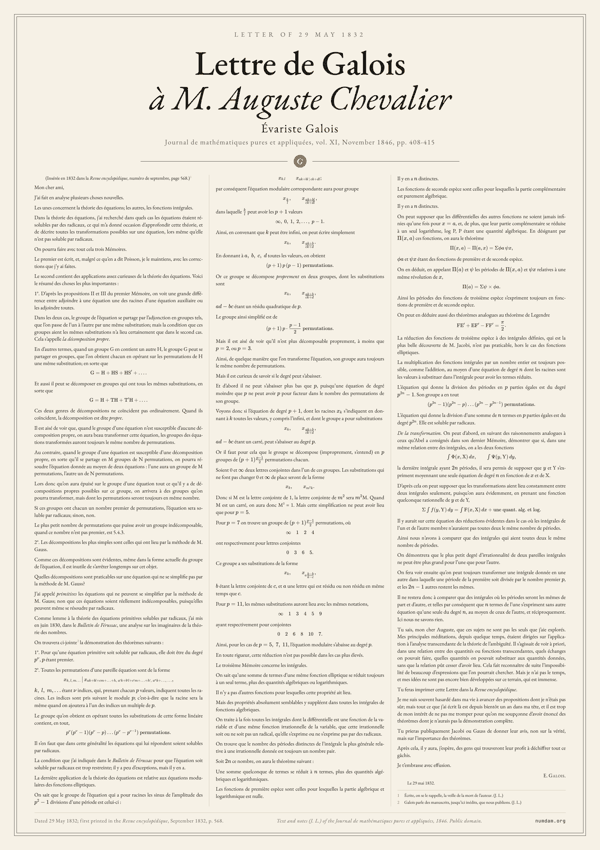</a> | [Lettre de Galois à M. Auguste Chevalier](dist/mathematics/galois-letter-A-ivory.pdf)<br>Dated 29 May 1832, two days before his death, Galois's letter summarizes his work on equations, groups and algebraic integrals.<br>[ivory](dist/mathematics/galois-letter-A-ivory.pdf)&nbsp;·&nbsp;[white](dist/mathematics/galois-letter-A-white.pdf)&nbsp;·&nbsp;[genesis](dist/mathematics/galois-letter-A-genesis.pdf)&nbsp;·&nbsp;[blueprint](dist/mathematics/galois-letter-A-blueprint.pdf) | Évariste Galois | 1832 | A2 | Public domain |
| <a href="dist/mathematics/riemann-1859-A-ivory.pdf">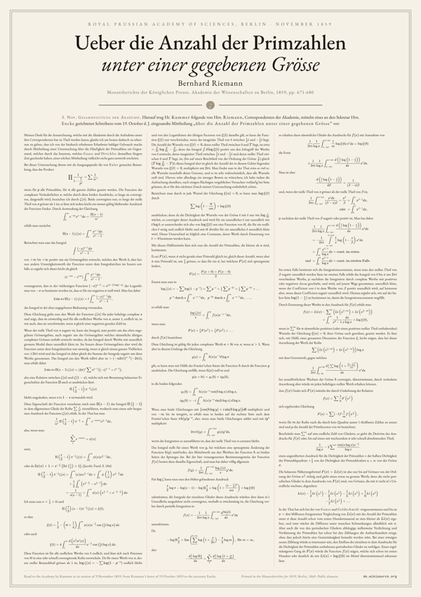</a> | [Ueber die Anzahl der Primzahlen unter einer gegebenen Grösse](dist/mathematics/riemann-1859-A-ivory.pdf)<br>Extends the zeta function to complex values, relates its zeros to the count of primes and states the Riemann hypothesis.<br>[ivory](dist/mathematics/riemann-1859-A-ivory.pdf)&nbsp;·&nbsp;[white](dist/mathematics/riemann-1859-A-white.pdf)&nbsp;·&nbsp;[genesis](dist/mathematics/riemann-1859-A-genesis.pdf)&nbsp;·&nbsp;[blueprint](dist/mathematics/riemann-1859-A-blueprint.pdf) | Bernhard Riemann | 1859 | A2 | Public domain |
| <a href="dist/mathematics/hilbert-problems-A-ivory.pdf">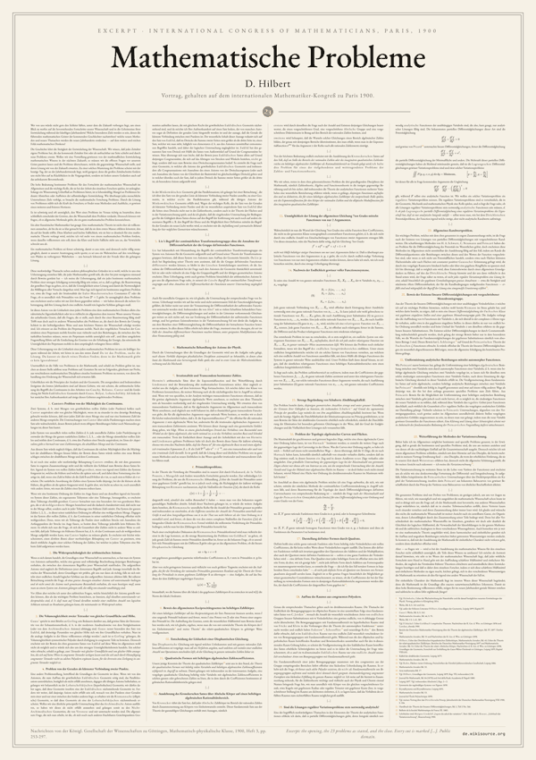</a> | [Mathematische Probleme](dist/mathematics/hilbert-problems-A-ivory.pdf)<br>Excerpt of the printed text of Hilbert's 1900 Paris lecture, which sets out 23 problems for the new century.<br>[ivory](dist/mathematics/hilbert-problems-A-ivory.pdf)&nbsp;·&nbsp;[white](dist/mathematics/hilbert-problems-A-white.pdf)&nbsp;·&nbsp;[genesis](dist/mathematics/hilbert-problems-A-genesis.pdf)&nbsp;·&nbsp;[blueprint](dist/mathematics/hilbert-problems-A-blueprint.pdf) | David Hilbert | 1900 | A1 | Public domain |

### Biology & medicine

| &nbsp;&nbsp;&nbsp;&nbsp;&nbsp;&nbsp;&nbsp;&nbsp;&nbsp;&nbsp;&nbsp;&nbsp;&nbsp;&nbsp;&nbsp;&nbsp;&nbsp;&nbsp;&nbsp;&nbsp;&nbsp;&nbsp;&nbsp;&nbsp; | Paper | Authors | Year | Print from | License |
|---|---|---|---|---|---|
| <a href="dist/life-sciences/hippocratic-oath-A-ivory.pdf">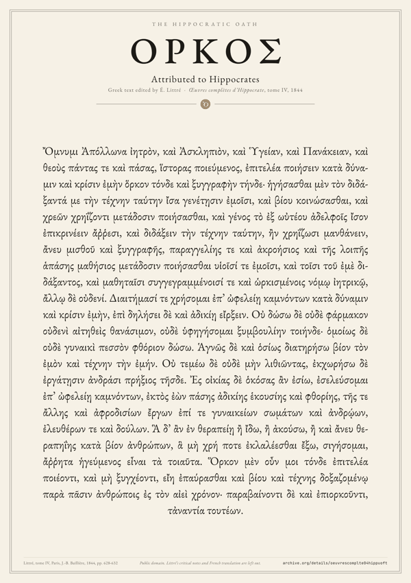</a> | [The Hippocratic Oath](dist/life-sciences/hippocratic-oath-A-ivory.pdf)<br>The physician's oath of the Hippocratic Collection, in the ancient Greek text edited by Émile Littré in 1844.<br>[ivory](dist/life-sciences/hippocratic-oath-A-ivory.pdf)&nbsp;·&nbsp;[white](dist/life-sciences/hippocratic-oath-A-white.pdf)&nbsp;·&nbsp;[genesis](dist/life-sciences/hippocratic-oath-A-genesis.pdf)&nbsp;·&nbsp;[blueprint](dist/life-sciences/hippocratic-oath-A-blueprint.pdf) | Hippocrates | c. 400 BC | A3 | Public domain |
| <a href="dist/life-sciences/darwin-wallace-1858-A-ivory.pdf">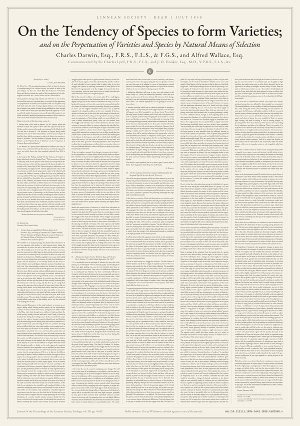</a> | [On the Tendency of Species to form Varieties; and on the Perpetuation of Varieties and Species by Natural Means of Selection](dist/life-sciences/darwin-wallace-1858-A-ivory.pdf)<br>Darwin's and Wallace's papers on natural selection, read together at the Linnean Society on 1 July 1858.<br>[ivory](dist/life-sciences/darwin-wallace-1858-A-ivory.pdf)&nbsp;·&nbsp;[white](dist/life-sciences/darwin-wallace-1858-A-white.pdf)&nbsp;·&nbsp;[genesis](dist/life-sciences/darwin-wallace-1858-A-genesis.pdf)&nbsp;·&nbsp;[blueprint](dist/life-sciences/darwin-wallace-1858-A-blueprint.pdf) | Charles Darwin, Alfred Russel Wallace | 1858 | A1 | Public domain |

### Historical data visualization

| &nbsp;&nbsp;&nbsp;&nbsp;&nbsp;&nbsp;&nbsp;&nbsp;&nbsp;&nbsp;&nbsp;&nbsp;&nbsp;&nbsp;&nbsp;&nbsp;&nbsp;&nbsp;&nbsp;&nbsp;&nbsp;&nbsp;&nbsp;&nbsp; | Paper | Authors | Year | Print from | License |
|---|---|---|---|---|---|
| <a href="dist/data-viz/snow-cholera-map-A-ivory.pdf"></a> | [John Snow: the Broad Street cholera map](dist/data-viz/snow-cholera-map-A-ivory.pdf)<br>John Snow's map of the 1854 cholera deaths around Broad Street, which pointed to a single public water pump.<br>[ivory](dist/data-viz/snow-cholera-map-A-ivory.pdf)&nbsp;·&nbsp;[white](dist/data-viz/snow-cholera-map-A-white.pdf)&nbsp;·&nbsp;[genesis](dist/data-viz/snow-cholera-map-A-genesis.pdf)&nbsp;·&nbsp;[blueprint](dist/data-viz/snow-cholera-map-A-blueprint.pdf) | John Snow | 1854 | A3 | Public domain (map); notice: MIT |
| <a href="dist/data-viz/nightingale-rose-A-ivory.pdf">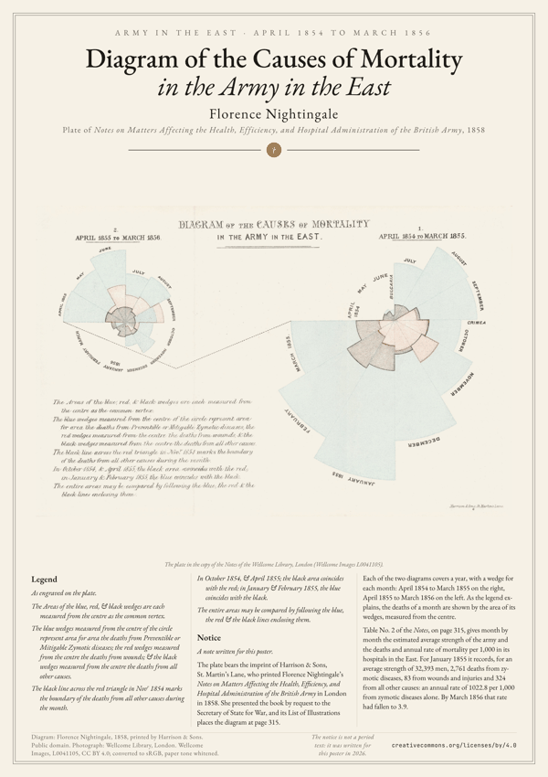</a> | [Florence Nightingale: Diagram of the Causes of Mortality in the Army in the East](dist/data-viz/nightingale-rose-A-ivory.pdf)<br>Florence Nightingale's 1858 diagram of the British army's monthly deaths in the East, from disease, wounds and other causes.<br>[ivory](dist/data-viz/nightingale-rose-A-ivory.pdf)&nbsp;·&nbsp;[white](dist/data-viz/nightingale-rose-A-white.pdf)&nbsp;·&nbsp;[genesis](dist/data-viz/nightingale-rose-A-genesis.pdf)&nbsp;·&nbsp;[blueprint](dist/data-viz/nightingale-rose-A-blueprint.pdf) | Florence Nightingale | 1858 | A3 | Public domain (diagram); photograph: CC BY 4.0; notice: MIT |
| <a href="dist/data-viz/mendeleev-1869-A-ivory.pdf">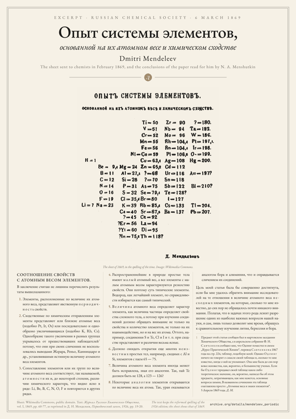</a> | [Опыт системы элементов, основанной на их атомном весе и химическом сходстве](dist/data-viz/mendeleev-1869-A-ivory.pdf)<br>Mendeleev's system of the elements by atomic weight, sent to chemists in February 1869, with the conclusions of his paper.<br>[ivory](dist/data-viz/mendeleev-1869-A-ivory.pdf)&nbsp;·&nbsp;[white](dist/data-viz/mendeleev-1869-A-white.pdf)&nbsp;·&nbsp;[genesis](dist/data-viz/mendeleev-1869-A-genesis.pdf)&nbsp;·&nbsp;[blueprint](dist/data-viz/mendeleev-1869-A-blueprint.pdf) | Dmitri Mendeleev | 1869 | A3 | Public domain |

### History & philosophy

| &nbsp;&nbsp;&nbsp;&nbsp;&nbsp;&nbsp;&nbsp;&nbsp;&nbsp;&nbsp;&nbsp;&nbsp;&nbsp;&nbsp;&nbsp;&nbsp;&nbsp;&nbsp;&nbsp;&nbsp;&nbsp;&nbsp;&nbsp;&nbsp; | Paper | Authors | Year | Print from | License |
|---|---|---|---|---|---|
| <a href="dist/history/luther-95-theses-A-ivory.pdf"></a> | [Disputatio pro declaratione virtutis indulgentiarum](dist/history/luther-95-theses-A-ivory.pdf)<br>Luther's ninety-five Latin theses against the preaching of indulgences, proposed for a disputation at Wittenberg in 1517.<br>[ivory](dist/history/luther-95-theses-A-ivory.pdf)&nbsp;·&nbsp;[white](dist/history/luther-95-theses-A-white.pdf)&nbsp;·&nbsp;[genesis](dist/history/luther-95-theses-A-genesis.pdf)&nbsp;·&nbsp;[blueprint](dist/history/luther-95-theses-A-blueprint.pdf) | Martin Luther | 1517 | A3 | Public domain |
| <a href="dist/history/us-declaration-of-independence-A-ivory.pdf">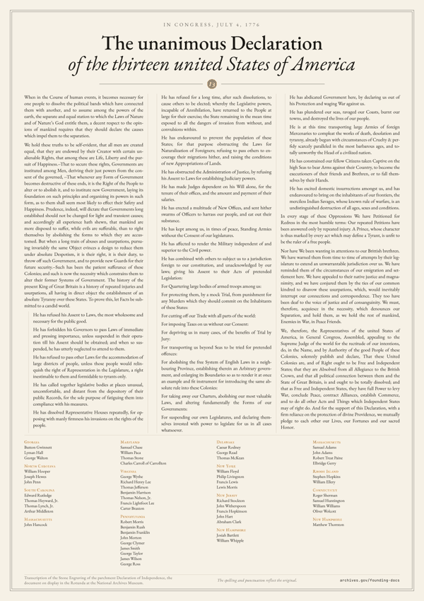</a> | [The Declaration of Independence](dist/history/us-declaration-of-independence-A-ivory.pdf)<br>The Continental Congress declares the thirteen colonies independent of Great Britain and lists their grievances against the King.<br>[ivory](dist/history/us-declaration-of-independence-A-ivory.pdf)&nbsp;·&nbsp;[white](dist/history/us-declaration-of-independence-A-white.pdf)&nbsp;·&nbsp;[genesis](dist/history/us-declaration-of-independence-A-genesis.pdf)&nbsp;·&nbsp;[blueprint](dist/history/us-declaration-of-independence-A-blueprint.pdf) | Thomas Jefferson, Second Continental Congress | 1776 | A3 | Public domain |
| <a href="dist/history/kant-aufklaerung-A-ivory.pdf"></a> | [Beantwortung der Frage: Was ist Aufklärung?](dist/history/kant-aufklaerung-A-ivory.pdf)<br>Kant's essay defining enlightenment as man's emergence from self-incurred immaturity and defending the free public use of reason.<br>[ivory](dist/history/kant-aufklaerung-A-ivory.pdf)&nbsp;·&nbsp;[white](dist/history/kant-aufklaerung-A-white.pdf)&nbsp;·&nbsp;[genesis](dist/history/kant-aufklaerung-A-genesis.pdf)&nbsp;·&nbsp;[blueprint](dist/history/kant-aufklaerung-A-blueprint.pdf) | Immanuel Kant | 1784 | A3 | Public domain |
| <a href="dist/history/declaration-droits-homme-A-ivory.pdf"></a> | [Déclaration des Droits de l'Homme et du Citoyen de 1789](dist/history/declaration-droits-homme-A-ivory.pdf)<br>The preamble and seventeen articles of rights adopted by the French National Assembly in August 1789.<br>[ivory](dist/history/declaration-droits-homme-A-ivory.pdf)&nbsp;·&nbsp;[white](dist/history/declaration-droits-homme-A-white.pdf)&nbsp;·&nbsp;[genesis](dist/history/declaration-droits-homme-A-genesis.pdf)&nbsp;·&nbsp;[blueprint](dist/history/declaration-droits-homme-A-blueprint.pdf) | Assemblée nationale | 1789 | A3 | Public domain |
| <a href="dist/history/gettysburg-address-A-ivory.pdf">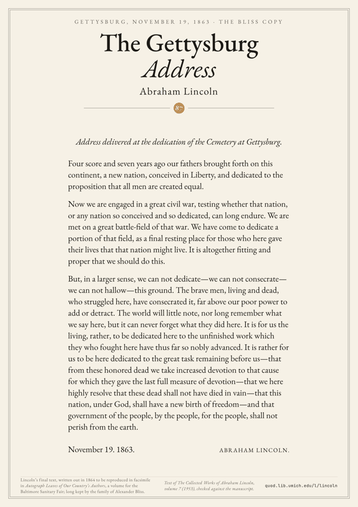</a> | [The Gettysburg Address](dist/history/gettysburg-address-A-ivory.pdf)<br>Lincoln's address at the dedication of the Cemetery at Gettysburg, in the final text he wrote out in 1864.<br>[ivory](dist/history/gettysburg-address-A-ivory.pdf)&nbsp;·&nbsp;[white](dist/history/gettysburg-address-A-white.pdf)&nbsp;·&nbsp;[genesis](dist/history/gettysburg-address-A-genesis.pdf)&nbsp;·&nbsp;[blueprint](dist/history/gettysburg-address-A-blueprint.pdf) | Abraham Lincoln | 1863 | A3 | Public domain |
| <a href="dist/history/kennedy-moon-speech-A-ivory.pdf">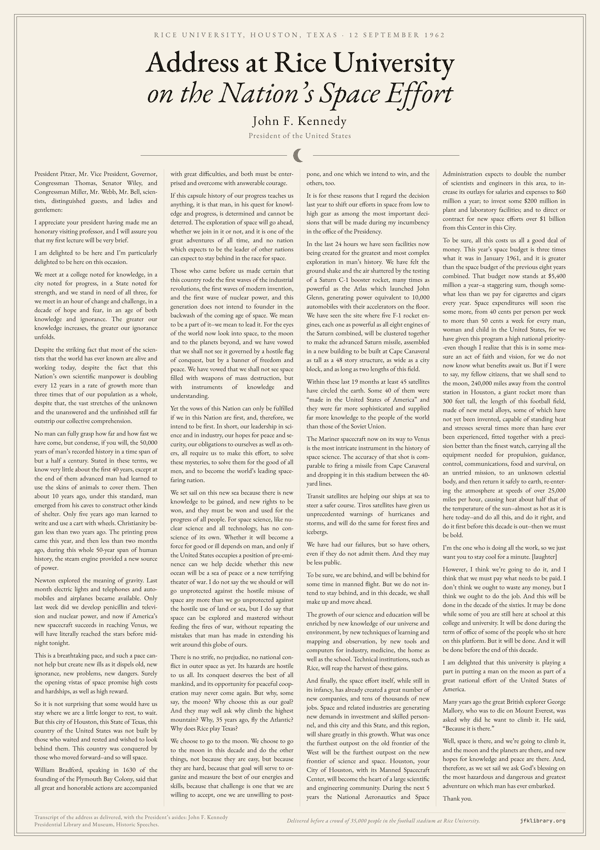</a> | [Address at Rice University on the Nation's Space Effort](dist/history/kennedy-moon-speech-A-ivory.pdf)<br>President Kennedy explains why the United States chooses to go to the Moon in this decade.<br>[ivory](dist/history/kennedy-moon-speech-A-ivory.pdf)&nbsp;·&nbsp;[white](dist/history/kennedy-moon-speech-A-white.pdf)&nbsp;·&nbsp;[genesis](dist/history/kennedy-moon-speech-A-genesis.pdf)&nbsp;·&nbsp;[blueprint](dist/history/kennedy-moon-speech-A-blueprint.pdf) | John F. Kennedy | 1962 | A3 | Public domain (U.S. Government work) |

## Coming soon

Texts that wait for a license allowing their redistribution; [PENDING.md](PENDING.md) says what is missing.

- A Cypherpunk's Manifesto (Eric Hughes, 1993)
- Hashcash: A Denial of Service Counter-Measure (Adam Back, 2002)
- b-money (Wei Dai, 1998)
- Bit Gold (Nick Szabo, 2005)
- Bitcoin v0.1 released (Satoshi Nakamoto, 2009)
- Mimblewimble (Tom Elvis Jedusor, 2016)
- Apollo 11: the master ignition routine of Luminary 099 (MIT Instrumentation Laboratory, 1969)
- Computing Machinery and Intelligence (Alan Turing, 1950)
- The Conscience of a Hacker (The Mentor, 1986)
- What would you like to see most in minix? (Linus Torvalds, 1991)

<!-- catalog:end -->

## Download

Every PDF is in [`dist/<category>/`](dist), named `<paper>-<format>-<theme>.pdf`, and the [latest release](https://github.com/vodhash/one-page-papers/releases/latest) has them all, with one zip per category. Text, equations and figures are all vector, so they print sharp at any size.

| Format | File size | Prints at |
|---|---|---|
| `A` | 59.4 × 84.1 cm (A1) | A0, A1, A2, A3 (same ratio, just scale) |
| `50x70` | 50 × 70 cm | 50 × 70 cm |
| `60x80` | 60 × 80 cm | 60 × 80 cm |

Themes: `ivory` (warm paper), `white` (pure white), `genesis` (dark, bitcoin orange), `blueprint` (navy). The catalog shows each poster in the first of its themes, and links its PDF in each of them.

**Print tips.** Print a poster at its *Print from* size or larger: below it, its body text falls under 8 pt (`make check` prints the body size of every paper at every format). Use matte paper, 200 g/m² or heavier. Dark themes are best printed by a professional lab.

## Build

Requires Node.js, Python 3 and Make. `make deps` uses [uv](https://docs.astral.sh/uv/) when it is installed, and the standard `venv` module otherwise (on Debian and Ubuntu: `apt install python3-venv`).

```bash
make deps      # node_modules and .venv at the pinned versions, plus headless Chromium
make           # every paper × format × theme into dist/ and docs/, then the catalog of this README
make bitcoin   # a single paper, by its slug
make internet  # every paper of a category
make readme    # the catalog of this README, from the meta.yaml files and PENDING.md
make check     # fit every poster, compare it with dist/ and docs/, check the catalog; writes nothing
.venv/bin/python engine/build.py rfc-1925 --formats A --themes genesis
```

Builds are deterministic, but for two differences that do not show: in about one print in twenty of a page full of formulas, Chromium sets one run of glyphs on a baseline rounded to a whole pixel, and the last digits of some numbers, such as the matrix of a rotation, depend on the processor. So a PDF is only rewritten when it differs from the one in `dist/` by more than that, and a commit only carries the PDFs and previews of the posters that changed. Pushing a `v*` tag makes GitHub Actions build every poster again and attach the PDFs to a release, with one zip per category. Versions are pinned (`package-lock.json`, and `requirements.txt`, whose Playwright version fixes the Chromium build), and Chromium lays text out without the local font hinting settings, to keep the layout independent of the machine.

`make check` also runs on GitHub Actions for every push and pull request. It fails when a poster overflows its page, when it still fits at the largest allowed body size, when a character is drawn with a system font, when `min_print` does not match the body size, when a PDF of `dist/` differs from a fresh build (beyond those differences) or a preview is missing from `docs/`, when either holds a file that no paper makes, or when the catalog of this README is out of date.

## Add a paper

A paper is a folder `papers/<category>/<slug>/`. The slug names its PDFs and its `make` target, so it is unique across categories. The categories are the folders of `papers/`: `crypto`, `computing`, `internet`, `software`, `manifestos`, `physics`, `mathematics`, `life-sciences`, `data-viz`, `patents` and `history`; `engine/papers.py` gives their titles in the catalog.

| File | Purpose |
|---|---|
| `meta.yaml` | title, source, license, header, footer and layout (see existing papers) |
| `text.md` | the text, in the small Markdown dialect documented in `engine/markdown.py` |
| `figures.py` | optional: `FIGS = {"name": fn}`, each `fn()` returns an SVG string built with `engine/svg.py` |
| images | optional: PNG, JPEG, GIF, WebP or SVG files for `::: image`, embedded in the PDF |
| `style.css` | optional: paper-specific CSS; a rule on `:root[data-theme=genesis]` applies to one theme only |

`text.md` is plain Markdown paragraphs and lists, plus these constructs (all listed in `engine/markdown.py`):

| Syntax | Effect |
|---|---|
| `## Title`, `### Title`, `#### Title` | headings; with `numbered: true` they are numbered 1., 1.1., 1.1.1., and a title that starts with a section number such as `3.1.` or `2.1` gets the same styling |
| `::: figure <name>` | an SVG figure from `figures.py` |
| `::: image <file> [caption="…"] [width=N%] [on_dark=plate\|invert] [on_light=multiply]` | an image from the folder of the paper, embedded in the page, `width` of its column (default 100%). On the dark themes, `plate` (default) keeps it on a light card and `invert` turns its white into the paper and its black into the ink (for line drawings). On the light themes, `on_light=multiply` melts its white into the paper, for scans with a white background |
| `::: wide` … `:::` | a block across all the columns, holding any other syntax (code, math, figures, HTML) |
| `::: wide cols=N` … `:::` | the `##` sections of the block side by side, one per left-aligned cell of an N-column grid (see `papers/rfc-1925`) |
| `$$ … $$` | display math, rendered with KaTeX |
| `\( … \)` | math within a line of text, rendered with KaTeX |
| `(1)`, `(1a)` | labelled items; a sub-item such as `(1a)` stays in the same column as its item |
| `[^label]`, `[^label]: text` | footnote call and definition; notes are numbered in order of first call and listed at the end of the text |
| `<tag …>` | raw HTML, passed through |

Mistakes, such as an unclosed block or a footnote that is never defined, are reported with their line number.

In `meta.yaml`, unknown keys are rejected, and these keys are required:

| Key | Content |
|---|---|
| `title`, `authors`, `year` | title, list of authors, and year of the text: a number, negative before the common era, or a text such as `c. 400 BC` |
| `summary` | one factual sentence of 20 words at most, shown under the title in the catalog |
| `min_print` | the smallest of A3, A2, A1 and A0 at which the body prints at 8 pt or more; the build computes it and fails when it differs |
| `source` | `url`, `retrieved` (a date) and `edition` of the primary source or reference edition of the text, with every difference between that source and the poster |
| `license` | `text`, short, for the catalog, then either `notice`, the license or permission word for word, or `basis`, why the text is in the public domain in France and in the United States; `holder` and `note` are optional |

The optional keys:

| Key | Default | Effect |
|---|---|---|
| `lang` | `en` | language of the text, for hyphenation (English, French, German and many more) |
| `layout` | `columns` | `centered` suits short texts: one column unless `columns` says otherwise, vertically centered on the page. `hero` puts the first `::: image` of the text across the top of the page, and the text in columns below |
| `hero_height` | 50 | share of the page height given to the hero image, in % |
| `themes` | all | the themes this paper is printed in, for instance `[white, genesis]` |
| `columns` | 4, or 1 when centered | number of text columns |
| `font_range` | `[8, 40]` | bounds of the search for the body size, in pt; the build warns when the text still fits at the maximum |
| `max_font` | none | hard cap on the body size, in pt, so that a short text does not end up in giant type; reaching it is expected |
| `numbered` | `false` | number the `##` sections |
| `title_html`, `title_size`, `header_scale` | `title`, `76pt`, `1` | title with HTML markup, its size, and the scale of the other header lines |
| `kicker`, `author`, `byline`, `emblem`, `abstract`, `abstract_label`, `footer` | | header and footer content (see existing papers) |

Every text comes from a primary source or a reference edition, never from memory, and its words are counted against that source; an excerpt says so on the poster. A text is only added when it is in the public domain in France and in the United States, or when a license or permission allows its redistribution, in which case the poster keeps the notices that the license requires. The other texts wait in [PENDING.md](PENDING.md), which says what is missing for each, and are listed under *Coming soon*.

Every character must come from the bundled fonts (EB Garamond, JetBrains Mono, KaTeX), since a system font would make the PDF depend on the machine. `make check` names the characters that fall back; `papers/crypto/bitcoin/style.css` shows the fix, taking ₿ from JetBrains Mono.

## How it works

`engine/build.py` finds the papers in `papers/<category>/<slug>/`, parses the Markdown, pre-renders math with KaTeX, injects SVG figures into an HTML template, then drives headless Chromium: for each format it waits for the fonts, binary-searches the largest body size that fits in whole hundredths of a point, settles it on pages that have laid out nothing else, so that it does not depend on what Chromium laid out before, prints a PDF at a fixed 594 mm design width, and scales it to the target format with pypdf, keeping the page vector and its content losslessly compressed. Images are embedded in the page as data URIs, so every PDF is self-contained. Themes are sets of CSS variables in `engine/themes.py`. `engine/readme.py` writes the catalog of this README from the `meta.yaml` files and PENDING.md.

## Origin

It started with a simple wish: to frame the Bitcoin whitepaper and hang
it in my office. A few one-page versions already existed online, but none
matched what I had in mind, so I typeset my own: the full text, the
equations and the C code, with every figure redrawn as vector graphics
and the genesis block hash in the footer.

The first version was a single poster, briefly published as
`one-page-satoshi`. Once it worked, the obvious question followed: which
other texts deserve the same treatment? A list quickly grew, from early
cryptocurrency papers to RFCs, manifestos and founding texts of science,
and it became clear that the typesetting engine was the real project.
The Bitcoin-specific code was split into a reusable engine and per-paper
content, and the project became `one-page-papers`.

Each new poster has pushed the engine a little further. RFC 1925 brought
short texts in large type, the Zen of Python centred layouts, RFC 791
full-width diagrams, and John Snow's cholera map images and hero layouts.
Some texts taught the limits of the idea: Turing's *On Computable
Numbers* runs to 36 pages and cannot fit legibly on a single sheet, so
not every classic makes the cut.

## License

Engine code: MIT. Each paper keeps its own license, recorded in its `meta.yaml` and summed up in the catalog above; see [`LICENSE`](LICENSE).
