# one-page-papers

**Foundational papers, typeset on a single poster. Print them, frame them, hang them.**

Browse the collection at **[vodhash.github.io/one-page-papers](https://vodhash.github.io/one-page-papers/)**.

Each paper is laid out in full on one page: every section, equation, code listing, table and reference, with figures redrawn as vector graphics. The body size is computed automatically so the text fills the page exactly.

## Papers

<!-- catalog:start -->

91 posters in 13 categories. Each one comes in 4 themes, shown here with *Bitcoin: A Peer-to-Peer Electronic Cash System*, and in 3 formats (see [Download](#download)).

| ivory | white | genesis | blueprint |
|:-:|:-:|:-:|:-:|
| <a href="dist/crypto/bitcoin-A-ivory.pdf"></a> | <a href="dist/crypto/bitcoin-A-white.pdf"></a> | <a href="dist/crypto/bitcoin-A-genesis.pdf"></a> | <a href="dist/crypto/bitcoin-A-blueprint.pdf"></a> |

A click on a poster opens its PDF in the A format and in its first theme, and the links under its summary open the other themes. *Print from* is the smallest A size at which its body text is at least 8 pt.

### Cryptocurrency

| &nbsp;&nbsp;&nbsp;&nbsp;&nbsp;&nbsp;&nbsp;&nbsp;&nbsp;&nbsp;&nbsp;&nbsp;&nbsp;&nbsp;&nbsp;&nbsp;&nbsp;&nbsp;&nbsp;&nbsp;&nbsp;&nbsp;&nbsp;&nbsp; | Paper | Authors | Year | Print from | License |
|---|---|---|---|---|---|
| <a href="dist/crypto/aes-A-ivory.pdf">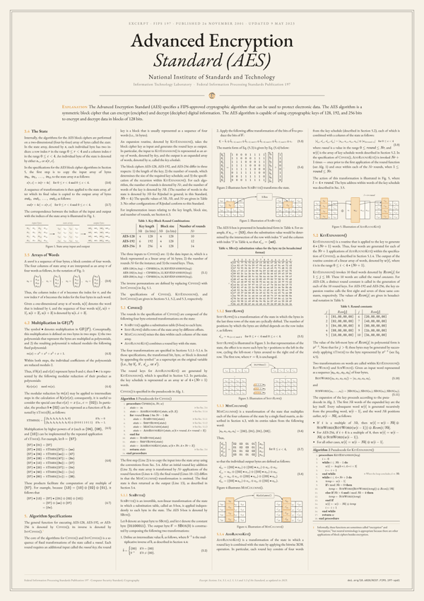</a> | [Advanced Encryption Standard (AES)](dist/crypto/aes-A-ivory.pdf)<br>Specifies the AES block cipher: the state, its four round transformations with the S-box, and the key expansion.<br>[ivory](dist/crypto/aes-A-ivory.pdf)&nbsp;·&nbsp;[white](dist/crypto/aes-A-white.pdf)&nbsp;·&nbsp;[genesis](dist/crypto/aes-A-genesis.pdf)&nbsp;·&nbsp;[blueprint](dist/crypto/aes-A-blueprint.pdf) | National Institute of Standards and Technology | 2001 | A2 | Public domain (U.S. Government work) |
| <a href="dist/crypto/bitcoin-A-ivory.pdf"></a> | [Bitcoin: A Peer-to-Peer Electronic Cash System](dist/crypto/bitcoin-A-ivory.pdf)<br>Proposes a peer-to-peer electronic cash system that prevents double-spending with a proof-of-work chain of timestamped blocks.<br>[ivory](dist/crypto/bitcoin-A-ivory.pdf)&nbsp;·&nbsp;[white](dist/crypto/bitcoin-A-white.pdf)&nbsp;·&nbsp;[genesis](dist/crypto/bitcoin-A-genesis.pdf)&nbsp;·&nbsp;[blueprint](dist/crypto/bitcoin-A-blueprint.pdf) | Satoshi Nakamoto | 2008 | A2 | MIT |
| <a href="dist/crypto/genesis-block-A-ivory.pdf">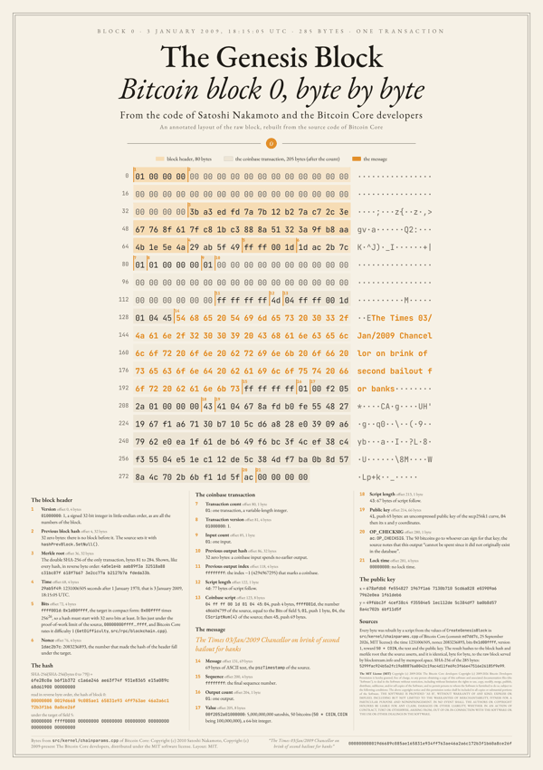</a> | [The Genesis Block](dist/crypto/genesis-block-A-ivory.pdf)<br>The 285 bytes of the first Bitcoin block, in hexadecimal, with every field of its header and coinbase transaction labelled.<br>[ivory](dist/crypto/genesis-block-A-ivory.pdf)&nbsp;·&nbsp;[white](dist/crypto/genesis-block-A-white.pdf)&nbsp;·&nbsp;[genesis](dist/crypto/genesis-block-A-genesis.pdf)&nbsp;·&nbsp;[blueprint](dist/crypto/genesis-block-A-blueprint.pdf) | Satoshi Nakamoto | 2009 | A2 | MIT (compilation); data: Bitcoin Core (MIT) |
| <a href="dist/crypto/peercoin-A-ivory.pdf"></a> | [PPCoin: Peer-to-Peer Crypto-Currency with Proof-of-Stake](dist/crypto/peercoin-A-ivory.pdf)<br>Proposes a crypto-currency derived from Bitcoin in which proof-of-stake, based on coin age, provides most of the network security.<br>[ivory](dist/crypto/peercoin-A-ivory.pdf)&nbsp;·&nbsp;[white](dist/crypto/peercoin-A-white.pdf)&nbsp;·&nbsp;[genesis](dist/crypto/peercoin-A-genesis.pdf)&nbsp;·&nbsp;[blueprint](dist/crypto/peercoin-A-blueprint.pdf) | Sunny King, Scott Nadal | 2012 | A3 | CC BY-ND 4.0 |
| <a href="dist/crypto/bip-39-A-ivory.pdf"></a> | [BIP 39: Mnemonic code for generating deterministic keys](dist/crypto/bip-39-A-ivory.pdf)<br>Encodes entropy as a sentence of words from a 2048-word list, shown in full, then derives a binary seed.<br>[ivory](dist/crypto/bip-39-A-ivory.pdf)&nbsp;·&nbsp;[white](dist/crypto/bip-39-A-white.pdf)&nbsp;·&nbsp;[genesis](dist/crypto/bip-39-A-genesis.pdf)&nbsp;·&nbsp;[blueprint](dist/crypto/bip-39-A-blueprint.pdf) | Marek Palatinus, Pavol Rusnak, Aaron Voisine, Sean Bowe | 2013 | A2 | MIT |
| <a href="dist/crypto/ethereum-A-ivory.pdf"></a> | [Ethereum: A Next-Generation Smart Contract and Decentralized Application Platform](dist/crypto/ethereum-A-ivory.pdf)<br>Proposes Ethereum, a blockchain with a built-in Turing-complete language for contracts that encode arbitrary state transition functions.<br>[ivory](dist/crypto/ethereum-A-ivory.pdf)&nbsp;·&nbsp;[white](dist/crypto/ethereum-A-white.pdf)&nbsp;·&nbsp;[genesis](dist/crypto/ethereum-A-genesis.pdf)&nbsp;·&nbsp;[blueprint](dist/crypto/ethereum-A-blueprint.pdf) | Vitalik Buterin | 2014 | A0 | CC BY 4.0 (text, figures); MIT (code) |
| <a href="dist/crypto/sha-256-A-ivory.pdf">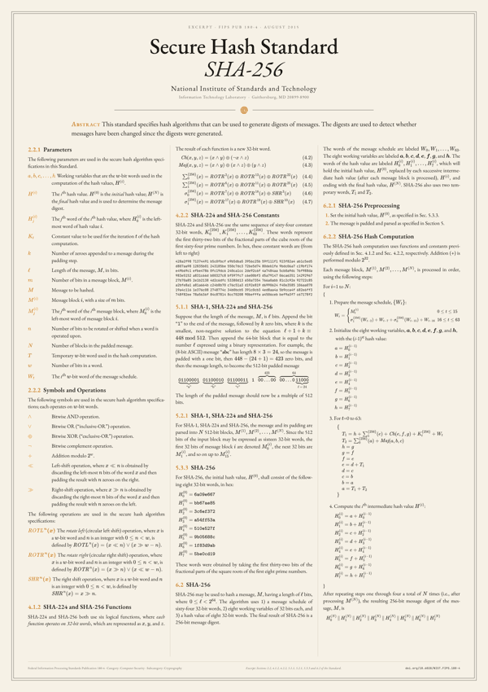</a> | [Secure Hash Standard (SHS): SHA-256](dist/crypto/sha-256-A-ivory.pdf)<br>Specifies SHA-256: its functions, constants, message padding and parsing, initial hash value and hash computation.<br>[ivory](dist/crypto/sha-256-A-ivory.pdf)&nbsp;·&nbsp;[white](dist/crypto/sha-256-A-white.pdf)&nbsp;·&nbsp;[genesis](dist/crypto/sha-256-A-genesis.pdf)&nbsp;·&nbsp;[blueprint](dist/crypto/sha-256-A-blueprint.pdf) | National Institute of Standards and Technology | 2015 | A3 | Public domain (U.S. Government work) |
| <a href="dist/crypto/bip-173-A-ivory.pdf">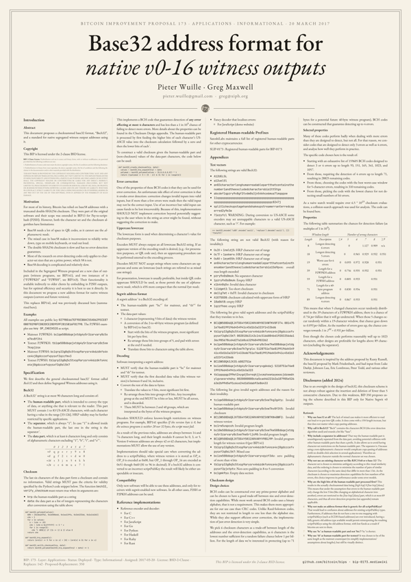</a> | [BIP 173: Base32 address format for native v0-16 witness outputs](dist/crypto/bip-173-A-ivory.pdf)<br>Defines Bech32, a checksummed base32 format, and the segwit addresses built on it, starting with bc1.<br>[ivory](dist/crypto/bip-173-A-ivory.pdf)&nbsp;·&nbsp;[white](dist/crypto/bip-173-A-white.pdf)&nbsp;·&nbsp;[genesis](dist/crypto/bip-173-A-genesis.pdf)&nbsp;·&nbsp;[blueprint](dist/crypto/bip-173-A-blueprint.pdf) | Pieter Wuille, Greg Maxwell | 2017 | A2 | BSD-2-Clause |
| <a href="dist/crypto/bip-340-A-ivory.pdf">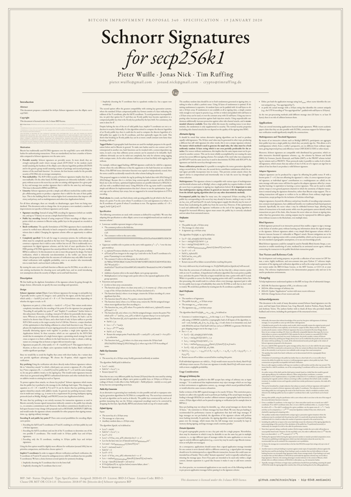</a> | [BIP 340: Schnorr Signatures for secp256k1](dist/crypto/bip-340-A-ivory.pdf)<br>Specifies 64-byte Schnorr signatures and 32-byte public keys over the secp256k1 curve, with batch verification.<br>[ivory](dist/crypto/bip-340-A-ivory.pdf)&nbsp;·&nbsp;[white](dist/crypto/bip-340-A-white.pdf)&nbsp;·&nbsp;[genesis](dist/crypto/bip-340-A-genesis.pdf)&nbsp;·&nbsp;[blueprint](dist/crypto/bip-340-A-blueprint.pdf) | Pieter Wuille, Jonas Nick, Tim Ruffing | 2020 | A1 | BSD-2-Clause |
| <a href="dist/crypto/nostr-nip-01-A-ivory.pdf">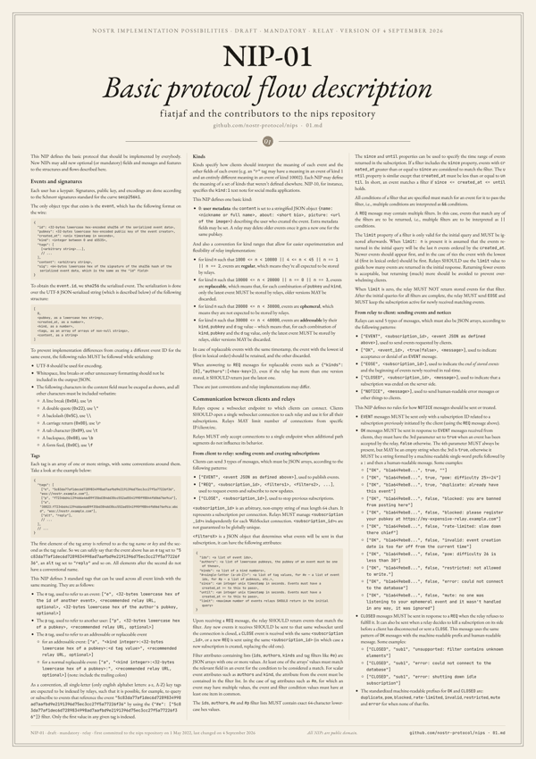</a> | [NIP-01: Basic protocol flow description](dist/crypto/nostr-nip-01-A-ivory.pdf)<br>Defines the Nostr event, its signed JSON serialization, tags, kinds, and the messages between clients and relays.<br>[ivory](dist/crypto/nostr-nip-01-A-ivory.pdf)&nbsp;·&nbsp;[white](dist/crypto/nostr-nip-01-A-white.pdf)&nbsp;·&nbsp;[genesis](dist/crypto/nostr-nip-01-A-genesis.pdf)&nbsp;·&nbsp;[blueprint](dist/crypto/nostr-nip-01-A-blueprint.pdf) | fiatjaf | 2022 | A2 | Public domain dedication |

### Computing pioneers

| &nbsp;&nbsp;&nbsp;&nbsp;&nbsp;&nbsp;&nbsp;&nbsp;&nbsp;&nbsp;&nbsp;&nbsp;&nbsp;&nbsp;&nbsp;&nbsp;&nbsp;&nbsp;&nbsp;&nbsp;&nbsp;&nbsp;&nbsp;&nbsp; | Paper | Authors | Year | Print from | License |
|---|---|---|---|---|---|
| <a href="dist/computing/leibniz-binary-A-ivory.pdf">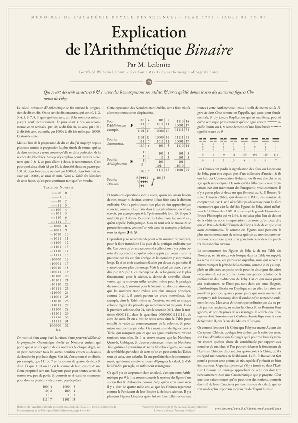</a> | [Leibniz: Explication de l'arithmétique binaire](dist/computing/leibniz-binary-A-ivory.pdf)<br>Leibniz's 1703 memoir presenting base-two arithmetic with 0 and 1, its tables, and the Fohy trigrams.<br>[ivory](dist/computing/leibniz-binary-A-ivory.pdf)&nbsp;·&nbsp;[white](dist/computing/leibniz-binary-A-white.pdf)&nbsp;·&nbsp;[genesis](dist/computing/leibniz-binary-A-genesis.pdf)&nbsp;·&nbsp;[blueprint](dist/computing/leibniz-binary-A-blueprint.pdf) | Gottfried Wilhelm Leibniz | 1703 | A3 | Public domain |
| <a href="dist/computing/lovelace-note-g-A-ivory.pdf"></a> | [Sketch of the Analytical Engine: Note G](dist/computing/lovelace-note-g-A-ivory.pdf)<br>Lovelace's last note on the Analytical Engine: its limits, and how it would compute the Bernoulli numbers.<br>[ivory](dist/computing/lovelace-note-g-A-ivory.pdf)&nbsp;·&nbsp;[white](dist/computing/lovelace-note-g-A-white.pdf)&nbsp;·&nbsp;[genesis](dist/computing/lovelace-note-g-A-genesis.pdf)&nbsp;·&nbsp;[blueprint](dist/computing/lovelace-note-g-A-blueprint.pdf) | Ada Lovelace | 1843 | A1 | Public domain |
| <a href="dist/computing/rfc-20-ascii-A-ivory.pdf">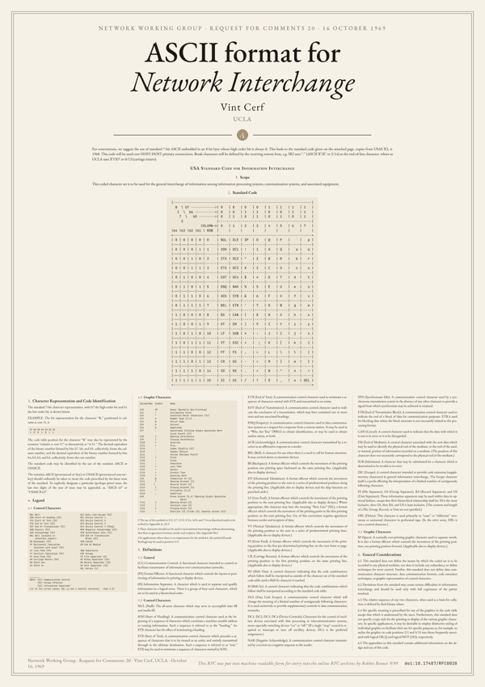</a> | [RFC 20: ASCII format for Network Interchange](dist/computing/rfc-20-ascii-A-ivory.pdf)<br>Vint Cerf's 1969 proposal to use 7-bit ASCII on the ARPA network, with the code table of the USA standard.<br>[ivory](dist/computing/rfc-20-ascii-A-ivory.pdf)&nbsp;·&nbsp;[white](dist/computing/rfc-20-ascii-A-white.pdf)&nbsp;·&nbsp;[genesis](dist/computing/rfc-20-ascii-A-genesis.pdf)&nbsp;·&nbsp;[blueprint](dist/computing/rfc-20-ascii-A-blueprint.pdf) | Vint Cerf | 1969 | A2 | Free reproduction (RFC Editor) |

### Internet & networking

| &nbsp;&nbsp;&nbsp;&nbsp;&nbsp;&nbsp;&nbsp;&nbsp;&nbsp;&nbsp;&nbsp;&nbsp;&nbsp;&nbsp;&nbsp;&nbsp;&nbsp;&nbsp;&nbsp;&nbsp;&nbsp;&nbsp;&nbsp;&nbsp; | Paper | Authors | Year | Print from | License |
|---|---|---|---|---|---|
| <a href="dist/internet/rfc-1-A-ivory.pdf"></a> | [RFC 1: Host Software](dist/internet/rfc-1-A-ivory.pdf)<br>The first Request for Comments: the planned host software of the ARPA Network and its first experiments.<br>[ivory](dist/internet/rfc-1-A-ivory.pdf)&nbsp;·&nbsp;[white](dist/internet/rfc-1-A-white.pdf)&nbsp;·&nbsp;[genesis](dist/internet/rfc-1-A-genesis.pdf)&nbsp;·&nbsp;[blueprint](dist/internet/rfc-1-A-blueprint.pdf) | Steve Crocker | 1969 | A2 | Free reproduction (RFC Editor) |
| <a href="dist/internet/rfc-791-A-ivory.pdf"></a> | [RFC 791: Internet Protocol](dist/internet/rfc-791-A-ivory.pdf)<br>Section 3.1 of the Internet Protocol specification, which defines each field of the IPv4 header and its options.<br>[ivory](dist/internet/rfc-791-A-ivory.pdf)&nbsp;·&nbsp;[white](dist/internet/rfc-791-A-white.pdf)&nbsp;·&nbsp;[genesis](dist/internet/rfc-791-A-genesis.pdf)&nbsp;·&nbsp;[blueprint](dist/internet/rfc-791-A-blueprint.pdf) | Jon Postel | 1981 | A1 | Free reproduction (RFC Editor) |
| <a href="dist/internet/rfc-793-tcp-A-ivory.pdf">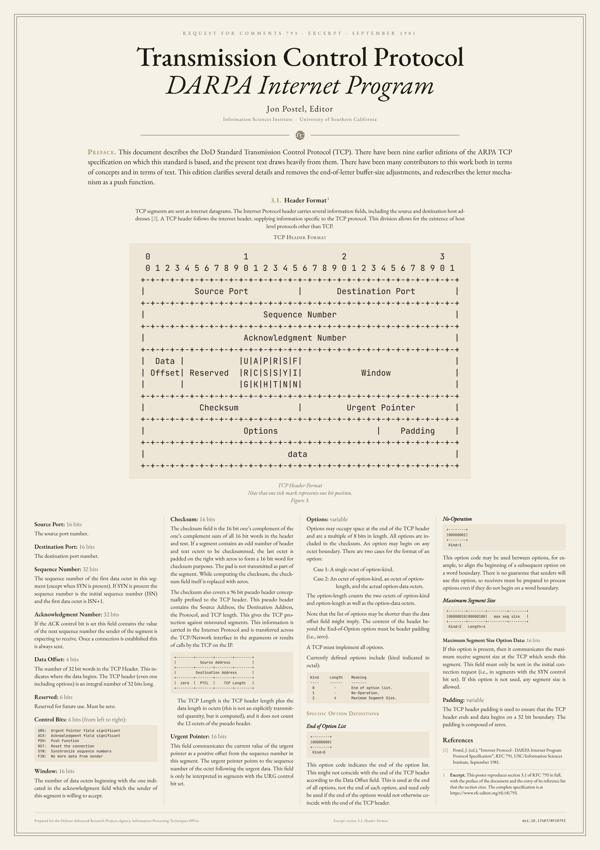</a> | [RFC 793: Transmission Control Protocol](dist/internet/rfc-793-tcp-A-ivory.pdf)<br>Section 3.1 of the Transmission Control Protocol specification, which defines each field of the TCP header and its options.<br>[ivory](dist/internet/rfc-793-tcp-A-ivory.pdf)&nbsp;·&nbsp;[white](dist/internet/rfc-793-tcp-A-white.pdf)&nbsp;·&nbsp;[genesis](dist/internet/rfc-793-tcp-A-genesis.pdf)&nbsp;·&nbsp;[blueprint](dist/internet/rfc-793-tcp-A-blueprint.pdf) | Jon Postel | 1981 | A2 | Free reproduction (RFC Editor) |
| <a href="dist/internet/rfc-968-A-ivory.pdf">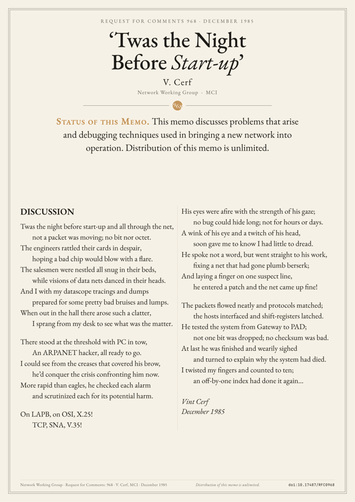</a> | [RFC 968: 'Twas the Night Before Start-up](dist/internet/rfc-968-A-ivory.pdf)<br>Vint Cerf's poem on debugging a new network the night before it is brought into operation.<br>[ivory](dist/internet/rfc-968-A-ivory.pdf)&nbsp;·&nbsp;[white](dist/internet/rfc-968-A-white.pdf)&nbsp;·&nbsp;[genesis](dist/internet/rfc-968-A-genesis.pdf)&nbsp;·&nbsp;[blueprint](dist/internet/rfc-968-A-blueprint.pdf) | Vint Cerf | 1985 | A3 | Distribution unlimited |
| <a href="dist/internet/rfc-1087-A-ivory.pdf">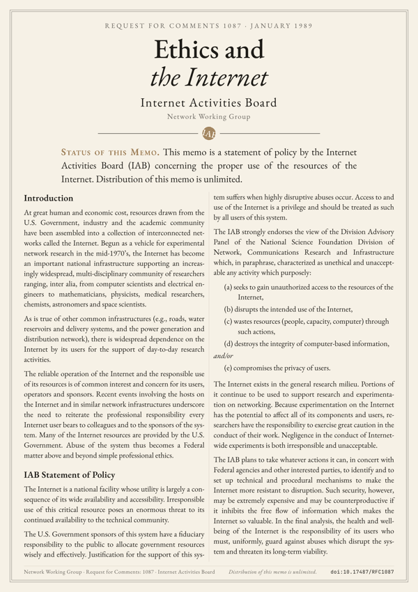</a> | [RFC 1087: Ethics and the Internet](dist/internet/rfc-1087-A-ivory.pdf)<br>A 1989 policy statement of the Internet Activities Board naming the uses of the Internet it considers unethical.<br>[ivory](dist/internet/rfc-1087-A-ivory.pdf)&nbsp;·&nbsp;[white](dist/internet/rfc-1087-A-white.pdf)&nbsp;·&nbsp;[genesis](dist/internet/rfc-1087-A-genesis.pdf)&nbsp;·&nbsp;[blueprint](dist/internet/rfc-1087-A-blueprint.pdf) | Internet Activities Board | 1989 | A3 | Distribution unlimited |
| <a href="dist/internet/rfc-1149-A-ivory.pdf"></a> | [RFC 1149: A Standard for the Transmission of IP Datagrams on Avian Carriers](dist/internet/rfc-1149-A-ivory.pdf)<br>An April Fools' RFC on sending IP datagrams printed on a paper scroll wrapped around the leg of a bird.<br>[ivory](dist/internet/rfc-1149-A-ivory.pdf)&nbsp;·&nbsp;[white](dist/internet/rfc-1149-A-white.pdf)&nbsp;·&nbsp;[genesis](dist/internet/rfc-1149-A-genesis.pdf)&nbsp;·&nbsp;[blueprint](dist/internet/rfc-1149-A-blueprint.pdf) | David Waitzman | 1990 | A3 | Distribution unlimited |
| <a href="dist/internet/rfc-1925-A-ivory.pdf"></a> | [RFC 1925: The Twelve Networking Truths](dist/internet/rfc-1925-A-ivory.pdf)<br>An April Fools' RFC stating twelve fundamental truths of networking, several with corollaries.<br>[ivory](dist/internet/rfc-1925-A-ivory.pdf)&nbsp;·&nbsp;[white](dist/internet/rfc-1925-A-white.pdf)&nbsp;·&nbsp;[genesis](dist/internet/rfc-1925-A-genesis.pdf)&nbsp;·&nbsp;[blueprint](dist/internet/rfc-1925-A-blueprint.pdf) | Ross Callon | 1996 | A3 | Distribution unlimited |
| <a href="dist/internet/rfc-2119-A-ivory.pdf">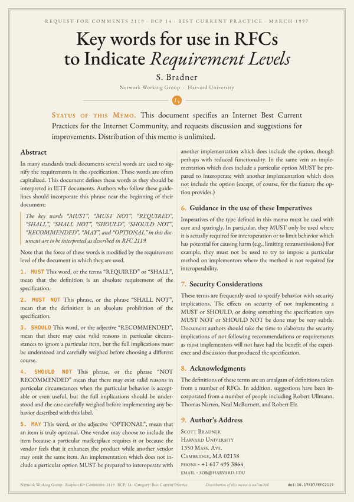</a> | [RFC 2119: Key words for use in RFCs to Indicate Requirement Levels](dist/internet/rfc-2119-A-ivory.pdf)<br>The Best Current Practice that defines MUST, SHOULD, MAY and related key words for requirement levels in specifications.<br>[ivory](dist/internet/rfc-2119-A-ivory.pdf)&nbsp;·&nbsp;[white](dist/internet/rfc-2119-A-white.pdf)&nbsp;·&nbsp;[genesis](dist/internet/rfc-2119-A-genesis.pdf)&nbsp;·&nbsp;[blueprint](dist/internet/rfc-2119-A-blueprint.pdf) | Scott Bradner | 1997 | A3 | Distribution unlimited |
| <a href="dist/internet/rfc-2324-A-ivory.pdf"></a> | [RFC 2324: Hyper Text Coffee Pot Control Protocol (HTCPCP/1.0)](dist/internet/rfc-2324-A-ivory.pdf)<br>An April Fools' RFC extending HTTP to control coffee pots; it defined the 418 I'm a teapot status code.<br>[ivory](dist/internet/rfc-2324-A-ivory.pdf)&nbsp;·&nbsp;[white](dist/internet/rfc-2324-A-white.pdf)&nbsp;·&nbsp;[genesis](dist/internet/rfc-2324-A-genesis.pdf)&nbsp;·&nbsp;[blueprint](dist/internet/rfc-2324-A-blueprint.pdf) | Larry Masinter | 1998 | A2 | © The Internet Society 1998, copies allowed |
| <a href="dist/internet/rfc-2549-A-ivory.pdf">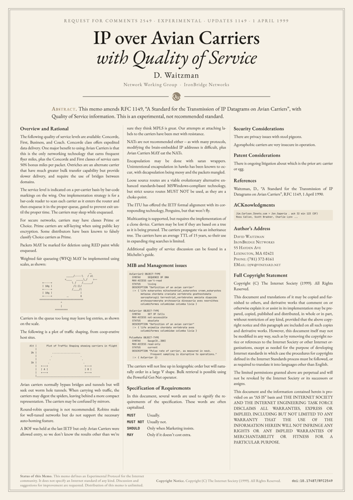</a> | [RFC 2549: IP over Avian Carriers with Quality of Service](dist/internet/rfc-2549-A-ivory.pdf)<br>An April Fools' RFC amending RFC 1149 with quality of service levels for IP datagrams carried by birds.<br>[ivory](dist/internet/rfc-2549-A-ivory.pdf)&nbsp;·&nbsp;[white](dist/internet/rfc-2549-A-white.pdf)&nbsp;·&nbsp;[genesis](dist/internet/rfc-2549-A-genesis.pdf)&nbsp;·&nbsp;[blueprint](dist/internet/rfc-2549-A-blueprint.pdf) | David Waitzman | 1999 | A3 | © The Internet Society 1999, copies allowed |
| <a href="dist/internet/rfc-2795-A-ivory.pdf">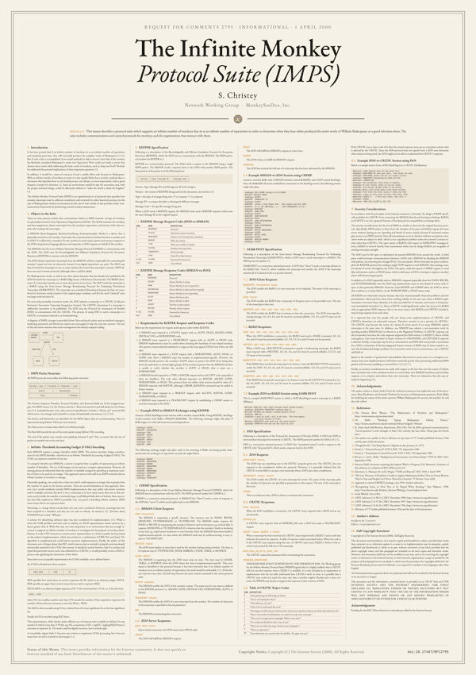</a> | [RFC 2795: The Infinite Monkey Protocol Suite (IMPS)](dist/internet/rfc-2795-A-ivory.pdf)<br>An April Fools' RFC specifying protocols for infinite monkeys at typewriters, their zoos, bards and critics.<br>[ivory](dist/internet/rfc-2795-A-ivory.pdf)&nbsp;·&nbsp;[white](dist/internet/rfc-2795-A-white.pdf)&nbsp;·&nbsp;[genesis](dist/internet/rfc-2795-A-genesis.pdf)&nbsp;·&nbsp;[blueprint](dist/internet/rfc-2795-A-blueprint.pdf) | S. Christey | 2000 | A1 | © The Internet Society 2000, copies allowed |
| <a href="dist/internet/rfc-6214-A-ivory.pdf">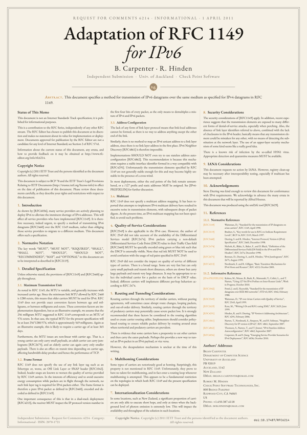</a> | [RFC 6214: Adaptation of RFC 1149 for IPv6](dist/internet/rfc-6214-A-ivory.pdf)<br>An April Fools' RFC adapting the transmission of IP datagrams by avian carriers to IPv6.<br>[ivory](dist/internet/rfc-6214-A-ivory.pdf)&nbsp;·&nbsp;[white](dist/internet/rfc-6214-A-white.pdf)&nbsp;·&nbsp;[genesis](dist/internet/rfc-6214-A-genesis.pdf)&nbsp;·&nbsp;[blueprint](dist/internet/rfc-6214-A-blueprint.pdf) | Brian Carpenter, Robert M. Hinden | 2011 | A3 | © 2011 IETF Trust and the authors, IETF Trust Legal Provisions |

### Software practice

| &nbsp;&nbsp;&nbsp;&nbsp;&nbsp;&nbsp;&nbsp;&nbsp;&nbsp;&nbsp;&nbsp;&nbsp;&nbsp;&nbsp;&nbsp;&nbsp;&nbsp;&nbsp;&nbsp;&nbsp;&nbsp;&nbsp;&nbsp;&nbsp; | Paper | Authors | Year | Print from | License |
|---|---|---|---|---|---|
| <a href="dist/software/postel-robustness-A-ivory.pdf">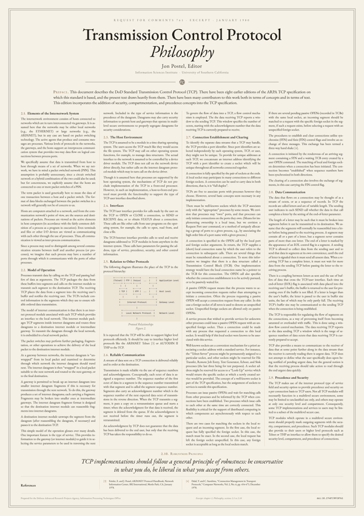</a> | [RFC 761: The Robustness Principle](dist/software/postel-robustness-A-ivory.pdf)<br>The philosophy chapter of the 1980 TCP specification, which ends with the principle: be conservative in what you do.<br>[ivory](dist/software/postel-robustness-A-ivory.pdf)&nbsp;·&nbsp;[white](dist/software/postel-robustness-A-white.pdf)&nbsp;·&nbsp;[genesis](dist/software/postel-robustness-A-genesis.pdf)&nbsp;·&nbsp;[blueprint](dist/software/postel-robustness-A-blueprint.pdf) | Jon Postel | 1980 | A2 | Free reproduction (RFC Editor) |
| <a href="dist/software/gnu-manifesto-A-ivory.pdf"></a> | [The GNU Manifesto](dist/software/gnu-manifesto-A-ivory.pdf)<br>Richard Stallman's 1985 call for support to write GNU, a complete Unix-compatible system that everyone may share and change.<br>[ivory](dist/software/gnu-manifesto-A-ivory.pdf)&nbsp;·&nbsp;[white](dist/software/gnu-manifesto-A-white.pdf)&nbsp;·&nbsp;[genesis](dist/software/gnu-manifesto-A-genesis.pdf)&nbsp;·&nbsp;[blueprint](dist/software/gnu-manifesto-A-blueprint.pdf) | Richard Stallman | 1985 | A2 | © FSF, verbatim copies allowed |
| <a href="dist/software/gnu-gpl-v2-A-ivory.pdf">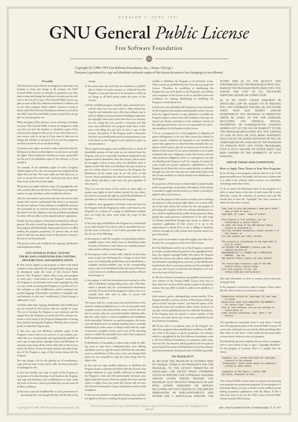</a> | [GNU General Public License, Version 2](dist/software/gnu-gpl-v2-A-ivory.pdf)<br>The Free Software Foundation license of 1991 letting anyone copy, change and share a program, provided derived works keep it.<br>[ivory](dist/software/gnu-gpl-v2-A-ivory.pdf)&nbsp;·&nbsp;[white](dist/software/gnu-gpl-v2-A-white.pdf)&nbsp;·&nbsp;[genesis](dist/software/gnu-gpl-v2-A-genesis.pdf)&nbsp;·&nbsp;[blueprint](dist/software/gnu-gpl-v2-A-blueprint.pdf) | Free Software Foundation | 1991 | A2 | © FSF, verbatim copies allowed |
| <a href="dist/software/free-software-definition-A-ivory.pdf">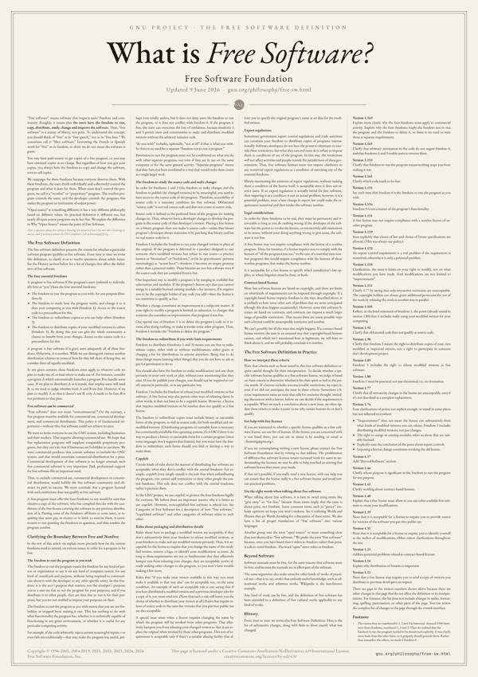</a> | [What is Free Software? The Free Software Definition](dist/software/free-software-definition-A-ivory.pdf)<br>The GNU Project's criteria for free software: the four freedoms to run, study and change, redistribute, and share changes.<br>[ivory](dist/software/free-software-definition-A-ivory.pdf)&nbsp;·&nbsp;[white](dist/software/free-software-definition-A-white.pdf)&nbsp;·&nbsp;[genesis](dist/software/free-software-definition-A-genesis.pdf)&nbsp;·&nbsp;[blueprint](dist/software/free-software-definition-A-blueprint.pdf) | Free Software Foundation | 1996 | A2 | CC BY-ND 4.0 |
| <a href="dist/software/agile-manifesto-A-ivory.pdf"></a> | [Manifesto for Agile Software Development](dist/software/agile-manifesto-A-ivory.pdf)<br>Four values for developing software, stated in 2001 by seventeen people who met at Snowbird, Utah.<br>[ivory](dist/software/agile-manifesto-A-ivory.pdf)&nbsp;·&nbsp;[white](dist/software/agile-manifesto-A-white.pdf)&nbsp;·&nbsp;[genesis](dist/software/agile-manifesto-A-genesis.pdf)&nbsp;·&nbsp;[blueprint](dist/software/agile-manifesto-A-blueprint.pdf) | Kent Beck, Mike Beedle, Arie van Bennekum, Alistair Cockburn, Ward Cunningham, Martin Fowler, James Grenning, Jim Highsmith, Andrew Hunt, Ron Jeffries, Jon Kern, Brian Marick, Robert C. Martin, Steve Mellor, Ken Schwaber, Jeff Sutherland, Dave Thomas | 2001 | A3 | © 2001 the authors, copies in entirety |
| <a href="dist/software/zen-of-python-A-ivory.pdf"></a> | [PEP 20: The Zen of Python](dist/software/zen-of-python-A-ivory.pdf)<br>Nineteen aphorisms by Tim Peters on the principles behind the design of the Python language.<br>[ivory](dist/software/zen-of-python-A-ivory.pdf)&nbsp;·&nbsp;[white](dist/software/zen-of-python-A-white.pdf)&nbsp;·&nbsp;[genesis](dist/software/zen-of-python-A-genesis.pdf)&nbsp;·&nbsp;[blueprint](dist/software/zen-of-python-A-blueprint.pdf) | Tim Peters | 2004 | A3 | Public domain |
| <a href="dist/software/open-source-definition-A-ivory.pdf">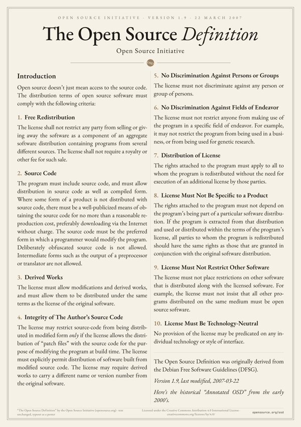</a> | [The Open Source Definition](dist/software/open-source-definition-A-ivory.pdf)<br>The ten criteria that the distribution terms of a software license must meet to be called open source.<br>[ivory](dist/software/open-source-definition-A-ivory.pdf)&nbsp;·&nbsp;[white](dist/software/open-source-definition-A-white.pdf)&nbsp;·&nbsp;[genesis](dist/software/open-source-definition-A-genesis.pdf)&nbsp;·&nbsp;[blueprint](dist/software/open-source-definition-A-blueprint.pdf) | Open Source Initiative | 2007 | A3 | CC BY 4.0 |
| <a href="dist/software/twelve-factor-app-A-ivory.pdf"></a> | [The Twelve-Factor App](dist/software/twelve-factor-app-A-ivory.pdf)<br>A methodology of twelve factors for building software-as-a-service apps, drawn from experience with hundreds of apps on Heroku.<br>[ivory](dist/software/twelve-factor-app-A-ivory.pdf)&nbsp;·&nbsp;[white](dist/software/twelve-factor-app-A-white.pdf)&nbsp;·&nbsp;[genesis](dist/software/twelve-factor-app-A-genesis.pdf)&nbsp;·&nbsp;[blueprint](dist/software/twelve-factor-app-A-blueprint.pdf) | Adam Wiggins | 2011 | A1 | MIT |
| <a href="dist/software/semver-A-ivory.pdf"></a> | [Semantic Versioning 2.0.0](dist/software/semver-A-ivory.pdf)<br>Rules and requirements that dictate how MAJOR.MINOR.PATCH version numbers are assigned and incremented, with a grammar and a FAQ.<br>[ivory](dist/software/semver-A-ivory.pdf)&nbsp;·&nbsp;[white](dist/software/semver-A-white.pdf)&nbsp;·&nbsp;[genesis](dist/software/semver-A-genesis.pdf)&nbsp;·&nbsp;[blueprint](dist/software/semver-A-blueprint.pdf) | Tom Preston-Werner | 2013 | A2 | CC BY 3.0 |
| <a href="dist/software/conventional-commits-A-ivory.pdf">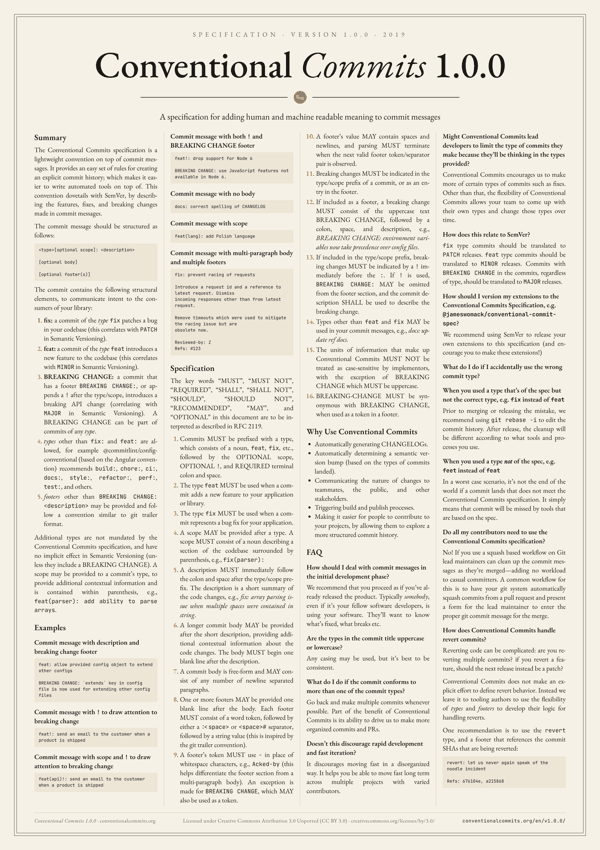</a> | [Conventional Commits 1.0.0](dist/software/conventional-commits-A-ivory.pdf)<br>A specification for structuring commit messages so that tools can derive changelogs and semantic version bumps from them.<br>[ivory](dist/software/conventional-commits-A-ivory.pdf)&nbsp;·&nbsp;[white](dist/software/conventional-commits-A-white.pdf)&nbsp;·&nbsp;[genesis](dist/software/conventional-commits-A-genesis.pdf)&nbsp;·&nbsp;[blueprint](dist/software/conventional-commits-A-blueprint.pdf) | Conventional Commits contributors | 2019 | A3 | CC BY 3.0 |
| <a href="dist/software/keep-a-changelog-A-ivory.pdf">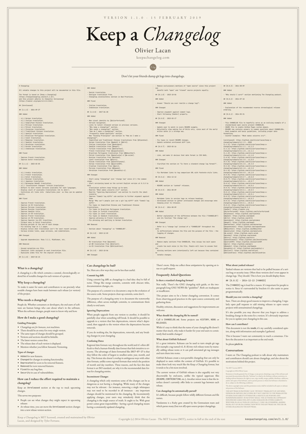</a> | [Keep a Changelog 1.1.0](dist/software/keep-a-changelog-A-ivory.pdf)<br>Guiding principles for a changelog written for humans: one entry per version, grouped types of changes, latest first.<br>[ivory](dist/software/keep-a-changelog-A-ivory.pdf)&nbsp;·&nbsp;[white](dist/software/keep-a-changelog-A-white.pdf)&nbsp;·&nbsp;[genesis](dist/software/keep-a-changelog-A-genesis.pdf)&nbsp;·&nbsp;[blueprint](dist/software/keep-a-changelog-A-blueprint.pdf) | Olivier Lacan | 2019 | A2 | MIT |

### Manifestos & announcements

| &nbsp;&nbsp;&nbsp;&nbsp;&nbsp;&nbsp;&nbsp;&nbsp;&nbsp;&nbsp;&nbsp;&nbsp;&nbsp;&nbsp;&nbsp;&nbsp;&nbsp;&nbsp;&nbsp;&nbsp;&nbsp;&nbsp;&nbsp;&nbsp; | Paper | Authors | Year | Print from | License |
|---|---|---|---|---|---|
| <a href="dist/manifestos/www-announcement-A-ivory.pdf"></a> | [WorldWideWeb: the announcement on alt.hypertext](dist/manifestos/www-announcement-A-ivory.pdf)<br>Tim Berners-Lee's two Usenet posts of 6 August 1991 that described the WorldWideWeb project and offered its software.<br>[ivory](dist/manifestos/www-announcement-A-ivory.pdf)&nbsp;·&nbsp;[white](dist/manifestos/www-announcement-A-white.pdf)&nbsp;·&nbsp;[genesis](dist/manifestos/www-announcement-A-genesis.pdf)&nbsp;·&nbsp;[blueprint](dist/manifestos/www-announcement-A-blueprint.pdf) | Tim Berners-Lee | 1991 | A2 | W3C Document License |
| <a href="dist/manifestos/cyberspace-independence-A-ivory.pdf"></a> | [A Declaration of the Independence of Cyberspace](dist/manifestos/cyberspace-independence-A-ivory.pdf)<br>John Perry Barlow's 1996 declaration, written at Davos, that governments have no sovereignty over cyberspace.<br>[ivory](dist/manifestos/cyberspace-independence-A-ivory.pdf)&nbsp;·&nbsp;[white](dist/manifestos/cyberspace-independence-A-white.pdf)&nbsp;·&nbsp;[genesis](dist/manifestos/cyberspace-independence-A-genesis.pdf)&nbsp;·&nbsp;[blueprint](dist/manifestos/cyberspace-independence-A-blueprint.pdf) | John Perry Barlow | 1996 | A3 | Redistribution invited by the author |

### Physics & astronomy

| &nbsp;&nbsp;&nbsp;&nbsp;&nbsp;&nbsp;&nbsp;&nbsp;&nbsp;&nbsp;&nbsp;&nbsp;&nbsp;&nbsp;&nbsp;&nbsp;&nbsp;&nbsp;&nbsp;&nbsp;&nbsp;&nbsp;&nbsp;&nbsp; | Paper | Authors | Year | Print from | License |
|---|---|---|---|---|---|
| <a href="dist/physics/sidereus-nuncius-A-ivory.pdf">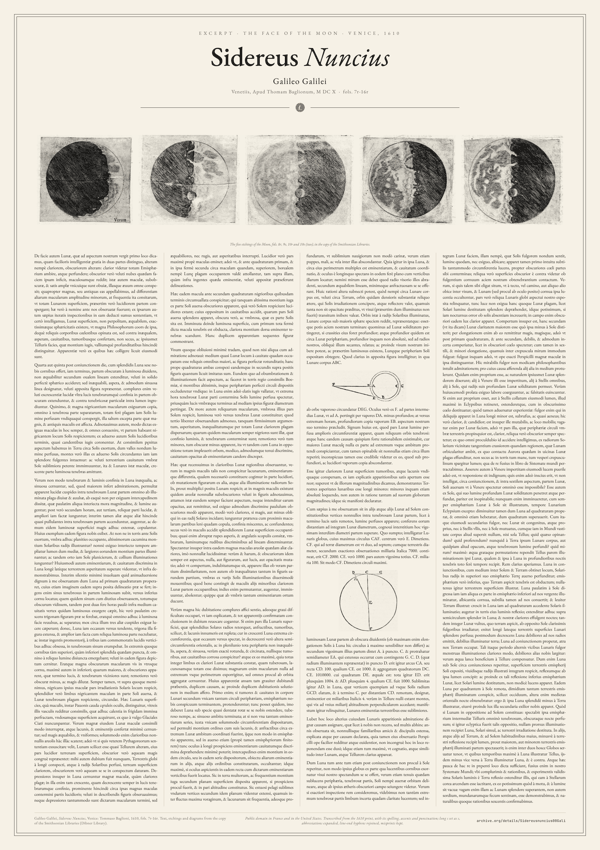</a> | [Sidereus Nuncius: the Moon](dist/physics/sidereus-nuncius-A-ivory.pdf)<br>Galileo's telescopic observations of the Moon's surface, mountains and earthshine, with his five etchings, from the 1610 edition.<br>[ivory](dist/physics/sidereus-nuncius-A-ivory.pdf)&nbsp;·&nbsp;[white](dist/physics/sidereus-nuncius-A-white.pdf)&nbsp;·&nbsp;[genesis](dist/physics/sidereus-nuncius-A-genesis.pdf)&nbsp;·&nbsp;[blueprint](dist/physics/sidereus-nuncius-A-blueprint.pdf) | Galileo Galilei | 1610 | A2 | Public domain |
| <a href="dist/physics/newton-laws-A-ivory.pdf">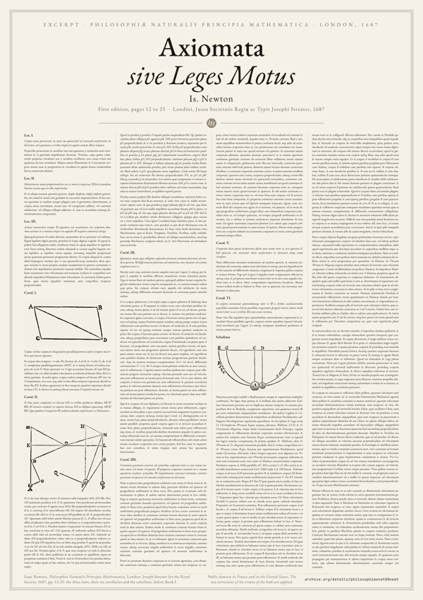</a> | [Axiomata, sive Leges Motus](dist/physics/newton-laws-A-ivory.pdf)<br>Newton states the three laws of motion, derives six corollaries from them and reports pendulum collision experiments.<br>[ivory](dist/physics/newton-laws-A-ivory.pdf)&nbsp;·&nbsp;[white](dist/physics/newton-laws-A-white.pdf)&nbsp;·&nbsp;[genesis](dist/physics/newton-laws-A-genesis.pdf)&nbsp;·&nbsp;[blueprint](dist/physics/newton-laws-A-blueprint.pdf) | Isaac Newton | 1687 | A2 | Public domain |
| <a href="dist/physics/michelson-morley-A-ivory.pdf">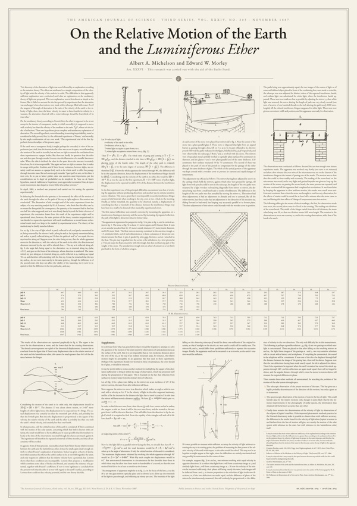</a> | [On the Relative Motion of the Earth and the Luminiferous Ether](dist/physics/michelson-morley-A-ivory.pdf)<br>An interferometer turning on a stone floating on mercury detects no appreciable motion of the earth relative to the ether.<br>[ivory](dist/physics/michelson-morley-A-ivory.pdf)&nbsp;·&nbsp;[white](dist/physics/michelson-morley-A-white.pdf)&nbsp;·&nbsp;[genesis](dist/physics/michelson-morley-A-genesis.pdf)&nbsp;·&nbsp;[blueprint](dist/physics/michelson-morley-A-blueprint.pdf) | Albert A. Michelson, Edward W. Morley | 1887 | A1 | Public domain |
| <a href="dist/physics/roentgen-x-rays-A-ivory.pdf">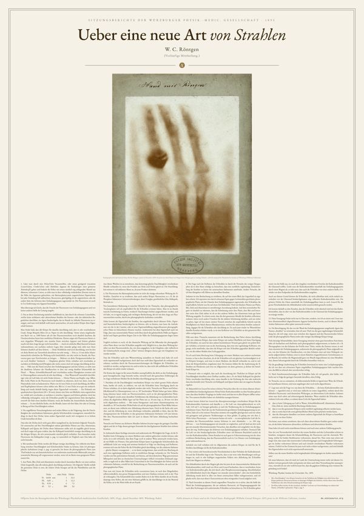</a> | [Ueber eine neue Art von Strahlen](dist/physics/roentgen-x-rays-A-ivory.pdf)<br>Röntgen reports a new kind of rays that cross opaque bodies, blacken photographic plates and show the hand bones.<br>[ivory](dist/physics/roentgen-x-rays-A-ivory.pdf)&nbsp;·&nbsp;[white](dist/physics/roentgen-x-rays-A-white.pdf)&nbsp;·&nbsp;[genesis](dist/physics/roentgen-x-rays-A-genesis.pdf)&nbsp;·&nbsp;[blueprint](dist/physics/roentgen-x-rays-A-blueprint.pdf) | Wilhelm Conrad Röntgen | 1895 | A1 | Public domain |
| <a href="dist/physics/curie-polonium-A-ivory.pdf">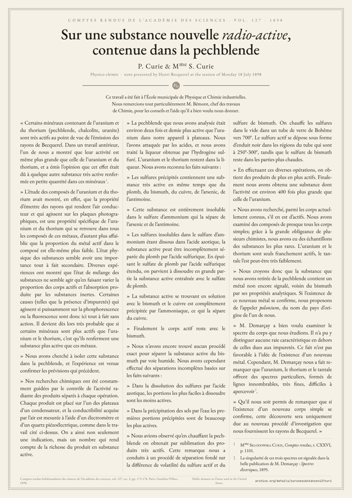</a> | [Sur une substance nouvelle radio-active, contenue dans la pechblende](dist/physics/curie-polonium-A-ivory.pdf)<br>The Curies separate from pitchblende a substance far more active than uranium and name its presumed new metal polonium.<br>[ivory](dist/physics/curie-polonium-A-ivory.pdf)&nbsp;·&nbsp;[white](dist/physics/curie-polonium-A-white.pdf)&nbsp;·&nbsp;[genesis](dist/physics/curie-polonium-A-genesis.pdf)&nbsp;·&nbsp;[blueprint](dist/physics/curie-polonium-A-blueprint.pdf) | Pierre Curie, Marie Curie | 1898 | A3 | Public domain |
| <a href="dist/physics/planck-1900-A-ivory.pdf"></a> | [Zur Theorie des Gesetzes der Energieverteilung im Normalspectrum](dist/physics/planck-1900-A-ivory.pdf)<br>Planck derives the spectral energy distribution by dividing resonator energy into finite elements hν and counting complexions.<br>[ivory](dist/physics/planck-1900-A-ivory.pdf)&nbsp;·&nbsp;[white](dist/physics/planck-1900-A-white.pdf)&nbsp;·&nbsp;[genesis](dist/physics/planck-1900-A-genesis.pdf)&nbsp;·&nbsp;[blueprint](dist/physics/planck-1900-A-blueprint.pdf) | Max Planck | 1900 | A2 | Public domain |
| <a href="dist/physics/einstein-mass-energy-A-ivory.pdf"></a> | [Ist die Trägheit eines Körpers von seinem Energieinhalt abhängig?](dist/physics/einstein-mass-energy-A-ivory.pdf)<br>Shows that a body emitting energy L as radiation loses mass L/V², so its mass measures its energy content.<br>[ivory](dist/physics/einstein-mass-energy-A-ivory.pdf)&nbsp;·&nbsp;[white](dist/physics/einstein-mass-energy-A-white.pdf)&nbsp;·&nbsp;[genesis](dist/physics/einstein-mass-energy-A-genesis.pdf)&nbsp;·&nbsp;[blueprint](dist/physics/einstein-mass-energy-A-blueprint.pdf) | Albert Einstein | 1905 | A3 | Public domain |
| <a href="dist/physics/einstein-electrodynamics-A-ivory.pdf"></a> | [Zur Elektrodynamik bewegter Körper](dist/physics/einstein-electrodynamics-A-ivory.pdf)<br>Derives special relativity from the relativity principle and the constant speed of light, and applies it to electrodynamics and optics.<br>[ivory](dist/physics/einstein-electrodynamics-A-ivory.pdf)&nbsp;·&nbsp;[white](dist/physics/einstein-electrodynamics-A-white.pdf)&nbsp;·&nbsp;[genesis](dist/physics/einstein-electrodynamics-A-genesis.pdf)&nbsp;·&nbsp;[blueprint](dist/physics/einstein-electrodynamics-A-blueprint.pdf) | Albert Einstein | 1905 | A0 | Public domain |
| <a href="dist/physics/hubble-1929-A-ivory.pdf"></a> | [A Relation between Distance and Radial Velocity among Extra-Galactic Nebulae](dist/physics/hubble-1929-A-ivory.pdf)<br>Finds a roughly linear relation between the distances of extra-galactic nebulae and their radial velocities.<br>[ivory](dist/physics/hubble-1929-A-ivory.pdf)&nbsp;·&nbsp;[white](dist/physics/hubble-1929-A-white.pdf)&nbsp;·&nbsp;[genesis](dist/physics/hubble-1929-A-genesis.pdf)&nbsp;·&nbsp;[blueprint](dist/physics/hubble-1929-A-blueprint.pdf) | Edwin Hubble | 1929 | A3 | Public domain |

### Space exploration

| &nbsp;&nbsp;&nbsp;&nbsp;&nbsp;&nbsp;&nbsp;&nbsp;&nbsp;&nbsp;&nbsp;&nbsp;&nbsp;&nbsp;&nbsp;&nbsp;&nbsp;&nbsp;&nbsp;&nbsp;&nbsp;&nbsp;&nbsp;&nbsp; | Paper | Authors | Year | Print from | License |
|---|---|---|---|---|---|
| <a href="dist/space/tsiolkovsky-rocket-equation-A-ivory.pdf">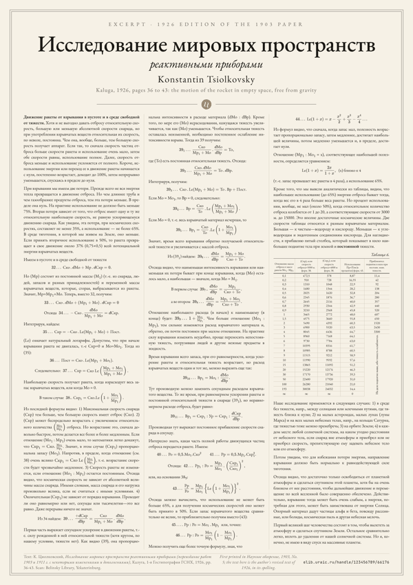</a> | [Исследование мировых пространств реактивными приборами](dist/space/tsiolkovsky-rocket-equation-A-ivory.pdf)<br>Tsiolkovsky derives the speed of a rocket in empty space from the mass of its propellant: the rocket equation.<br>[ivory](dist/space/tsiolkovsky-rocket-equation-A-ivory.pdf)&nbsp;·&nbsp;[white](dist/space/tsiolkovsky-rocket-equation-A-white.pdf)&nbsp;·&nbsp;[genesis](dist/space/tsiolkovsky-rocket-equation-A-genesis.pdf)&nbsp;·&nbsp;[blueprint](dist/space/tsiolkovsky-rocket-equation-A-blueprint.pdf) | Konstantin Tsiolkovsky | 1926 | A3 | Public domain |
| <a href="dist/space/apollo-11-landing-A-ivory.pdf">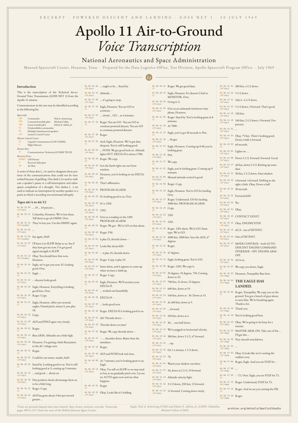</a> | [Apollo 11 Technical Air-to-Ground Voice Transcription: the landing](dist/space/apollo-11-landing-A-ivory.pdf)<br>NASA's transcript of the radio exchanges between Houston and Eagle from powered descent to the landing on the Moon.<br>[ivory](dist/space/apollo-11-landing-A-ivory.pdf)&nbsp;·&nbsp;[white](dist/space/apollo-11-landing-A-white.pdf)&nbsp;·&nbsp;[genesis](dist/space/apollo-11-landing-A-genesis.pdf)&nbsp;·&nbsp;[blueprint](dist/space/apollo-11-landing-A-blueprint.pdf) | NASA Manned Spacecraft Center | 1969 | A3 | Public domain (U.S. Government work) |
| <a href="dist/space/voyager-golden-record-A-ivory.pdf">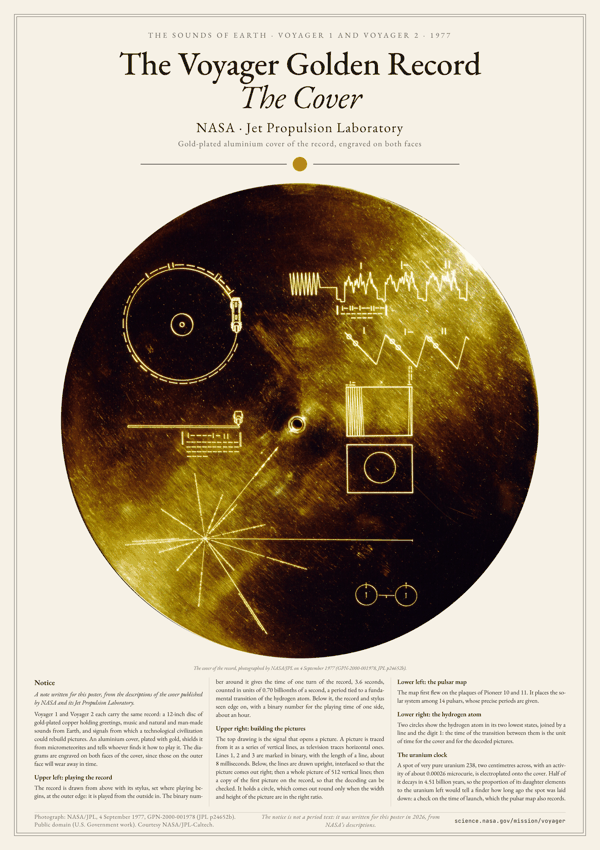</a> | [The Voyager Golden Record: the cover](dist/space/voyager-golden-record-A-ivory.pdf)<br>The engraved cover of the record carried by Voyager 1 and 2, with a notice on each of its diagrams.<br>[ivory](dist/space/voyager-golden-record-A-ivory.pdf)&nbsp;·&nbsp;[white](dist/space/voyager-golden-record-A-white.pdf)&nbsp;·&nbsp;[genesis](dist/space/voyager-golden-record-A-genesis.pdf)&nbsp;·&nbsp;[blueprint](dist/space/voyager-golden-record-A-blueprint.pdf) | NASA, Jet Propulsion Laboratory | 1977 | A3 | Public domain (U.S. Government work); notice: MIT |

### Mathematics

| &nbsp;&nbsp;&nbsp;&nbsp;&nbsp;&nbsp;&nbsp;&nbsp;&nbsp;&nbsp;&nbsp;&nbsp;&nbsp;&nbsp;&nbsp;&nbsp;&nbsp;&nbsp;&nbsp;&nbsp;&nbsp;&nbsp;&nbsp;&nbsp; | Paper | Authors | Year | Print from | License |
|---|---|---|---|---|---|
| <a href="dist/mathematics/euclid-elements-i-A-ivory.pdf">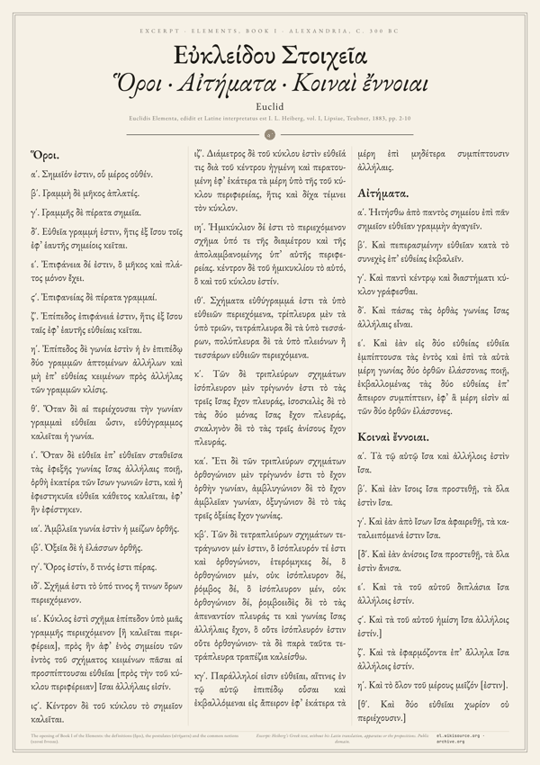</a> | [Euclid's Elements, Book I: definitions, postulates and common notions](dist/mathematics/euclid-elements-i-A-ivory.pdf)<br>The 23 definitions, five postulates and common notions that open Euclid's Elements, in Heiberg's Greek text.<br>[ivory](dist/mathematics/euclid-elements-i-A-ivory.pdf)&nbsp;·&nbsp;[white](dist/mathematics/euclid-elements-i-A-white.pdf)&nbsp;·&nbsp;[genesis](dist/mathematics/euclid-elements-i-A-genesis.pdf)&nbsp;·&nbsp;[blueprint](dist/mathematics/euclid-elements-i-A-blueprint.pdf) | Euclid | c.&nbsp;300&nbsp;BC | A3 | Public domain |
| <a href="dist/mathematics/pascal-triangle-A-ivory.pdf">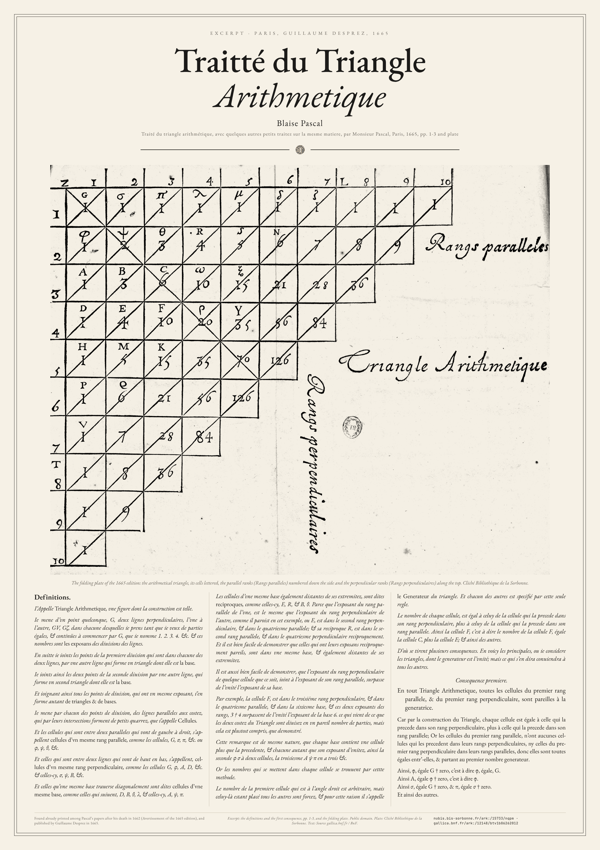</a> | [Traitté du Triangle Arithmetique](dist/mathematics/pascal-triangle-A-ivory.pdf)<br>Excerpt of Pascal's treatise on the arithmetical triangle: its construction, the rule of its numbers and the first consequence.<br>[ivory](dist/mathematics/pascal-triangle-A-ivory.pdf)&nbsp;·&nbsp;[white](dist/mathematics/pascal-triangle-A-white.pdf)&nbsp;·&nbsp;[genesis](dist/mathematics/pascal-triangle-A-genesis.pdf)&nbsp;·&nbsp;[blueprint](dist/mathematics/pascal-triangle-A-blueprint.pdf) | Blaise Pascal | 1665 | A3 | Public domain |
| <a href="dist/mathematics/fermat-marginal-note-A-ivory.pdf">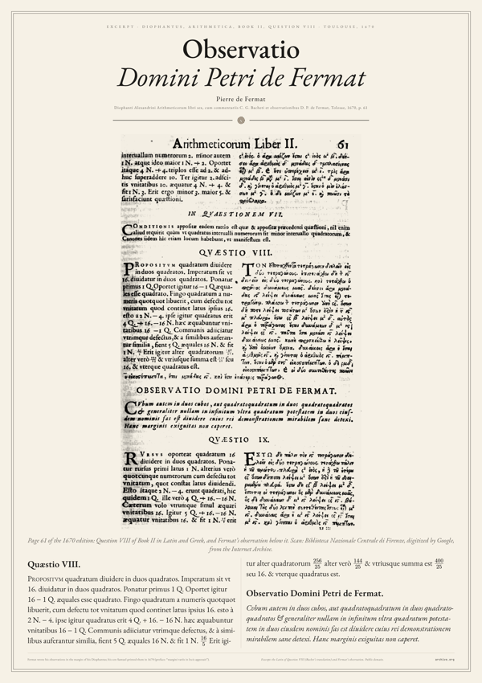</a> | [Observatio Domini Petri de Fermat](dist/mathematics/fermat-marginal-note-A-ivory.pdf)<br>Fermat's note that no cube or higher power splits into two like powers, with the question of Diophantus it annotates.<br>[ivory](dist/mathematics/fermat-marginal-note-A-ivory.pdf)&nbsp;·&nbsp;[white](dist/mathematics/fermat-marginal-note-A-white.pdf)&nbsp;·&nbsp;[genesis](dist/mathematics/fermat-marginal-note-A-genesis.pdf)&nbsp;·&nbsp;[blueprint](dist/mathematics/fermat-marginal-note-A-blueprint.pdf) | Pierre de Fermat | 1670 | A3 | Public domain |
| <a href="dist/mathematics/euler-koenigsberg-A-ivory.pdf">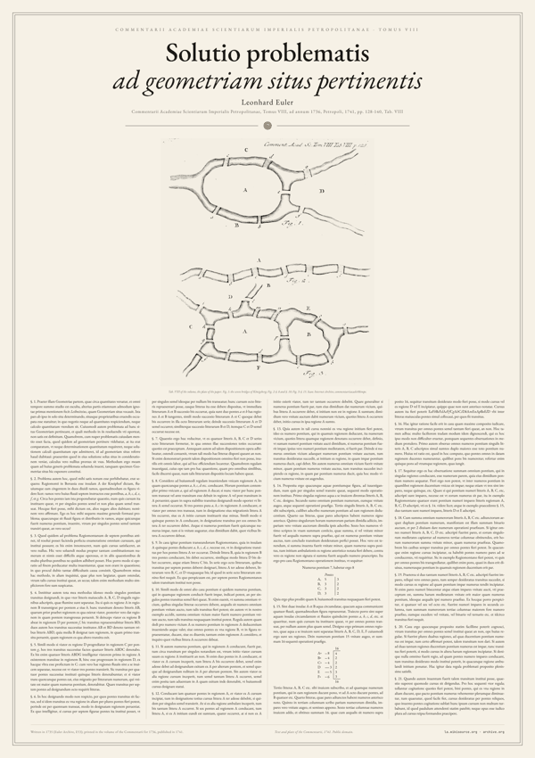</a> | [Solutio problematis ad geometriam situs pertinentis](dist/mathematics/euler-koenigsberg-A-ivory.pdf)<br>Euler shows that no walk crosses each of the seven bridges of Königsberg exactly once, and gives the general rule.<br>[ivory](dist/mathematics/euler-koenigsberg-A-ivory.pdf)&nbsp;·&nbsp;[white](dist/mathematics/euler-koenigsberg-A-white.pdf)&nbsp;·&nbsp;[genesis](dist/mathematics/euler-koenigsberg-A-genesis.pdf)&nbsp;·&nbsp;[blueprint](dist/mathematics/euler-koenigsberg-A-blueprint.pdf) | Leonhard Euler | 1736 | A2 | Public domain |
| <a href="dist/mathematics/galois-letter-A-ivory.pdf"></a> | [Lettre de Galois à M. Auguste Chevalier](dist/mathematics/galois-letter-A-ivory.pdf)<br>Dated 29 May 1832, two days before his death, Galois's letter summarizes his work on equations, groups and algebraic integrals.<br>[ivory](dist/mathematics/galois-letter-A-ivory.pdf)&nbsp;·&nbsp;[white](dist/mathematics/galois-letter-A-white.pdf)&nbsp;·&nbsp;[genesis](dist/mathematics/galois-letter-A-genesis.pdf)&nbsp;·&nbsp;[blueprint](dist/mathematics/galois-letter-A-blueprint.pdf) | Évariste Galois | 1832 | A2 | Public domain |
| <a href="dist/mathematics/riemann-1859-A-ivory.pdf"></a> | [Ueber die Anzahl der Primzahlen unter einer gegebenen Grösse](dist/mathematics/riemann-1859-A-ivory.pdf)<br>Extends the zeta function to complex values, relates its zeros to the count of primes and states the Riemann hypothesis.<br>[ivory](dist/mathematics/riemann-1859-A-ivory.pdf)&nbsp;·&nbsp;[white](dist/mathematics/riemann-1859-A-white.pdf)&nbsp;·&nbsp;[genesis](dist/mathematics/riemann-1859-A-genesis.pdf)&nbsp;·&nbsp;[blueprint](dist/mathematics/riemann-1859-A-blueprint.pdf) | Bernhard Riemann | 1859 | A2 | Public domain |
| <a href="dist/mathematics/cantor-diagonal-A-ivory.pdf">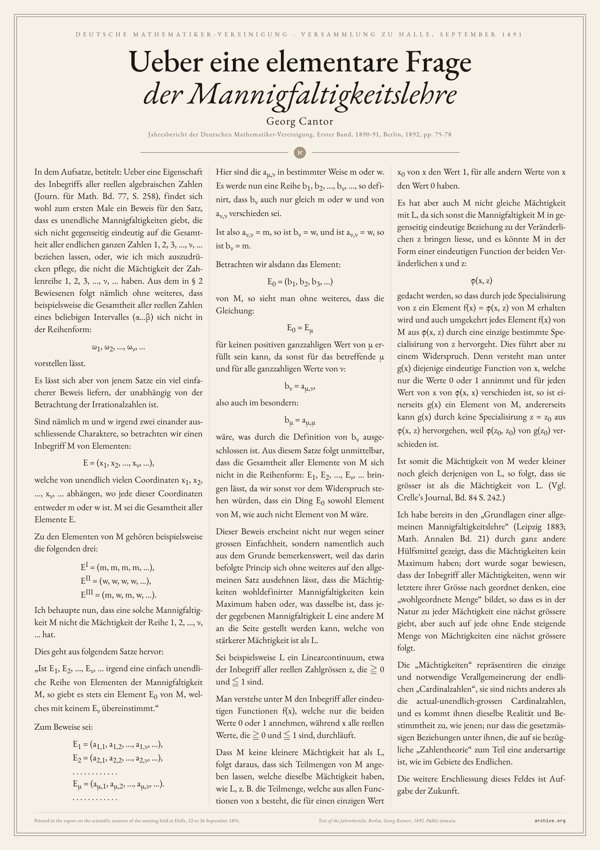</a> | [Ueber eine elementare Frage der Mannigfaltigkeitslehre](dist/mathematics/cantor-diagonal-A-ivory.pdf)<br>Cantor's diagonal argument: the sequences of two symbols cannot be listed, and no set has the greatest cardinality.<br>[ivory](dist/mathematics/cantor-diagonal-A-ivory.pdf)&nbsp;·&nbsp;[white](dist/mathematics/cantor-diagonal-A-white.pdf)&nbsp;·&nbsp;[genesis](dist/mathematics/cantor-diagonal-A-genesis.pdf)&nbsp;·&nbsp;[blueprint](dist/mathematics/cantor-diagonal-A-blueprint.pdf) | Georg Cantor | 1891 | A3 | Public domain |
| <a href="dist/mathematics/hilbert-problems-A-ivory.pdf"></a> | [Mathematische Probleme](dist/mathematics/hilbert-problems-A-ivory.pdf)<br>Excerpt of the printed text of Hilbert's 1900 Paris lecture, which sets out 23 problems for the new century.<br>[ivory](dist/mathematics/hilbert-problems-A-ivory.pdf)&nbsp;·&nbsp;[white](dist/mathematics/hilbert-problems-A-white.pdf)&nbsp;·&nbsp;[genesis](dist/mathematics/hilbert-problems-A-genesis.pdf)&nbsp;·&nbsp;[blueprint](dist/mathematics/hilbert-problems-A-blueprint.pdf) | David Hilbert | 1900 | A1 | Public domain |
| <a href="dist/mathematics/ramanujan-letter-A-ivory.pdf">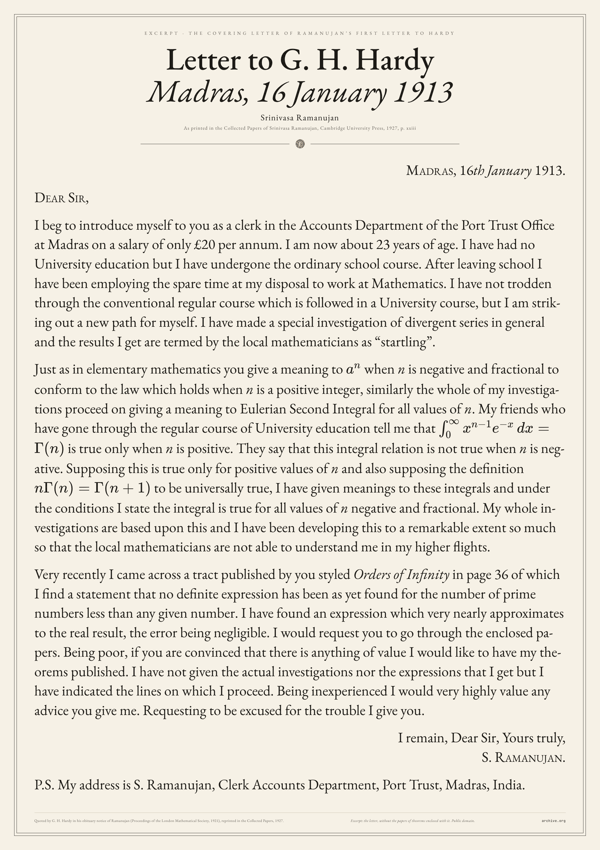</a> | [Letter to G. H. Hardy, 16 January 1913](dist/mathematics/ramanujan-letter-A-ivory.pdf)<br>Ramanujan, a clerk in Madras, introduces himself to Hardy and sends him his theorems.<br>[ivory](dist/mathematics/ramanujan-letter-A-ivory.pdf)&nbsp;·&nbsp;[white](dist/mathematics/ramanujan-letter-A-white.pdf)&nbsp;·&nbsp;[genesis](dist/mathematics/ramanujan-letter-A-genesis.pdf)&nbsp;·&nbsp;[blueprint](dist/mathematics/ramanujan-letter-A-blueprint.pdf) | Srinivasa Ramanujan | 1913 | A3 | Public domain |

### Biology & medicine

| &nbsp;&nbsp;&nbsp;&nbsp;&nbsp;&nbsp;&nbsp;&nbsp;&nbsp;&nbsp;&nbsp;&nbsp;&nbsp;&nbsp;&nbsp;&nbsp;&nbsp;&nbsp;&nbsp;&nbsp;&nbsp;&nbsp;&nbsp;&nbsp; | Paper | Authors | Year | Print from | License |
|---|---|---|---|---|---|
| <a href="dist/life-sciences/hippocratic-oath-A-ivory.pdf"></a> | [The Hippocratic Oath](dist/life-sciences/hippocratic-oath-A-ivory.pdf)<br>The physician's oath of the Hippocratic Collection, in the ancient Greek text edited by Émile Littré in 1844.<br>[ivory](dist/life-sciences/hippocratic-oath-A-ivory.pdf)&nbsp;·&nbsp;[white](dist/life-sciences/hippocratic-oath-A-white.pdf)&nbsp;·&nbsp;[genesis](dist/life-sciences/hippocratic-oath-A-genesis.pdf)&nbsp;·&nbsp;[blueprint](dist/life-sciences/hippocratic-oath-A-blueprint.pdf) | Hippocrates | c.&nbsp;400&nbsp;BC | A3 | Public domain |
| <a href="dist/life-sciences/linnaeus-systema-naturae-A-ivory.pdf">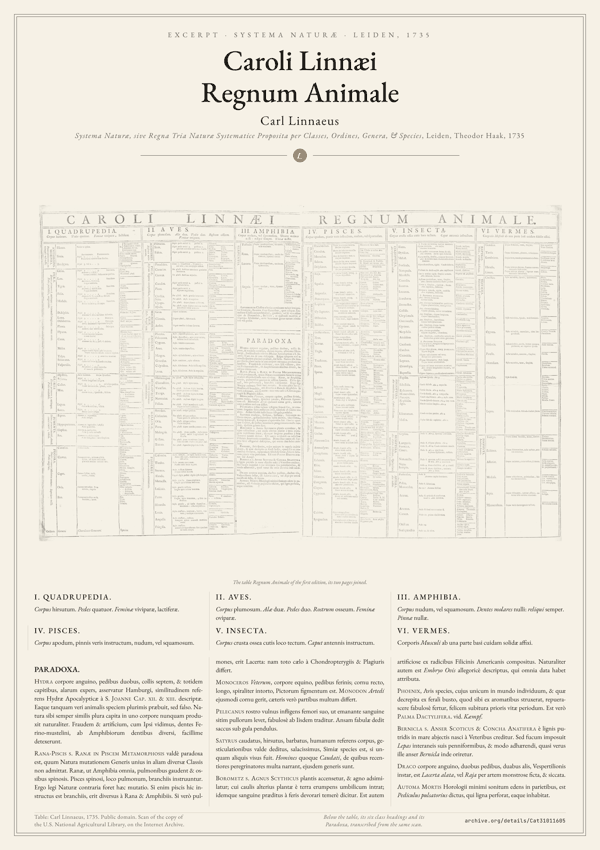</a> | [Caroli Linnæi Regnum Animale](dist/life-sciences/linnaeus-systema-naturae-A-ivory.pdf)<br>The animal kingdom table of the first edition of Linnaeus's Systema Naturae, 1735, with its six classes and its paradoxes.<br>[ivory](dist/life-sciences/linnaeus-systema-naturae-A-ivory.pdf)&nbsp;·&nbsp;[white](dist/life-sciences/linnaeus-systema-naturae-A-white.pdf)&nbsp;·&nbsp;[genesis](dist/life-sciences/linnaeus-systema-naturae-A-genesis.pdf)&nbsp;·&nbsp;[blueprint](dist/life-sciences/linnaeus-systema-naturae-A-blueprint.pdf) | Carl Linnaeus | 1735 | A3 | Public domain |
| <a href="dist/life-sciences/jenner-vaccination-A-ivory.pdf">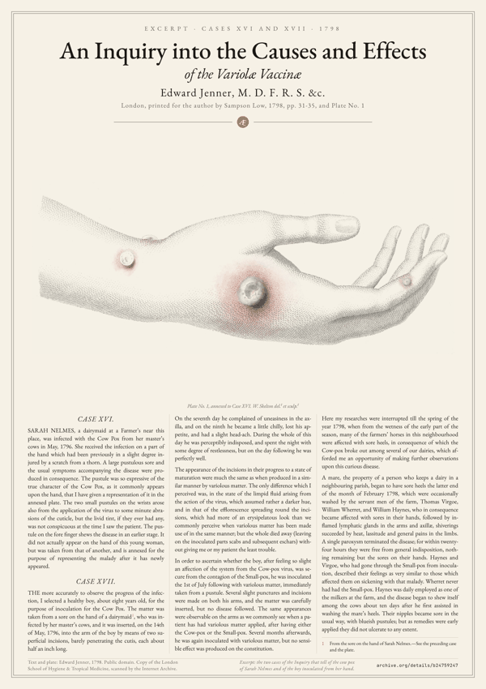</a> | [An Inquiry into the Causes and Effects of the Variolæ Vaccinæ](dist/life-sciences/jenner-vaccination-A-ivory.pdf)<br>Cases XVI and XVII of Jenner's 1798 Inquiry: a boy inoculated with cow pox in 1796 resisted smallpox inoculation.<br>[ivory](dist/life-sciences/jenner-vaccination-A-ivory.pdf)&nbsp;·&nbsp;[white](dist/life-sciences/jenner-vaccination-A-white.pdf)&nbsp;·&nbsp;[genesis](dist/life-sciences/jenner-vaccination-A-genesis.pdf)&nbsp;·&nbsp;[blueprint](dist/life-sciences/jenner-vaccination-A-blueprint.pdf) | Edward Jenner | 1798 | A3 | Public domain |
| <a href="dist/life-sciences/darwin-wallace-1858-A-ivory.pdf"></a> | [On the Tendency of Species to form Varieties; and on the Perpetuation of Varieties and Species by Natural Means of Selection](dist/life-sciences/darwin-wallace-1858-A-ivory.pdf)<br>Darwin's and Wallace's papers on natural selection, read together at the Linnean Society on 1 July 1858.<br>[ivory](dist/life-sciences/darwin-wallace-1858-A-ivory.pdf)&nbsp;·&nbsp;[white](dist/life-sciences/darwin-wallace-1858-A-white.pdf)&nbsp;·&nbsp;[genesis](dist/life-sciences/darwin-wallace-1858-A-genesis.pdf)&nbsp;·&nbsp;[blueprint](dist/life-sciences/darwin-wallace-1858-A-blueprint.pdf) | Charles Darwin, Alfred Russel Wallace | 1858 | A1 | Public domain |
| <a href="dist/life-sciences/mendel-1866-A-ivory.pdf">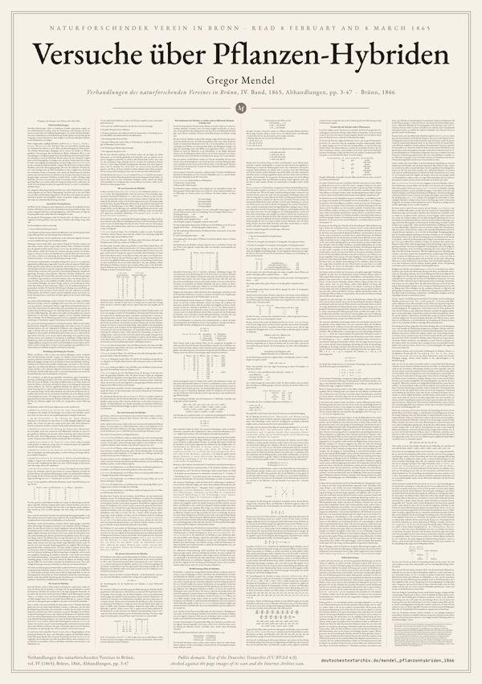</a> | [Versuche über Pflanzen-Hybriden](dist/life-sciences/mendel-1866-A-ivory.pdf)<br>Gregor Mendel's 1866 paper on crosses of garden peas, which set out the laws of inheritance.<br>[ivory](dist/life-sciences/mendel-1866-A-ivory.pdf)&nbsp;·&nbsp;[white](dist/life-sciences/mendel-1866-A-white.pdf)&nbsp;·&nbsp;[genesis](dist/life-sciences/mendel-1866-A-genesis.pdf)&nbsp;·&nbsp;[blueprint](dist/life-sciences/mendel-1866-A-blueprint.pdf) | Gregor Mendel | 1866 | A0 | Public domain |
| <a href="dist/life-sciences/fleming-penicillin-A-ivory.pdf">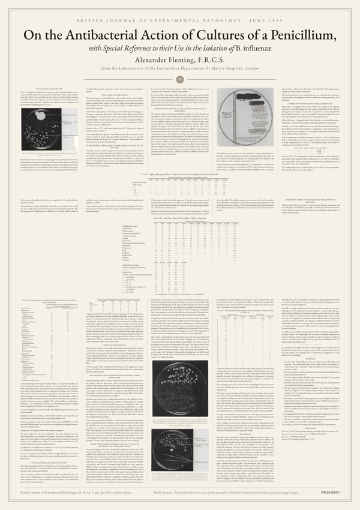</a> | [On the Antibacterial Action of Cultures of a Penicillium, with Special Reference to their Use in the Isolation of B. influenzæ](dist/life-sciences/fleming-penicillin-A-ivory.pdf)<br>Alexander Fleming's 1929 paper on penicillin, the antibacterial substance made by a mould in broth cultures.<br>[ivory](dist/life-sciences/fleming-penicillin-A-ivory.pdf)&nbsp;·&nbsp;[white](dist/life-sciences/fleming-penicillin-A-white.pdf)&nbsp;·&nbsp;[genesis](dist/life-sciences/fleming-penicillin-A-genesis.pdf)&nbsp;·&nbsp;[blueprint](dist/life-sciences/fleming-penicillin-A-blueprint.pdf) | Alexander Fleming | 1929 | A1 | Public domain |

### Historical data visualization

| &nbsp;&nbsp;&nbsp;&nbsp;&nbsp;&nbsp;&nbsp;&nbsp;&nbsp;&nbsp;&nbsp;&nbsp;&nbsp;&nbsp;&nbsp;&nbsp;&nbsp;&nbsp;&nbsp;&nbsp;&nbsp;&nbsp;&nbsp;&nbsp; | Paper | Authors | Year | Print from | License |
|---|---|---|---|---|---|
| <a href="dist/data-viz/halley-winds-A-ivory.pdf">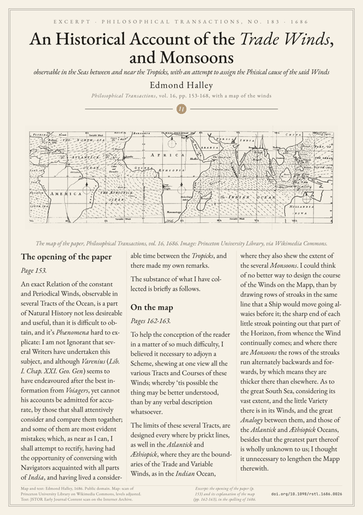</a> | [Edmond Halley: An Historical Account of the Trade Winds, and Monsoons](dist/data-viz/halley-winds-A-ivory.pdf)<br>Halley's 1686 account of the trade winds and monsoons, with his map of the winds between and near the tropics.<br>[ivory](dist/data-viz/halley-winds-A-ivory.pdf)&nbsp;·&nbsp;[white](dist/data-viz/halley-winds-A-white.pdf)&nbsp;·&nbsp;[genesis](dist/data-viz/halley-winds-A-genesis.pdf)&nbsp;·&nbsp;[blueprint](dist/data-viz/halley-winds-A-blueprint.pdf) | Edmond Halley | 1686 | A3 | Public domain |
| <a href="dist/data-viz/playfair-charts-A-ivory.pdf">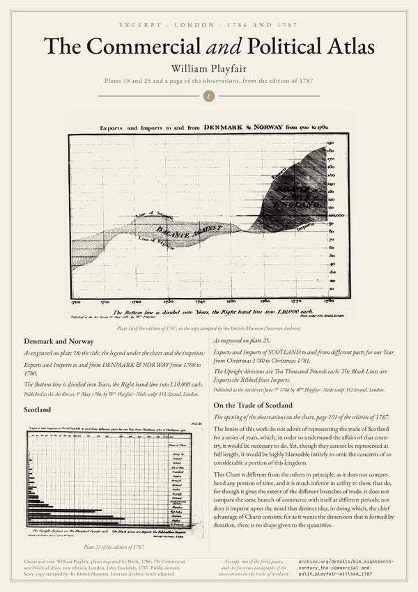</a> | [William Playfair: The Commercial and Political Atlas](dist/data-viz/playfair-charts-A-ivory.pdf)<br>Two 1786 charts by William Playfair: trade with Denmark and Norway over time, and Scotland's trade as bars.<br>[ivory](dist/data-viz/playfair-charts-A-ivory.pdf)&nbsp;·&nbsp;[white](dist/data-viz/playfair-charts-A-white.pdf)&nbsp;·&nbsp;[genesis](dist/data-viz/playfair-charts-A-genesis.pdf)&nbsp;·&nbsp;[blueprint](dist/data-viz/playfair-charts-A-blueprint.pdf) | William Playfair | 1786 | A3 | Public domain |
| <a href="dist/data-viz/snow-cholera-map-A-ivory.pdf"></a> | [John Snow: the Broad Street cholera map](dist/data-viz/snow-cholera-map-A-ivory.pdf)<br>John Snow's map of the 1854 cholera deaths around Broad Street, which pointed to a single public water pump.<br>[ivory](dist/data-viz/snow-cholera-map-A-ivory.pdf)&nbsp;·&nbsp;[white](dist/data-viz/snow-cholera-map-A-white.pdf)&nbsp;·&nbsp;[genesis](dist/data-viz/snow-cholera-map-A-genesis.pdf)&nbsp;·&nbsp;[blueprint](dist/data-viz/snow-cholera-map-A-blueprint.pdf) | John Snow | 1854 | A3 | Public domain (map); notice: MIT |
| <a href="dist/data-viz/nightingale-rose-A-ivory.pdf"></a> | [Florence Nightingale: Diagram of the Causes of Mortality in the Army in the East](dist/data-viz/nightingale-rose-A-ivory.pdf)<br>Florence Nightingale's 1858 diagram of the British army's monthly deaths in the East, from disease, wounds and other causes.<br>[ivory](dist/data-viz/nightingale-rose-A-ivory.pdf)&nbsp;·&nbsp;[white](dist/data-viz/nightingale-rose-A-white.pdf)&nbsp;·&nbsp;[genesis](dist/data-viz/nightingale-rose-A-genesis.pdf)&nbsp;·&nbsp;[blueprint](dist/data-viz/nightingale-rose-A-blueprint.pdf) | Florence Nightingale | 1858 | A3 | Public domain (diagram); photograph: CC BY 4.0; notice: MIT |
| <a href="dist/data-viz/minard-russia-A-ivory.pdf">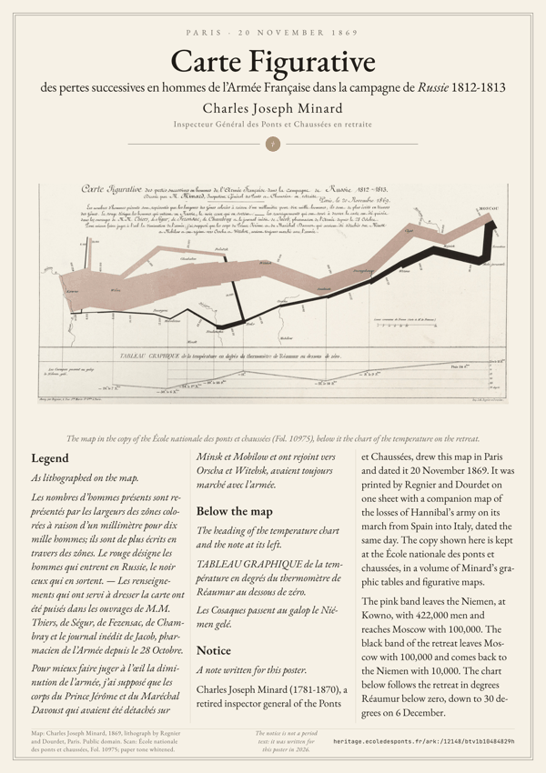</a> | [Charles Joseph Minard: Carte figurative des pertes successives en hommes de l'Armée Française dans la campagne de Russie 1812-1813](dist/data-viz/minard-russia-A-ivory.pdf)<br>Minard's 1869 map of the French army in Russia in 1812-1813, its width drawn to scale of the men left.<br>[ivory](dist/data-viz/minard-russia-A-ivory.pdf)&nbsp;·&nbsp;[white](dist/data-viz/minard-russia-A-white.pdf)&nbsp;·&nbsp;[genesis](dist/data-viz/minard-russia-A-genesis.pdf)&nbsp;·&nbsp;[blueprint](dist/data-viz/minard-russia-A-blueprint.pdf) | Charles Joseph Minard | 1869 | A3 | Public domain (map); notice: MIT |
| <a href="dist/data-viz/mendeleev-1869-A-ivory.pdf"></a> | [Опыт системы элементов, основанной на их атомном весе и химическом сходстве](dist/data-viz/mendeleev-1869-A-ivory.pdf)<br>Mendeleev's system of the elements by atomic weight, sent to chemists in February 1869, with the conclusions of his paper.<br>[ivory](dist/data-viz/mendeleev-1869-A-ivory.pdf)&nbsp;·&nbsp;[white](dist/data-viz/mendeleev-1869-A-white.pdf)&nbsp;·&nbsp;[genesis](dist/data-viz/mendeleev-1869-A-genesis.pdf)&nbsp;·&nbsp;[blueprint](dist/data-viz/mendeleev-1869-A-blueprint.pdf) | Dmitri Mendeleev | 1869 | A3 | Public domain |
| <a href="dist/data-viz/haeckel-tree-A-ivory.pdf">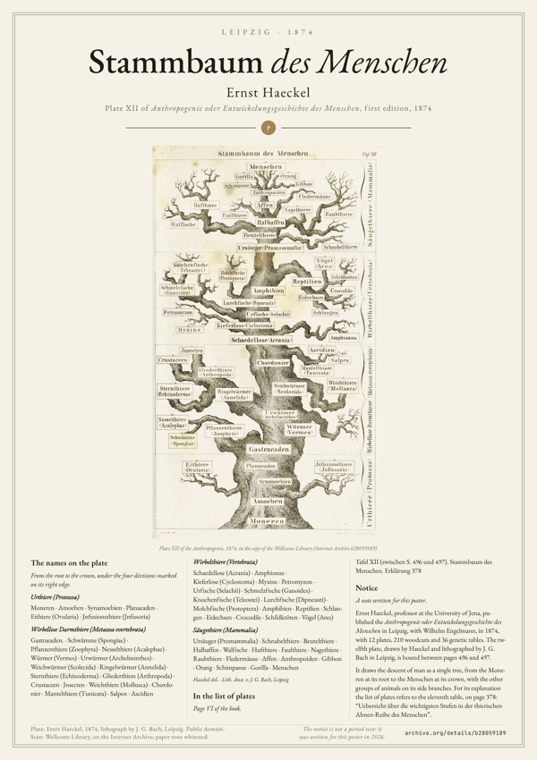</a> | [Ernst Haeckel: Stammbaum des Menschen](dist/data-viz/haeckel-tree-A-ivory.pdf)<br>Ernst Haeckel's 1874 tree of the descent of man, from the Moneren to the Menschen, plate XII of his Anthropogenie.<br>[ivory](dist/data-viz/haeckel-tree-A-ivory.pdf)&nbsp;·&nbsp;[white](dist/data-viz/haeckel-tree-A-white.pdf)&nbsp;·&nbsp;[genesis](dist/data-viz/haeckel-tree-A-genesis.pdf)&nbsp;·&nbsp;[blueprint](dist/data-viz/haeckel-tree-A-blueprint.pdf) | Ernst Haeckel | 1874 | A3 | Public domain (plate); notice: MIT |

### Patents

| &nbsp;&nbsp;&nbsp;&nbsp;&nbsp;&nbsp;&nbsp;&nbsp;&nbsp;&nbsp;&nbsp;&nbsp;&nbsp;&nbsp;&nbsp;&nbsp;&nbsp;&nbsp;&nbsp;&nbsp;&nbsp;&nbsp;&nbsp;&nbsp; | Paper | Authors | Year | Print from | License |
|---|---|---|---|---|---|
| <a href="dist/patents/bell-telephone-A-ivory.pdf">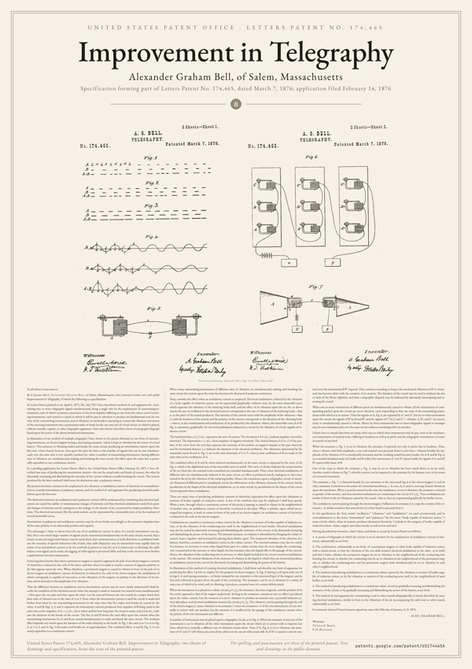</a> | [Alexander Graham Bell: Improvement in Telegraphy, US Patent 174,465](dist/patents/bell-telephone-A-ivory.pdf)<br>Bell's patent for transmitting vocal or other sounds telegraphically by undulatory electric currents.<br>[ivory](dist/patents/bell-telephone-A-ivory.pdf)&nbsp;·&nbsp;[white](dist/patents/bell-telephone-A-white.pdf)&nbsp;·&nbsp;[genesis](dist/patents/bell-telephone-A-genesis.pdf)&nbsp;·&nbsp;[blueprint](dist/patents/bell-telephone-A-blueprint.pdf) | Alexander Graham Bell | 1876 | A1 | Public domain |
| <a href="dist/patents/edison-lamp-A-ivory.pdf">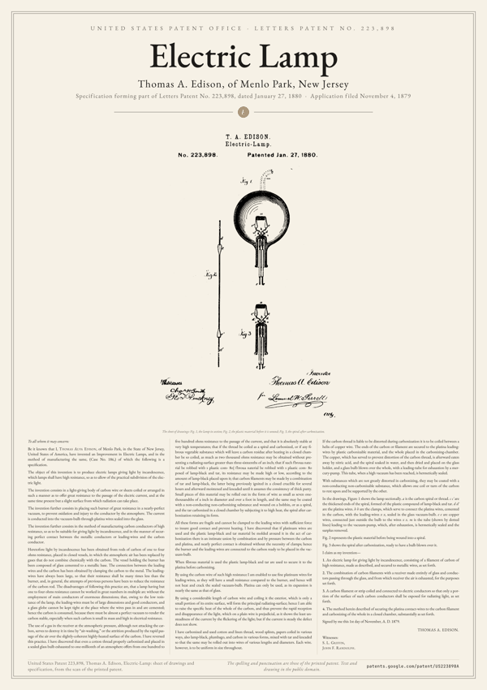</a> | [Thomas A. Edison: Electric-Lamp, US Patent 223,898](dist/patents/edison-lamp-A-ivory.pdf)<br>Edison's patent for an incandescent lamp with a high-resistance carbon filament in a sealed, evacuated glass bulb.<br>[ivory](dist/patents/edison-lamp-A-ivory.pdf)&nbsp;·&nbsp;[white](dist/patents/edison-lamp-A-white.pdf)&nbsp;·&nbsp;[genesis](dist/patents/edison-lamp-A-genesis.pdf)&nbsp;·&nbsp;[blueprint](dist/patents/edison-lamp-A-blueprint.pdf) | Thomas A. Edison | 1880 | A2 | Public domain |
| <a href="dist/patents/wright-flying-machine-A-ivory.pdf">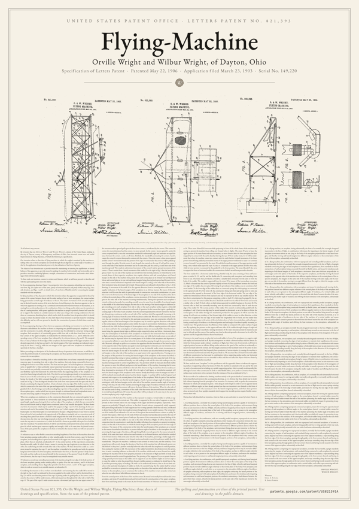</a> | [Orville and Wilbur Wright: Flying-Machine, US Patent 821,393](dist/patents/wright-flying-machine-A-ivory.pdf)<br>The Wrights' patent for a biplane balanced by warping its wings, with front horizontal and rear vertical rudders.<br>[ivory](dist/patents/wright-flying-machine-A-ivory.pdf)&nbsp;·&nbsp;[white](dist/patents/wright-flying-machine-A-white.pdf)&nbsp;·&nbsp;[genesis](dist/patents/wright-flying-machine-A-genesis.pdf)&nbsp;·&nbsp;[blueprint](dist/patents/wright-flying-machine-A-blueprint.pdf) | Orville Wright, Wilbur Wright | 1906 | A1 | Public domain |

### History & philosophy

| &nbsp;&nbsp;&nbsp;&nbsp;&nbsp;&nbsp;&nbsp;&nbsp;&nbsp;&nbsp;&nbsp;&nbsp;&nbsp;&nbsp;&nbsp;&nbsp;&nbsp;&nbsp;&nbsp;&nbsp;&nbsp;&nbsp;&nbsp;&nbsp; | Paper | Authors | Year | Print from | License |
|---|---|---|---|---|---|
| <a href="dist/history/magna-carta-A-ivory.pdf">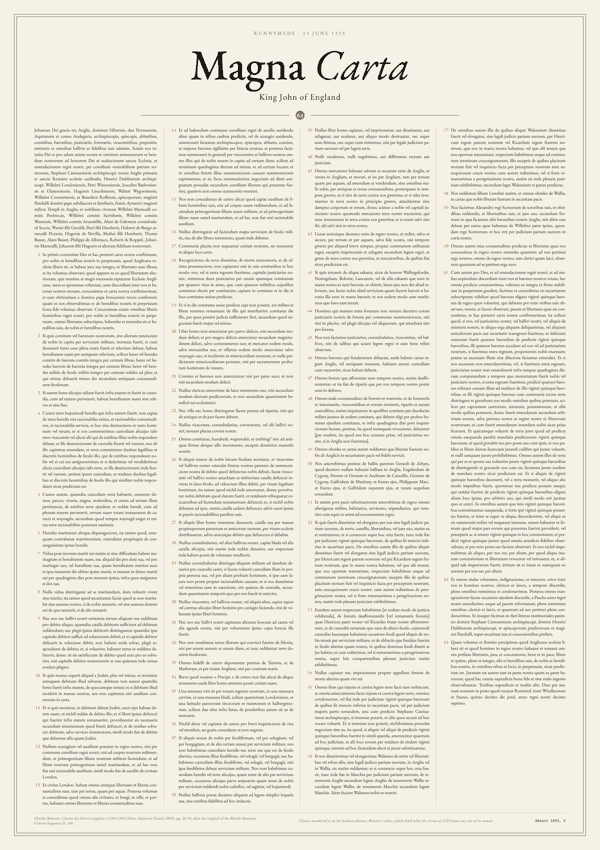</a> | [Magna Carta](dist/history/magna-carta-A-ivory.pdf)<br>The charter of liberties granted by King John to the barons of England at Runnymede in June 1215.<br>[ivory](dist/history/magna-carta-A-ivory.pdf)&nbsp;·&nbsp;[white](dist/history/magna-carta-A-white.pdf)&nbsp;·&nbsp;[genesis](dist/history/magna-carta-A-genesis.pdf)&nbsp;·&nbsp;[blueprint](dist/history/magna-carta-A-blueprint.pdf) | King John of England | 1215 | A2 | Public domain |
| <a href="dist/history/luther-95-theses-A-ivory.pdf"></a> | [Disputatio pro declaratione virtutis indulgentiarum](dist/history/luther-95-theses-A-ivory.pdf)<br>Luther's ninety-five Latin theses against the preaching of indulgences, proposed for a disputation at Wittenberg in 1517.<br>[ivory](dist/history/luther-95-theses-A-ivory.pdf)&nbsp;·&nbsp;[white](dist/history/luther-95-theses-A-white.pdf)&nbsp;·&nbsp;[genesis](dist/history/luther-95-theses-A-genesis.pdf)&nbsp;·&nbsp;[blueprint](dist/history/luther-95-theses-A-blueprint.pdf) | Martin Luther | 1517 | A3 | Public domain |
| <a href="dist/history/pascal-roseau-pensant-A-ivory.pdf">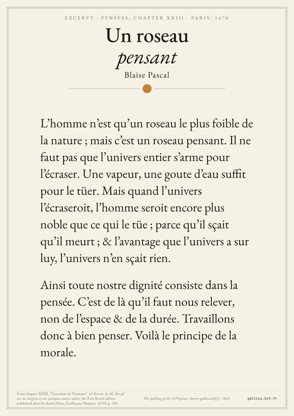</a> | [Pensées: Grandeur de l'homme](dist/history/pascal-roseau-pensant-A-ivory.pdf)<br>Pascal's fragment on man as a thinking reed, whose whole dignity lies in thought.<br>[ivory](dist/history/pascal-roseau-pensant-A-ivory.pdf)&nbsp;·&nbsp;[white](dist/history/pascal-roseau-pensant-A-white.pdf)&nbsp;·&nbsp;[genesis](dist/history/pascal-roseau-pensant-A-genesis.pdf)&nbsp;·&nbsp;[blueprint](dist/history/pascal-roseau-pensant-A-blueprint.pdf) | Blaise Pascal | 1670 | A3 | Public domain |
| <a href="dist/history/us-declaration-of-independence-A-ivory.pdf"></a> | [The Declaration of Independence](dist/history/us-declaration-of-independence-A-ivory.pdf)<br>The Continental Congress declares the thirteen colonies independent of Great Britain and lists their grievances against the King.<br>[ivory](dist/history/us-declaration-of-independence-A-ivory.pdf)&nbsp;·&nbsp;[white](dist/history/us-declaration-of-independence-A-white.pdf)&nbsp;·&nbsp;[genesis](dist/history/us-declaration-of-independence-A-genesis.pdf)&nbsp;·&nbsp;[blueprint](dist/history/us-declaration-of-independence-A-blueprint.pdf) | Thomas Jefferson, Second Continental Congress | 1776 | A3 | Public domain |
| <a href="dist/history/kant-aufklaerung-A-ivory.pdf"></a> | [Beantwortung der Frage: Was ist Aufklärung?](dist/history/kant-aufklaerung-A-ivory.pdf)<br>Kant's essay defining enlightenment as man's emergence from self-incurred immaturity and defending the free public use of reason.<br>[ivory](dist/history/kant-aufklaerung-A-ivory.pdf)&nbsp;·&nbsp;[white](dist/history/kant-aufklaerung-A-white.pdf)&nbsp;·&nbsp;[genesis](dist/history/kant-aufklaerung-A-genesis.pdf)&nbsp;·&nbsp;[blueprint](dist/history/kant-aufklaerung-A-blueprint.pdf) | Immanuel Kant | 1784 | A3 | Public domain |
| <a href="dist/history/declaration-droits-homme-A-ivory.pdf"></a> | [Déclaration des Droits de l'Homme et du Citoyen de 1789](dist/history/declaration-droits-homme-A-ivory.pdf)<br>The preamble and seventeen articles of rights adopted by the French National Assembly in August 1789.<br>[ivory](dist/history/declaration-droits-homme-A-ivory.pdf)&nbsp;·&nbsp;[white](dist/history/declaration-droits-homme-A-white.pdf)&nbsp;·&nbsp;[genesis](dist/history/declaration-droits-homme-A-genesis.pdf)&nbsp;·&nbsp;[blueprint](dist/history/declaration-droits-homme-A-blueprint.pdf) | Assemblée nationale | 1789 | A3 | Public domain |
| <a href="dist/history/declaration-droits-femme-A-ivory.pdf">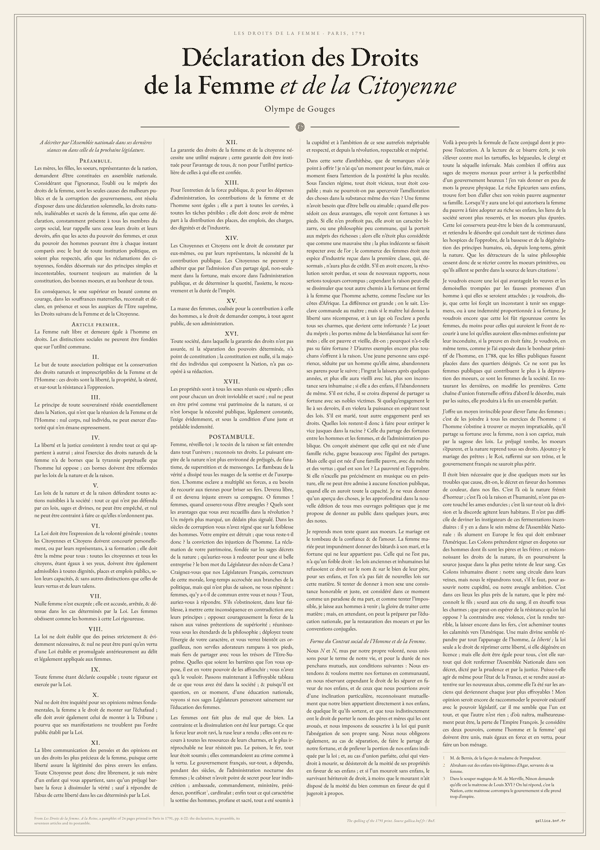</a> | [Déclaration des droits de la femme et de la citoyenne](dist/history/declaration-droits-femme-A-ivory.pdf)<br>Olympe de Gouges's seventeen articles on the rights of woman, modelled on the Declaration of 1789, with a postamble.<br>[ivory](dist/history/declaration-droits-femme-A-ivory.pdf)&nbsp;·&nbsp;[white](dist/history/declaration-droits-femme-A-white.pdf)&nbsp;·&nbsp;[genesis](dist/history/declaration-droits-femme-A-genesis.pdf)&nbsp;·&nbsp;[blueprint](dist/history/declaration-droits-femme-A-blueprint.pdf) | Olympe de Gouges | 1791 | A2 | Public domain |
| <a href="dist/history/us-bill-of-rights-A-ivory.pdf">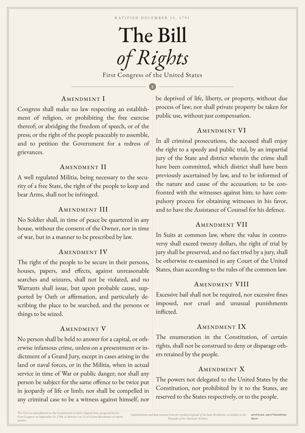</a> | [The Bill of Rights](dist/history/us-bill-of-rights-A-ivory.pdf)<br>The first ten amendments to the Constitution of the United States, ratified on December 15, 1791.<br>[ivory](dist/history/us-bill-of-rights-A-ivory.pdf)&nbsp;·&nbsp;[white](dist/history/us-bill-of-rights-A-white.pdf)&nbsp;·&nbsp;[genesis](dist/history/us-bill-of-rights-A-genesis.pdf)&nbsp;·&nbsp;[blueprint](dist/history/us-bill-of-rights-A-blueprint.pdf) | First Congress of the United States | 1791 | A3 | Public domain |
| <a href="dist/history/abolition-esclavage-1848-A-ivory.pdf">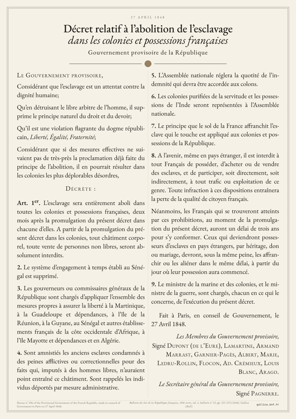</a> | [Décret relatif à l'abolition de l'esclavage dans les colonies et possessions françaises](dist/history/abolition-esclavage-1848-A-ivory.pdf)<br>The French Provisional Government abolishes slavery in all French colonies and possessions and forbids French citizens to own slaves.<br>[ivory](dist/history/abolition-esclavage-1848-A-ivory.pdf)&nbsp;·&nbsp;[white](dist/history/abolition-esclavage-1848-A-white.pdf)&nbsp;·&nbsp;[genesis](dist/history/abolition-esclavage-1848-A-genesis.pdf)&nbsp;·&nbsp;[blueprint](dist/history/abolition-esclavage-1848-A-blueprint.pdf) | Gouvernement provisoire de la République française | 1848 | A3 | Public domain |
| <a href="dist/history/emancipation-proclamation-A-ivory.pdf">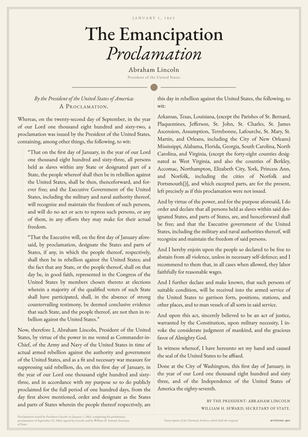</a> | [The Emancipation Proclamation](dist/history/emancipation-proclamation-A-ivory.pdf)<br>Lincoln's proclamation declaring free the persons held as slaves within the States then in rebellion.<br>[ivory](dist/history/emancipation-proclamation-A-ivory.pdf)&nbsp;·&nbsp;[white](dist/history/emancipation-proclamation-A-white.pdf)&nbsp;·&nbsp;[genesis](dist/history/emancipation-proclamation-A-genesis.pdf)&nbsp;·&nbsp;[blueprint](dist/history/emancipation-proclamation-A-blueprint.pdf) | Abraham Lincoln | 1863 | A3 | Public domain (U.S. Government work) |
| <a href="dist/history/gettysburg-address-A-ivory.pdf"></a> | [The Gettysburg Address](dist/history/gettysburg-address-A-ivory.pdf)<br>Lincoln's address at the dedication of the Cemetery at Gettysburg, in the final text he wrote out in 1864.<br>[ivory](dist/history/gettysburg-address-A-ivory.pdf)&nbsp;·&nbsp;[white](dist/history/gettysburg-address-A-white.pdf)&nbsp;·&nbsp;[genesis](dist/history/gettysburg-address-A-genesis.pdf)&nbsp;·&nbsp;[blueprint](dist/history/gettysburg-address-A-blueprint.pdf) | Abraham Lincoln | 1863 | A3 | Public domain |
| <a href="dist/history/kennedy-moon-speech-A-ivory.pdf"></a> | [Address at Rice University on the Nation's Space Effort](dist/history/kennedy-moon-speech-A-ivory.pdf)<br>President Kennedy explains why the United States chooses to go to the Moon in this decade.<br>[ivory](dist/history/kennedy-moon-speech-A-ivory.pdf)&nbsp;·&nbsp;[white](dist/history/kennedy-moon-speech-A-white.pdf)&nbsp;·&nbsp;[genesis](dist/history/kennedy-moon-speech-A-genesis.pdf)&nbsp;·&nbsp;[blueprint](dist/history/kennedy-moon-speech-A-blueprint.pdf) | John F. Kennedy | 1962 | A3 | Public domain (U.S. Government work) |

### Reference sheets

| &nbsp;&nbsp;&nbsp;&nbsp;&nbsp;&nbsp;&nbsp;&nbsp;&nbsp;&nbsp;&nbsp;&nbsp;&nbsp;&nbsp;&nbsp;&nbsp;&nbsp;&nbsp;&nbsp;&nbsp;&nbsp;&nbsp;&nbsp;&nbsp; | Paper | Authors | Year | Print from | License |
|---|---|---|---|---|---|
| <a href="dist/reference/ascii-table-A-ivory.pdf">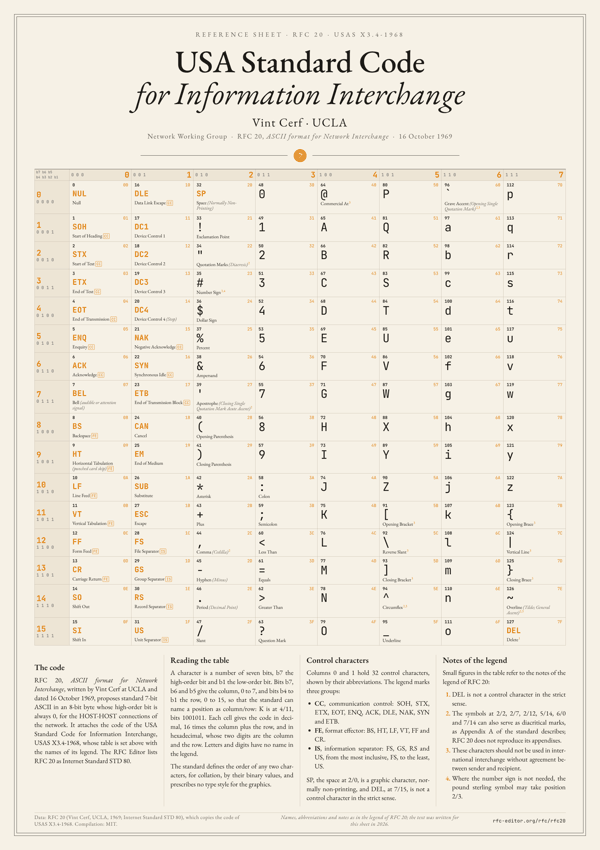</a> | [ASCII: USA Standard Code for Information Interchange](dist/reference/ascii-table-A-ivory.pdf)<br>The 128 codes of 7-bit ASCII with their decimal and hexadecimal values and names, as RFC 20 gives them.<br>[ivory](dist/reference/ascii-table-A-ivory.pdf)&nbsp;·&nbsp;[white](dist/reference/ascii-table-A-white.pdf)&nbsp;·&nbsp;[genesis](dist/reference/ascii-table-A-genesis.pdf)&nbsp;·&nbsp;[blueprint](dist/reference/ascii-table-A-blueprint.pdf) | Vint Cerf | 1969 | A3 | MIT (compilation); data: RFC 20 (USAS X3.4-1968) |
| <a href="dist/reference/si-base-units-A-ivory.pdf">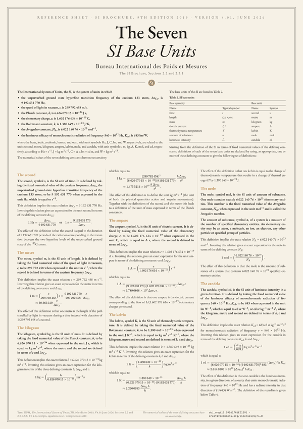</a> | [The SI Base Units](dist/reference/si-base-units-A-ivory.pdf)<br>The seven defining constants of the SI and the definitions of its seven base units, from the SI Brochure.<br>[ivory](dist/reference/si-base-units-A-ivory.pdf)&nbsp;·&nbsp;[white](dist/reference/si-base-units-A-white.pdf)&nbsp;·&nbsp;[genesis](dist/reference/si-base-units-A-genesis.pdf)&nbsp;·&nbsp;[blueprint](dist/reference/si-base-units-A-blueprint.pdf) | Bureau International des Poids et Mesures | 2019 | A3 | MIT (compilation); data: SI Brochure, BIPM (CC BY 4.0) |
| <a href="dist/reference/http-status-codes-A-ivory.pdf">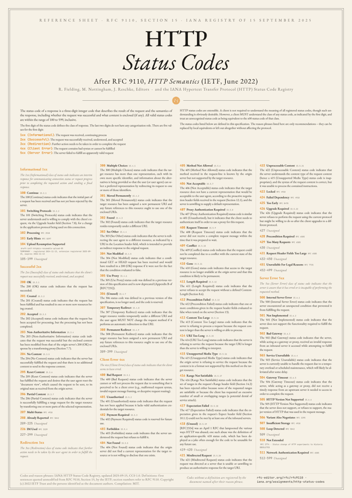</a> | [HTTP Status Codes](dist/reference/http-status-codes-A-ivory.pdf)<br>Every status code of the IANA HTTP registry with its reason phrase, and the definitions of RFC 9110.<br>[ivory](dist/reference/http-status-codes-A-ivory.pdf)&nbsp;·&nbsp;[white](dist/reference/http-status-codes-A-white.pdf)&nbsp;·&nbsp;[genesis](dist/reference/http-status-codes-A-genesis.pdf)&nbsp;·&nbsp;[blueprint](dist/reference/http-status-codes-A-blueprint.pdf) | Roy T. Fielding, Mark Nottingham, Julian Reschke, IANA | 2022 | A2 | MIT (compilation); data: RFC 9110 (IETF Trust), IANA registry (CC0 1.0) |
| <a href="dist/reference/morse-phonetic-alphabet-A-ivory.pdf">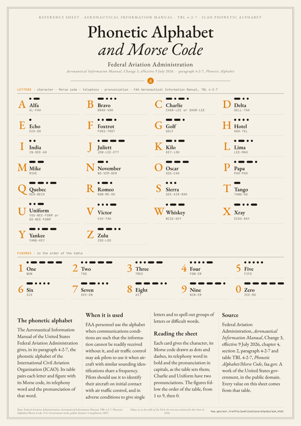</a> | [Phonetic Alphabet and Morse Code](dist/reference/morse-phonetic-alphabet-A-ivory.pdf)<br>The ICAO phonetic alphabet with the Morse code of each letter and figure, from the FAA's Aeronautical Information Manual.<br>[ivory](dist/reference/morse-phonetic-alphabet-A-ivory.pdf)&nbsp;·&nbsp;[white](dist/reference/morse-phonetic-alphabet-A-white.pdf)&nbsp;·&nbsp;[genesis](dist/reference/morse-phonetic-alphabet-A-genesis.pdf)&nbsp;·&nbsp;[blueprint](dist/reference/morse-phonetic-alphabet-A-blueprint.pdf) | Federal Aviation Administration | 2026 | A3 | MIT (compilation); data: FAA AIM (public domain) |

## Coming soon

Texts that wait for a license allowing their redistribution; [PENDING.md](PENDING.md) says what is missing.

- A Cypherpunk's Manifesto (Eric Hughes, 1993)
- Hashcash: A Denial of Service Counter-Measure (Adam Back, 2002)
- b-money (Wei Dai, 1998)
- Bit Gold (Nick Szabo, 2005)
- Bitcoin v0.1 released (Satoshi Nakamoto, 2009)
- Mimblewimble (Tom Elvis Jedusor, 2016)
- Apollo 11: the master ignition routine of Luminary 099 (MIT Instrumentation Laboratory, 1969)
- Computing Machinery and Intelligence (Alan Turing, 1950)
- The Conscience of a Hacker (The Mentor, 1986)
- What would you like to see most in minix? (Linus Torvalds, 1991)
- RPOW: Reusable Proofs of Work (Hal Finney, 2004)
- Universal Declaration of Human Rights (United Nations General Assembly, 1948)
- The Pioneer plaque (Carl Sagan, Frank Drake, Linda Salzman Sagan, 1972)
- The Arecibo message (Frank Drake and colleagues, 1974)
- I think: the tree sketch of Notebook B (Charles Darwin, 1837)

<!-- catalog:end -->

## Download

Every PDF is in [`dist/<category>/`](dist), named `<paper>-<format>-<theme>.pdf`, and the [latest release](https://github.com/vodhash/one-page-papers/releases/latest) has them all, with one zip per category. Text, equations and figures are all vector, so they print sharp at any size.

| Format | File size | Prints at |
|---|---|---|
| `A` | 59.4 × 84.1 cm (A1) | A0, A1, A2, A3 (same ratio, just scale) |
| `50x70` | 50 × 70 cm | 50 × 70 cm |
| `60x80` | 60 × 80 cm | 60 × 80 cm |

Themes: `ivory` (warm paper), `white` (pure white), `genesis` (dark, bitcoin orange), `blueprint` (navy). The catalog shows each poster in the first of its themes, and links its PDF in each of them.

**Print tips.** Print a poster at its *Print from* size or larger: below it, its body text falls under 8 pt (`make check` prints the body size of every paper at every format). Use matte paper, 200 g/m² or heavier. Dark themes are best printed by a professional lab.

## Build

Requires Node.js, Python 3 and Make. `make deps` uses [uv](https://docs.astral.sh/uv/) when it is installed, and the standard `venv` module otherwise (on Debian and Ubuntu: `apt install python3-venv`).

```bash
make deps      # node_modules and .venv at the pinned versions, plus headless Chromium
make           # every paper × format × theme into dist/ and docs/, then the catalog of this README
make bitcoin   # a single paper, by its slug
make internet  # every paper of a category
make readme    # the catalog of this README, from the meta.yaml files and PENDING.md
make site      # the showcase site into site/ (needs pdftoppm, from poppler-utils)
make serve     # the site on http://localhost:8000/
make check     # fit every poster, compare it with dist/ and docs/, check the catalog; writes nothing
.venv/bin/python engine/build.py rfc-1925 --formats A --themes genesis
```

Builds are deterministic, but for two differences that do not show: in about one print in twenty of a page full of formulas, Chromium sets one run of glyphs on a baseline rounded to a whole pixel, and the last digits of some numbers, such as the matrix of a rotation, depend on the processor. So a PDF is only rewritten when it differs from the one in `dist/` by more than that, and a commit only carries the PDFs and previews of the posters that changed. Pushing a `v*` tag makes GitHub Actions build every poster again and attach the PDFs to a release, with one zip per category. Versions are pinned (`package-lock.json`, and `requirements.txt`, whose Playwright version fixes the Chromium build), and Chromium lays text out without the local font hinting settings, to keep the layout independent of the machine.

`make check` also runs on GitHub Actions for every push and pull request. It fails when a poster overflows its page, when it still fits at the largest allowed body size, when a character is drawn with a system font, when `min_print` does not match the body size, when a PDF of `dist/` differs from a fresh build (beyond those differences) or a preview is missing from `docs/`, when either holds a file that no paper makes, or when the catalog of this README is out of date.

## Add a paper

A paper is a folder `papers/<category>/<slug>/`. The slug names its PDFs and its `make` target, so it is unique across categories. The categories are the folders of `papers/`: `crypto`, `computing`, `internet`, `software`, `manifestos`, `physics`, `space`, `mathematics`, `life-sciences`, `data-viz`, `patents`, `history` and `reference` (reference sheets compiled for the project from the standards they cite); `engine/papers.py` gives their titles in the catalog.

| File | Purpose |
|---|---|
| `meta.yaml` | title, source, license, header, footer and layout (see existing papers) |
| `text.md` | the text, in the small Markdown dialect documented in `engine/markdown.py` |
| `figures.py` | optional: `FIGS = {"name": fn}`, each `fn()` returns an SVG string built with `engine/svg.py` |
| images | optional: PNG, JPEG, GIF, WebP or SVG files for `::: image`, embedded in the PDF |
| `style.css` | optional: paper-specific CSS; a rule on `:root[data-theme=genesis]` applies to one theme only |

`text.md` is plain Markdown paragraphs and lists, plus these constructs (all listed in `engine/markdown.py`):

| Syntax | Effect |
|---|---|
| `## Title`, `### Title`, `#### Title` | headings; with `numbered: true` they are numbered 1., 1.1., 1.1.1., and a title that starts with a section number such as `3.1.` or `2.1` gets the same styling |
| `::: figure <name>` | an SVG figure from `figures.py` |
| `::: image <file> [caption="…"] [width=N%] [on_dark=plate\|invert] [on_light=multiply]` | an image from the folder of the paper, embedded in the page, `width` of its column (default 100%). On the dark themes, `plate` (default) keeps it on a light card and `invert` turns its white into the paper and its black into the ink (for line drawings). On the light themes, `on_light=multiply` melts its white into the paper, for scans with a white background |
| `::: wide` … `:::` | a block across all the columns, holding any other syntax (code, math, figures, HTML) |
| `::: wide cols=N` … `:::` | the `##` sections of the block side by side, one per left-aligned cell of an N-column grid (see `papers/rfc-1925`) |
| `$$ … $$` | display math, rendered with KaTeX |
| `\( … \)` | math within a line of text, rendered with KaTeX |
| `(1)`, `(1a)` | labelled items; a sub-item such as `(1a)` stays in the same column as its item |
| `[^label]`, `[^label]: text` | footnote call and definition; notes are numbered in order of first call and listed at the end of the text |
| `<tag …>` | raw HTML, passed through |

Mistakes, such as an unclosed block or a footnote that is never defined, are reported with their line number.

In `meta.yaml`, unknown keys are rejected, and these keys are required:

| Key | Content |
|---|---|
| `title`, `authors`, `year` | title, list of authors, and year of the text: a number, negative before the common era, or a text such as `c. 400 BC` |
| `summary` | one factual sentence of 20 words at most, shown under the title in the catalog |
| `min_print` | the smallest of A3, A2, A1 and A0 at which the body prints at 8 pt or more; the build computes it and fails when it differs |
| `source` | `url`, `retrieved` (a date) and `edition` of the primary source or reference edition of the text, with every difference between that source and the poster |
| `license` | `text`, short, for the catalog, then either `notice`, the license or permission word for word, or `basis`, why the text is in the public domain in France and in the United States; `holder` and `note` are optional |

The optional keys:

| Key | Default | Effect |
|---|---|---|
| `lang` | `en` | language of the text, for hyphenation (English, French, German and many more) |
| `layout` | `columns` | `centered` suits short texts: one column unless `columns` says otherwise, vertically centered on the page. `hero` puts the first `::: image` of the text across the top of the page, and the text in columns below |
| `hero_height` | 50 | share of the page height given to the hero image, in % |
| `themes` | all | the themes this paper is printed in, for instance `[white, genesis]` |
| `columns` | 4, or 1 when centered | number of text columns |
| `font_range` | `[8, 40]` | bounds of the search for the body size, in pt; the build warns when the text still fits at the maximum |
| `max_font` | none | hard cap on the body size, in pt, so that a short text does not end up in giant type; reaching it is expected |
| `numbered` | `false` | number the `##` sections |
| `title_html`, `title_size`, `header_scale` | `title`, `76pt`, `1` | title with HTML markup, its size, and the scale of the other header lines |
| `kicker`, `author`, `byline`, `emblem`, `abstract`, `abstract_label`, `footer` | | header and footer content (see existing papers) |

Every text comes from a primary source or a reference edition, never from memory, and its words are counted against that source; an excerpt says so on the poster. A text is only added when it is in the public domain in France and in the United States, or when a license or permission allows its redistribution, in which case the poster keeps the notices that the license requires. The other texts wait in [PENDING.md](PENDING.md), which says what is missing for each, and are listed under *Coming soon*.

Every character must come from the bundled fonts (EB Garamond, JetBrains Mono, KaTeX), since a system font would make the PDF depend on the machine. `make check` names the characters that fall back; `papers/crypto/bitcoin/style.css` shows the fix, taking ₿ from JetBrains Mono.

## How it works

`engine/build.py` finds the papers in `papers/<category>/<slug>/`, parses the Markdown, pre-renders math with KaTeX, injects SVG figures into an HTML template, then drives headless Chromium: for each format it waits for the fonts, binary-searches the largest body size that fits in whole hundredths of a point, settles it on pages that have laid out nothing else, so that it does not depend on what Chromium laid out before, prints a PDF at a fixed 594 mm design width, and scales it to the target format with pypdf, keeping the page vector and its content losslessly compressed. Images are embedded in the page as data URIs, so every PDF is self-contained. Themes are sets of CSS variables in `engine/themes.py`. `engine/readme.py` writes the catalog of this README from the `meta.yaml` files and PENDING.md.

## Origin

It started with a simple wish: to frame the Bitcoin whitepaper and hang
it in my office. A few one-page versions already existed online, but none
matched what I had in mind, so I typeset my own: the full text, the
equations and the C code, with every figure redrawn as vector graphics
and the genesis block hash in the footer.

The first version was a single poster, briefly published as
`one-page-satoshi`. Once it worked, the obvious question followed: which
other texts deserve the same treatment? A list quickly grew, from early
cryptocurrency papers to RFCs, manifestos and founding texts of science,
and it became clear that the typesetting engine was the real project.
The Bitcoin-specific code was split into a reusable engine and per-paper
content, and the project became `one-page-papers`.

Each new poster has pushed the engine a little further. RFC 1925 brought
short texts in large type, the Zen of Python centred layouts, RFC 791
full-width diagrams, and John Snow's cholera map images and hero layouts.
Some texts taught the limits of the idea: Turing's *On Computable
Numbers* runs to 36 pages and cannot fit legibly on a single sheet, so
not every classic makes the cut.

## License

Engine code: MIT. Each paper keeps its own license, recorded in its `meta.yaml` and summed up in the catalog above; see [`LICENSE`](LICENSE).
