# one-page-papers

**Foundational papers, typeset on a single poster. Print them, frame them, hang them.**

Each paper is laid out in full on one page: every section, equation, code listing, table and reference, with figures redrawn as vector graphics. The body size is computed automatically so the text fills the page exactly.

## Papers

### Bitcoin: A Peer-to-Peer Electronic Cash System
Satoshi Nakamoto, 2008. Full text, 7 redrawn figures, genesis block in the footer.

| ivory | white | genesis | blueprint |
|---|---|---|---|
|  | 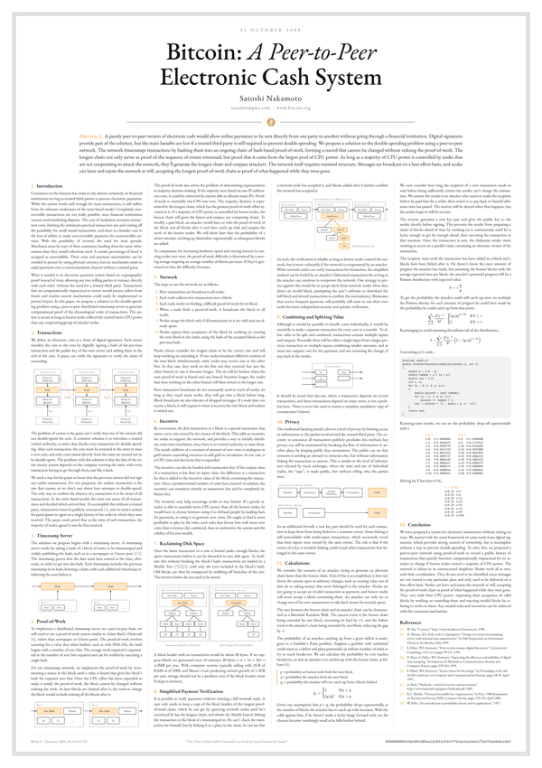 | 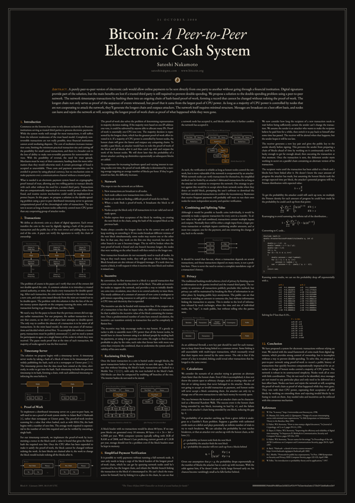 | 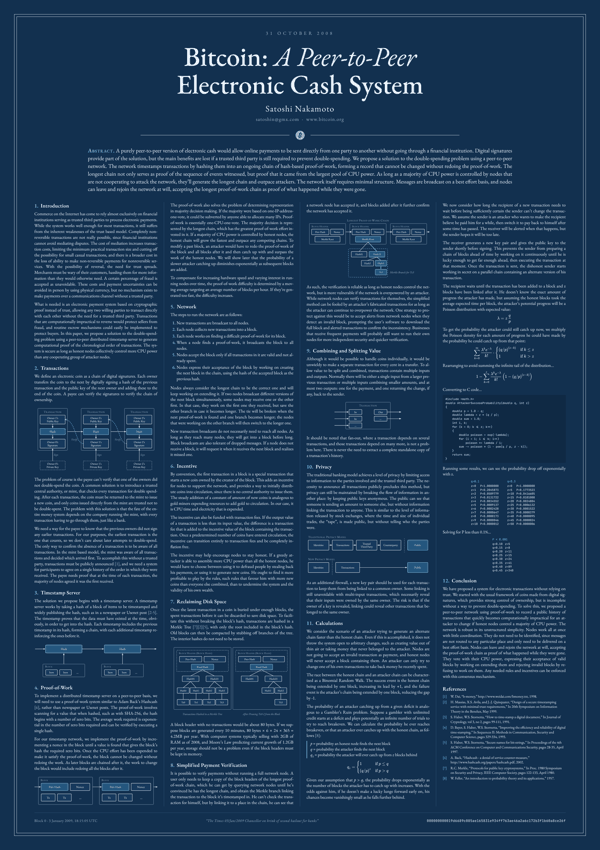 |

### RFC 1925: The Twelve Networking Truths
Ross Callon, 1 April 1996. Large type, readable from across the room.

| ivory | white | genesis | blueprint |
|---|---|---|---|
| 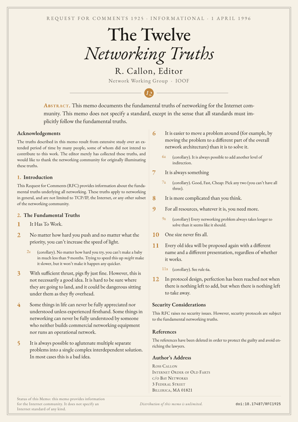 | 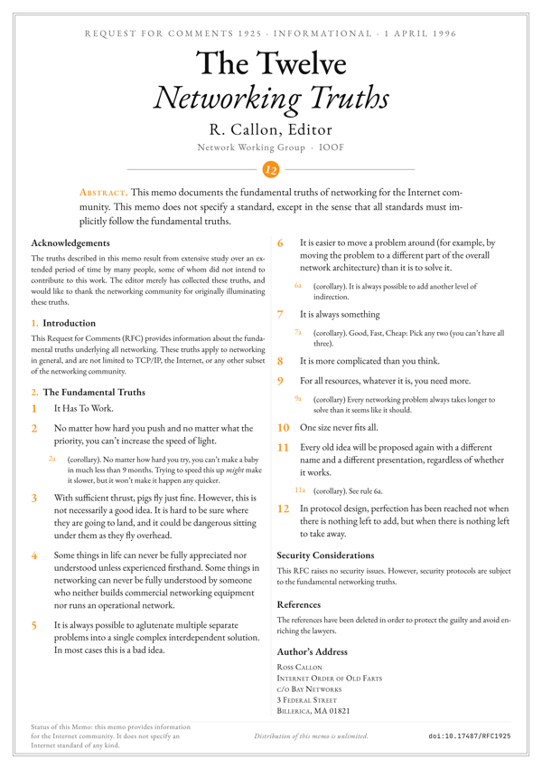 | 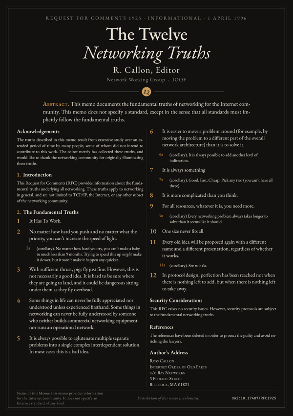 | 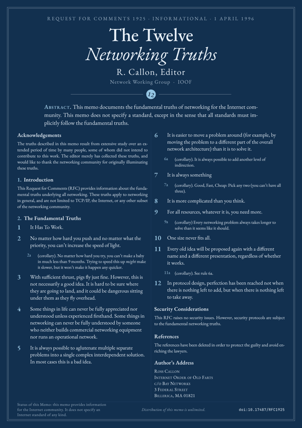 |

### PEP 20: The Zen of Python
Tim Peters, 2004. The nineteen aphorisms, set as a typographic poster; comfortable down to A3.

| ivory | white | genesis | blueprint |
|---|---|---|---|
| 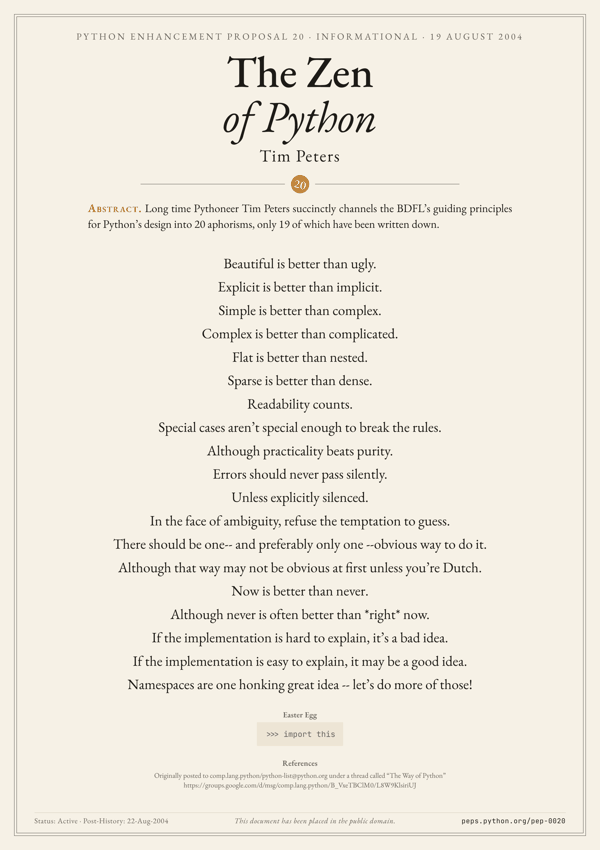 | 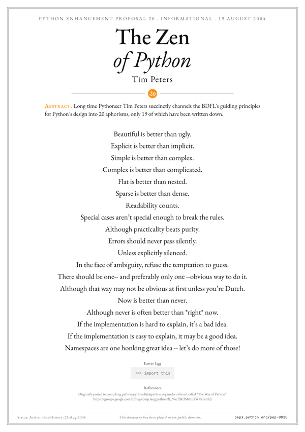 | 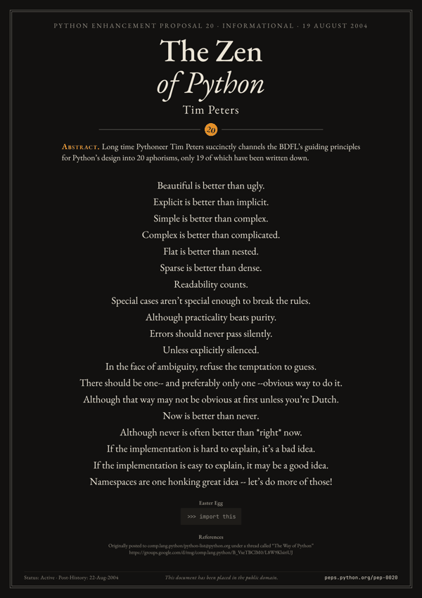 | 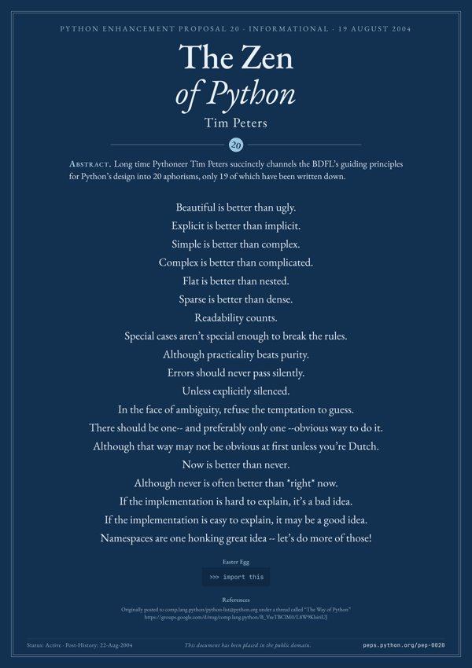 |

## Download

Vector PDFs are in [`dist/<paper>/`](dist), named `<paper>-<format>-<theme>.pdf`. Text, equations and figures are all vector, so they print sharp at any size.

| Format | File size | Prints at |
|---|---|---|
| `A` | 59.4 × 84.1 cm (A1) | A0, A1, A2, A3 (same ratio, just scale) |
| `50x70` | 50 × 70 cm | 50 × 70 cm |
| `60x80` | 60 × 80 cm | 60 × 80 cm |

Themes: `ivory` (warm paper), `white` (pure white), `genesis` (dark, bitcoin orange), `blueprint` (navy).

**Print tips.** For dense papers like Bitcoin, A2 is the smallest comfortable size (8.7 pt body text; `make check` prints the size of every paper at every format). Use matte paper, 200 g/m² or heavier. Dark themes are best printed by a professional lab.

## Build

Requires Node.js, Python 3 and Make. `make deps` uses [uv](https://docs.astral.sh/uv/) when it is installed, and the standard `venv` module otherwise (on Debian and Ubuntu: `apt install python3-venv`).

```bash
make deps      # node_modules and .venv at the pinned versions, plus headless Chromium
make           # every paper × format × theme, into dist/ and docs/
make bitcoin   # a single paper
make check     # fit every poster and report problems, without touching dist/ or docs/
.venv/bin/python engine/build.py rfc-1925 --formats A --themes genesis
```

Builds are deterministic: rebuilding unchanged sources rewrites byte-identical files, so a commit only carries the posters that changed. Versions are pinned (`package-lock.json`, and `requirements.txt`, whose Playwright version fixes the Chromium build), and Chromium lays text out without the local font hinting settings, to keep the layout independent of the machine.

`make check` also runs on GitHub Actions for every push and pull request. It fails when a poster overflows its page, when it still fits at the largest allowed body size, or when a character is drawn with a system font.

## Add a paper

Create `papers/<name>/` with:

| File | Purpose |
|---|---|
| `meta.yaml` | title, header, abstract, footer, columns, license (see existing papers) |
| `text.md` | the text, in the small Markdown dialect documented in `engine/markdown.py` |
| `figures.py` | optional: `FIGS = {"name": fn}`, each `fn()` returns an SVG string built with `engine/svg.py` |
| `style.css` | optional: paper-specific CSS; a rule on `:root[data-theme=genesis]` applies to one theme only |

In `text.md`, `::: figure <name>` inserts a figure, `$$ … $$` is rendered with KaTeX, `(1)` / `(1a)` makes labelled items (a sub-item such as `(1a)` stays in the same column as its item), and raw HTML passes through. Mistakes are reported with their line number.

In `meta.yaml`, `title` and `license` are required and unknown keys are rejected. The optional keys:

| Key | Default | Effect |
|---|---|---|
| `lang` | `en` | language of the text, for hyphenation (English, French, German and many more) |
| `layout` | `columns` | `centered` suits short texts: one column unless `columns` says otherwise, vertically centered on the page |
| `columns` | 4, or 1 when centered | number of text columns |
| `font_range` | `[8, 40]` | bounds of the search for the body size, in pt; the build warns when the text still fits at the maximum |
| `max_font` | none | hard cap on the body size, in pt, so that a short text does not end up in giant type; reaching it is expected |
| `numbered` | `false` | number the `##` sections |
| `title_html`, `title_size`, `header_scale` | `title`, `76pt`, `1` | title with HTML markup, its size, and the scale of the other header lines |
| `kicker`, `author`, `byline`, `emblem`, `abstract`, `abstract_label`, `footer` | | header and footer content (see existing papers) |

Every character must come from the bundled fonts (EB Garamond, JetBrains Mono, KaTeX), since a system font would make the PDF depend on the machine. `make check` names the characters that fall back; `papers/bitcoin/style.css` shows the fix, taking ₿ from JetBrains Mono.

Only add texts whose license allows redistribution, and record it in `meta.yaml`.

## How it works

`engine/build.py` parses the Markdown, pre-renders math with KaTeX, injects SVG figures into an HTML template, then drives headless Chromium: for each format it waits for the fonts, binary-searches the largest body size that fits in whole hundredths of a point, checks it again on a freshly loaded page, prints a PDF at a fixed 594 mm design width, and scales it to the target format with pypdf, keeping the page vector and its content losslessly compressed. Themes are sets of CSS variables in `engine/themes.py`.

## License

Engine code: MIT. Each paper keeps its own license, see [`LICENSE`](LICENSE) and `papers/*/meta.yaml`.
