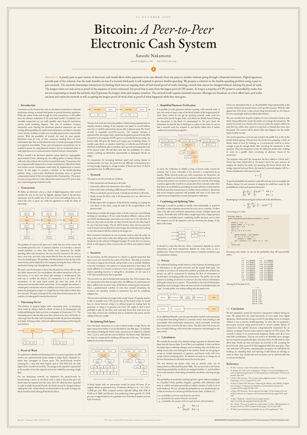
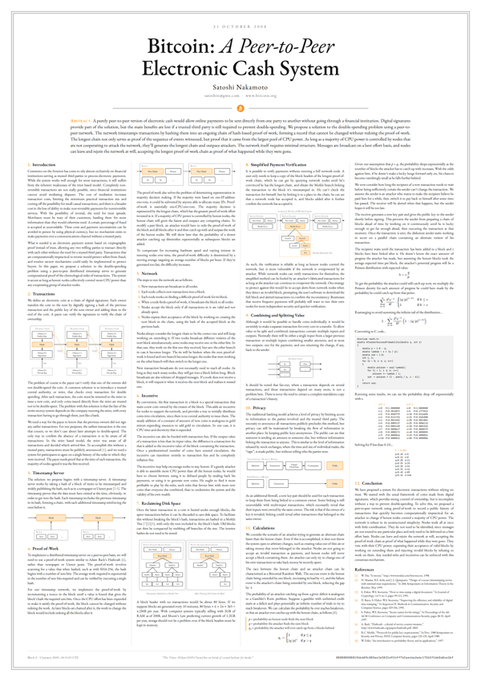
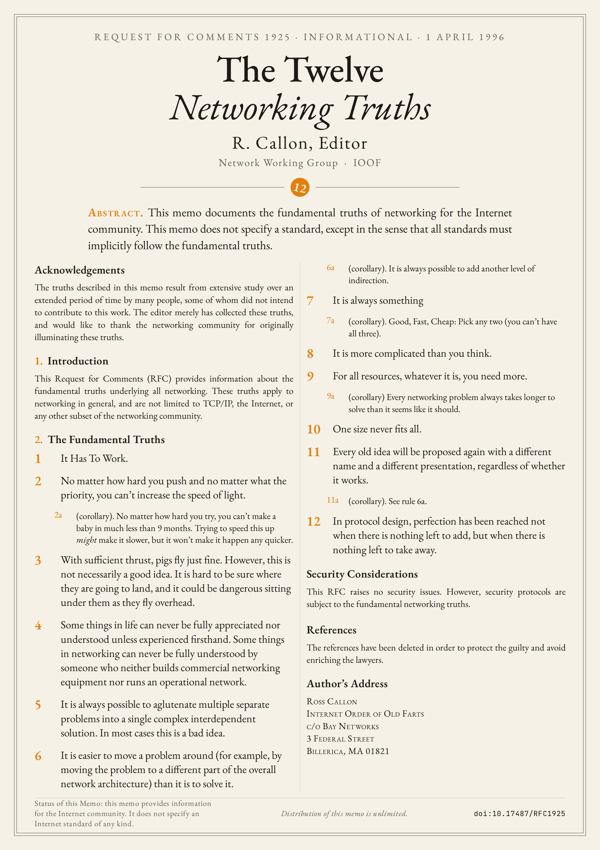
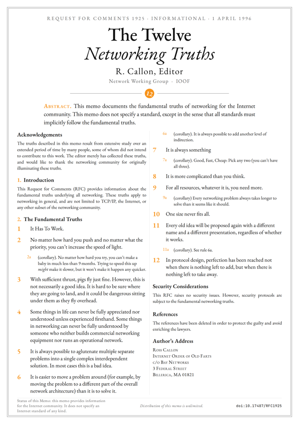

# one-page-papers

**Foundational papers, typeset on a single poster. Print them, frame them, hang them.**

Each paper is laid out in full on one page: every section, equation, code listing, table and reference, with figures redrawn as vector graphics. The body size is computed automatically so the text fills the page exactly.

## Papers

### Bitcoin: A Peer-to-Peer Electronic Cash System
Satoshi Nakamoto, 2008. Full text, 7 redrawn figures, genesis block in the footer.

| ivoire | blanc | genesis | blueprint |
|---|---|---|---|
|  |  |  |  |

### RFC 1925: The Twelve Networking Truths
Ross Callon, 1 April 1996. Large type, readable from across the room.

| ivoire | blanc | genesis | blueprint |
|---|---|---|---|
|  |  |  |  |

## Download

Vector PDFs are in [`dist/<paper>/`](dist), named `<paper>-<format>-<theme>.pdf`.

| Format | File size | Prints at |
|---|---|---|
| `A` | 59.4 × 84.1 cm (A1) | A0, A1, A2, A3 (same ratio, just scale) |
| `50x70` | 50 × 70 cm | 50 × 70 cm |
| `60x80` | 60 × 80 cm | 60 × 80 cm |

Themes: `ivoire` (warm paper), `blanc` (pure white), `genesis` (dark, bitcoin orange), `blueprint` (navy).

**Print tips.** For dense papers like Bitcoin, A2 is the smallest comfortable size. Use matte paper, 200 g/m² or heavier. Dark themes are best printed by a professional lab.

## Build

Requires Node.js, Python 3 and Make.

```bash
make deps      # npm + pip + Chromium for Playwright
make           # every paper × format × theme
make bitcoin   # a single paper
python3 engine/build.py rfc-1925 --formats A --themes genesis
```

## Add a paper

Create `papers/<name>/` with:

| File | Purpose |
|---|---|
| `meta.yaml` | title, header, abstract, footer, columns, license (see existing papers) |
| `text.md` | the text, in the small Markdown dialect documented in `engine/markdown.py` |
| `figures.py` | optional: `FIGS = {"name": fn}`, each `fn()` returns an SVG string built with `engine/svg.py` |
| `style.css` | optional: paper-specific CSS |

In `text.md`, `::: figure <name>` inserts a figure, `$$ … $$` is rendered with KaTeX, `(1)` / `(1a)` makes labelled items, and raw HTML passes through.

Only add texts whose license allows redistribution, and record it in `meta.yaml`.

## How it works

`engine/build.py` parses the Markdown, pre-renders math with KaTeX, injects SVG figures into an HTML template, then drives headless Chromium: for each format it binary-searches the largest body size that fits, prints a PDF at a fixed 594 mm design width, and scales it to the target format with pypdf. Themes are sets of CSS variables in `engine/themes.py`.

## License

Engine code: MIT. Each paper keeps its own license, see [`LICENSE`](LICENSE) and `papers/*/meta.yaml`.
